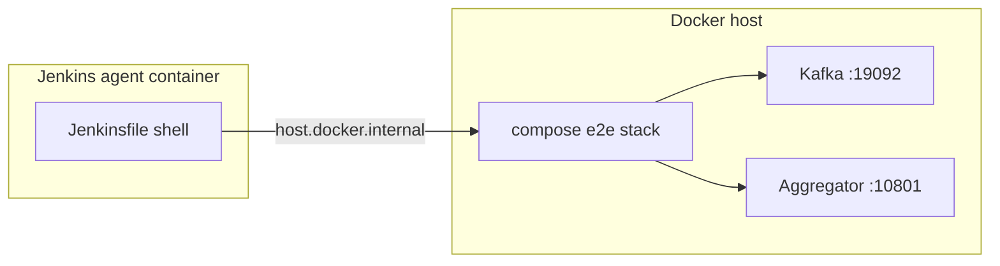

# Skill CI Port Profile

## Use When

Apply when:

- меняются `config/e2e_ports.local.env` или `config/e2e_ports.jenkins.env`;
- Jenkins pipeline задаёт `E2E_RUN_MODE=jenkins`, но Makefile wait/preflight использует local-порты;
- `make e2e-codespace` red при green `make ports-check`;
- нужно проверить propagation профиля через compose → readiness → pytest.

**Связано:** ADR-004, `skill_devops_broker_cicd`, `docs/ci_failure_joint_plan.md` H1.

## Contract Chain

```text
E2E_RUN_MODE (local | jenkins)
  → config/e2e_ports.{mode}.env
  → Makefile LOAD_E2E_PORTS / E2E_ENV
  → scripts/prepare_multi.py (merge ports into compose)
  → published host ports in .generated/e2e/docker-compose.yml
  → readiness URLs (Makefile, e2e_wait_health.sh, pytest fixtures)
  → Jenkinsfile environment (host.docker.internal:{jenkins_port})
```

**Разрыв контракта** — любое звено использует порты из **другого** профиля.

## Profile Comparison (example pattern)

| Variable | local env | jenkins env | Notes |
|---|---|---|---|
| `AGREGATOR_PORT` | 8081 | 10801 | host publish |
| `KAFKA_PORT` | 9092 | 19092 | bootstrap |
| Readiness from Jenkins container | N/A | `host.docker.internal:10801` | not `127.0.0.1:8081` |

Точные значения — только из `config/e2e_ports.*.env` и `docs/ports.md`.

## Mandatory Checks Before CI Complete

```bash
make ports-check
make ci-config-check
make jenkins-preflight          # if remote SCM configured
E2E_RUN_MODE=jenkins make e2e-codespace   # or ci-jenkins-profile-check when implemented
```

При изменении Makefile e2e-* — grep на hardcoded `8081`, `9092`, `8088` вне `$(E2E_ENV)` блоков.

## Jenkins ↔ Host Topology



Makefile на **хосте** при `E2E_RUN_MODE=jenkins` должен ждать **jenkins**-порты, не local.

## Output Contract

```markdown
## profile_scope
## mode_and_env_files
## propagation_chain_status
## contract_breaks_found
## fix_plan
## validation_commands
## human_review
## next_step
```

## Guardrails

- Ни одно число host-порта local не совпадает с jenkins (кроме internal container ports not published).
- Не использовать `127.0.0.1:<local-port>` из Jenkins-контейнера для readiness.
- Не править только Jenkinsfile без sync Makefile и `e2e_ports.jenkins.env`.
- Синхронизировать fix в **оба** репозитория `-economics` и `-ai` при зеркальных Makefile.
