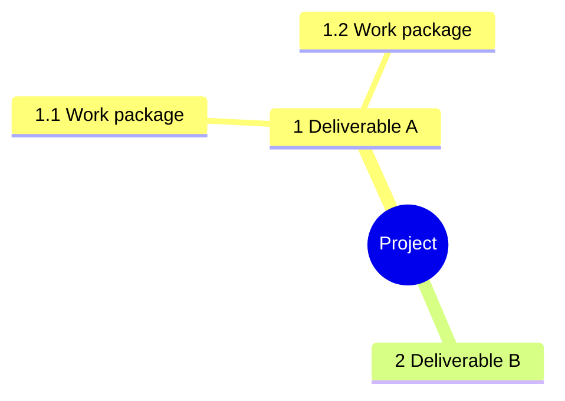
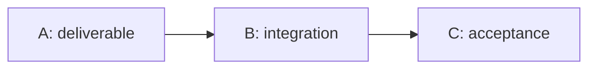
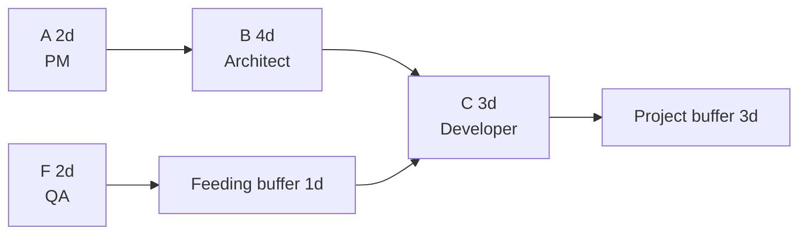

# Skill Project Management CCPM

## Use When

Apply for project management tasks requiring:

- WBS (work breakdown structure) and responsibility decomposition;
- dependency network and critical path method (CPM);
- resource constraints and critical chain project management (CCPM);
- feeding, project and resource buffers;
- milestone control, blocker escalation and replanning;
- portfolio or pilot planning where scope, evidence, budget and human decision owners must stay visible.

## Required Inputs

If inputs are incomplete, produce a draft and mark assumptions explicitly.

| Input | Minimum needed |
|---|---|
| Goal | project objective, boundaries, expected outcome |
| Deliverables | artifacts, acceptance criteria, quality gates |
| Work packages | owner, output, duration estimate, dependencies |
| Resources | scarce roles, capacity, calendar constraints |
| Constraints | fixed dates, external dependencies, procurement, regulation |
| Evidence | command, review, document, demo or decision proving completion |

## Planning Principles

1. Plan around **deliverables and flow**, not local utilization.
2. Keep the **critical path** and **critical chain** separate: path is logic, chain includes resource constraints.
3. Use buffers to protect the whole project; do not hide safety inside every task estimate.
4. Make acceptance criteria observable: a file, command, review, demo, signed decision or metric.
5. Every major scope, budget, acceptance or escalation decision needs `human_review`.

## Workflow

### 1. Frame The Project

Define:

- project objective and excluded scope;
- deliverables and acceptance criteria;
- decision owner, delivery owner, reviewer roles;
- constraints and assumptions;
- planning unit: days, weeks, sprints or lifecycle stages.

### 2. Build WBS

Build a deliverable-oriented WBS:

- Level 1: major deliverables or lifecycle stages.
- Level 2: work packages with a concrete output.
- Level 3 only when a package is too large to estimate or assign.

Each work package should have: `id`, `owner`, `output`, `acceptance`, `duration`, `predecessors`, `resource`, `evidence`.

### 3. Build Dependency Network

Create a precedence table before drawing:

| id | work package | duration | predecessors | resource | evidence |
|---|---|---:|---|---|---|
| A | Scope baseline | 2d | — | PM | approved scope |
| B | Architecture draft | 4d | A | Architect | C4 diagrams |

Then draw a Mermaid flowchart for review.

### 4. Compute Critical Path

For each task:

- `ES` — earliest start;
- `EF = ES + duration`;
- `LF` — latest finish;
- `LS = LF - duration`;
- `float = LS - ES = LF - EF`.

Critical path is the longest logical path where total float is zero or the minimum visible float. Show the path and total duration.

### 5. Identify Critical Chain

Apply resource constraints:

1. Level overloaded resources.
2. Resolve same-resource parallel tasks into feasible sequence.
3. Recalculate the constrained chain.
4. Mark scarce roles and conflict points.

The critical chain may differ from the critical path; explain why.

### 6. Place CCPM Buffers

Use buffers explicitly:

| Buffer | Where | Purpose |
|---|---|---|
| Project buffer | after the critical chain | protects final due date |
| Feeding buffer | before non-critical chain joins the critical chain | protects merges |
| Resource buffer | before scarce resource handoff | protects availability |

Initial sizing rule when no project policy exists: use 50% of removed safety from the protected chain, or 25-33% of chain duration for a rough draft. Mark the sizing basis.

### 7. Control Execution

Manage by buffer consumption:

| Zone | Signal | Action |
|---|---|---|
| Green | buffer consumption below progress risk | continue, remove blockers locally |
| Yellow | buffer burn faster than progress | replanning proposal and owner review |
| Red | due date or acceptance at risk | escalation, scope/date/resource decision |

Track: completed work, remaining duration, buffer used, blockers, decisions required.

## Output Contract

```markdown
## project_scope
- objective, excluded scope, delivery owner, decision owner

## wbs
- deliverable tree and work package table

## dependency_network
- precedence table and Mermaid flowchart

## critical_path
- CPM table, path, duration, float notes

## critical_chain
- resource conflicts, constrained chain, scarce resources

## buffers
- project, feeding and resource buffers with sizing basis

## control_rules
- buffer zones, reporting cadence, escalation triggers

## risks_and_escalations
- schedule, scope, resource, quality and external blockers

## evidence_and_acceptance
- what proves each major deliverable is done

## human_review
- decision owners and unresolved decisions

## next_step
```

## WBS Diagram Format

Use Mermaid by default:



For dependencies, use:



For a critical chain view:



## Review Checklist

- [ ] Work packages are output-oriented, not activity-only.
- [ ] Every package has owner, duration, predecessor and evidence.
- [ ] Critical path includes float calculation or explicit approximation.
- [ ] Critical chain accounts for scarce resources.
- [ ] Buffers are visible and have a sizing basis.
- [ ] Control rules use buffer consumption, not percent-complete optimism.
- [ ] `human_review` names owners for scope, budget, date and acceptance.

## Guardrails

- Do not call a path critical without showing dependencies and float.
- Do not optimize every task locally; CCPM protects system throughput through buffers.
- Do not remove human decision owners from scope, budget, acceptance or escalation decisions.
- Do not hide missing estimates; mark them as assumptions and request owner confirmation.
- Do not treat a Mermaid diagram as the plan unless the underlying table is present.
