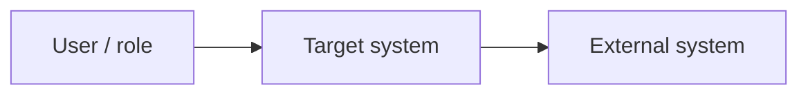
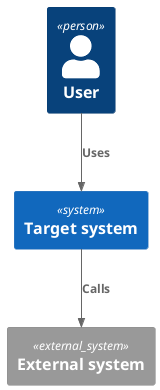

# Skill Software Architecture C4

## Use When

Apply for software architecture work requiring:

- C4 model diagrams: System Context, Container, Component and Code views;
- integration, deployment, runtime or security views;
- tool selection between Mermaid, draw.io, PlantUML and ArchiMate;
- architecture decision records and traceability from requirements to components.

## Workflow

1. Define architecture scope: system boundary, users, external systems, quality attributes and decisions needed.
2. Pick the C4 level:
   - **C1 Context** for stakeholders, neighboring systems and responsibilities.
   - **C2 Container** for deployable/runtime units and protocols.
   - **C3 Component** for internal modules and interfaces.
   - **C4 Code** only when code-level structure is necessary and stable enough.
3. Select a diagram tool:
   - **Mermaid**: quick Markdown-native diagrams, reviews, docs.
   - **PlantUML**: versioned C4 diagrams, reusable styles, CI rendering.
   - **draw.io**: collaborative editable diagrams and polished stakeholder views.
   - **ArchiMate**: enterprise architecture, capability, application, technology and motivation views.
4. Tie diagrams to decisions: assumptions, constraints, trade-offs, ADR candidates and validation evidence.
5. For security-sensitive architecture, invoke `skill_systems_engineer_sbd`, `skill_cpb_review` or `skill_traceability`.

## Output Contract

```markdown
## architecture_scope
## stakeholders_and_drivers
## c4_views
## selected_notation_and_tool
## decisions_and_tradeoffs
## risks_and_quality_attributes
## validation_plan
## human_review
## next_step
```

## Diagram Templates

Mermaid C1/C2 draft:



PlantUML C4 draft:



ArchiMate view skeleton:

```text
Motivation: goal -> requirement -> constraint
Business: actor -> business process
Application: application component -> application service
Technology: node -> system software -> artifact
```

## Guardrails

- Do not create diagrams without explicit scope and audience.
- Do not mix C4 levels in one diagram unless the exception is named.
- Do not present a diagram as validated architecture without review owner and evidence.
- Prefer text-based diagrams for versioned repo docs; use draw.io when manual layout or stakeholder polish is the main value.
