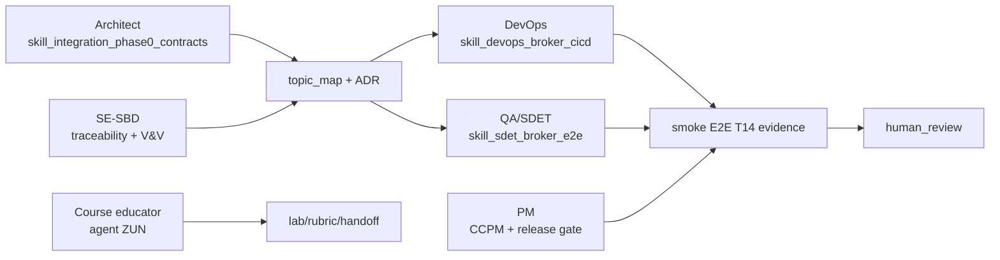

<!-- doc-meta: status=active version=1.1 updated=2026-06-28 audience=internal -->

# Улучшение AI-агентов и навыков для `sbd-drones-economics-ai`

Документ фиксирует анализ истории изменений, слабые места реализации, пробелы навыков агентов, план усиления и ход выполнения.

## 1. Контекст анализа

Репозиторий: `sbd-drones-economics-ai`  
Ветка: `test/integration-phase0-initiation`  
Целевой контур: ТЭМ БАС (ОП), phase 0 integration, Operator, broker-backed E2E, учебные материалы.

Использованные источники:

- `git log --oneline -n 30`
- `git status --short`
- `docs/ai_dev_tasks.md`
- `docs/concept.md`
- `.cursor/agents/*.md`
- `.cursor/skills/*/SKILL.md`
- `config/agent_skill_registry.json`

Подключённые экспертные роли:

- `systems-engineer-sbd` / школа СИ: ConOps, V&V, traceability, human_review.
- `software-architect-c4`: C4, topic map, ADR, broker boundary, integration views.
- `course-educator-platform`: ЗУН агентов, рубрики развития, учебная применимость навыков.

## 2. Сигналы из истории изменений

| Сигнал | Наблюдение | Риск |
|---|---|---|
| Phase 0 integration стала центральной темой | последние коммиты: ADR, topic map, агенты, план stage 1 | агентам нужны навыки контрактного управления, а не только общая архитектура |
| E2E остаётся главным блокером | `docs/ai_dev_tasks.md`: T14 не закрыт, PR-E1 red, `e2e-codespace` не подтверждён | CI может быть зелёным без фактической интеграции |
| Broker boundary нестабилен | Kafka для phase 0, broker-agnostic target позже, MQTT/Kafka конфликт в истории | без source of truth для topic map агенты могут генерировать несовместимые изменения |
| Dirty tree большой | много untracked generated/docs/systems/slides/notebooks | высокий риск случайного коммита generated или privacy-sensitive артефактов |
| Учебный контур смешан с runtime | slides, notebooks, systems и integration docs движутся вместе | нужен явный ЗУН/handoff, чтобы обучение не подменяло readiness платформы |

## 3. Ключевые слабости реализации

1. **Нет единого hard gate для phase 0 readiness.** План описан, но агенты должны уметь требовать связку `topic_map.yaml -> compose integration-phase0 -> smoke E2E T14 -> evidence`.
2. **Soft-green CI остаётся системным риском.** История фиксирует `pytest.skip` и отключённые Docker/E2E режимы; QA/SDET должен отличать skip, xfail, infra failure и product failure.
3. **Контракты обмена слабее кода.** Kafka/MQTT boundary, topic prefixes, consumer groups и correlation ids требуют отдельного навыка, иначе coding-агенты будут чинить локально и ломать целое.
4. **Агенты были ролевыми, но не все имели операционные процедуры.** Нужны skills для phase 0 contracts, ЗУН развития агентов и repo hygiene.
5. **Release hygiene не отделён от engineering work.** Untracked/generated/private artifacts требуют отдельного gate до merge или публикации.

## 4. Матрица ЗУН агентов

| Агент | Знания | Умения | Навыки, которые нужно развивать |
|---|---|---|---|
| `systems-engineer-sbd` | ConOps, ЦБ, V&V, PR-E1/PR-A1 constraints | строить traceability harm -> topic -> test | phase 0 contract review, release readiness |
| `software-architect-c4` | C4, ADR, broker boundary, topic map | фиксировать архитектурные решения и зависимости | integration contract governance, broker E2E impact |
| `ci-marinet-steward` | Jenkins/GHA, compose, Kafka/Mosquitto, ports | строить broker-backed CI profile | deterministic readiness, cleanup, evidence |
| `qa-marinet-spec` | AC, TS, traceability, flake taxonomy | проектировать smoke/full E2E без mandatory skip | anti-flake broker SDET, failure classification |
| `course-educator-platform` | ЗУН, рубрики, лабораторные | переводить agent workflow в учебные упражнения | ЗУН развития агентов и rubrics |
| `project-manager-ccpm` | WBS, critical chain, buffers | планировать M1-M4 и evidence gates | cross-repo dependencies, repo hygiene blockers |
| `artifact-quality-controller` | completeness, coherence, gates | выявлять missing evidence | dirty tree / generated / privacy release gate |
| `tem-bas-operator` | Operator modules, EventJournal, broker SDK | править consumer/producer под topic map | Kafka env overrides, shell tests, T14 smoke |

### 4.1. Таблица пробелов ЗУН (stub, course-educator)

| ЗУН / компетенция | Текущий уровень | Целевой (M2) | Lab / evidence | Владелец |
|---|---|---|---|---|
| Чтение topic map v0.2 | L1 observe | L3 apply | exercise: map TM-001 → env | Architect |
| Broker E2E classification (skip/xfail/pass) | L1 | L3 | lab: разбор `test_phase0_smoke.py` | QA |
| Compose profile `integration-phase0` | L0 | L2 | demo: `integration-phase0-compose.md` | DevOps |
| Traceability TR-PH0-* | L1 | L3 | worksheet harm→test | SE-SBD |
| Repo hygiene перед push | L1 | L2 | checklist `skill_repo_hygiene_release_gate` | PM |
| Agent ZUN maturity rubric | L0 | L2 | `skill_agent_zun_development` | Course-educator |

`accepted_by_orchestrator` — черновик рубрики до review преподавателя.

## 4.2. Пробелы агентов (sprint 2026-06-28)

| Пробел | Persona | Действие спринта |
|---|---|---|
| Нет vertical coding-профиля Operator | Architect / PM | ✅ `tem-bas-operator.md` |
| T14 smoke не в CI gate | QA / DevOps | ✅ skeleton + `make phase0-smoke` |
| ADR-003 compose без YAML | DevOps | stub doc + ADR-003 |
| PlantUML T12 отсутствовал | Architect | ✅ `phase0_happy_path.puml` |
| ZUN lab не формализован | Course-educator | §4.1 stub |
| `team1-regulator` ломает `ci-unit-test` | DevOps | exclude в `-economics` Makefile |

## 4.3. Coding package stubs (rollout Этап 1b)

| Пакет | Issue / worktree | Первый deliverable |
|---|---|---|
| `tem-bas-operator` | pending | env KAFKA_OPERATOR_* + green shell tests |
| `tem-bas-aggregator` | pending | `service_type: agro_field` HTTP→Kafka |
| `tem-bas-integration-stubs` | pending | ORVD ping stub, DronePort battery OK |

## 5. План усиления

| Шаг | Действие | Статус |
|---|---|---|
| 1 | Прочитать текущие agent/skill профили и registry | done |
| 2 | Проанализировать git history, `ai_dev_tasks.md`, `concept.md` | done |
| 3 | Подключить экспертные роли СИ, архитектор, преподаватель | done |
| 4 | Добавить недостающие skills для phase 0 contracts, ЗУН и repo hygiene | done |
| 5 | Подключить skills к агентам и registry | done |
| 6 | Проверить JSON registry, lints, согласованность маршрутизации | done |
| 7 | Зафиксировать итог и residual risks | done |
| 8 | Учесть финальные выводы экспертных агентов и закрыть найденные skill-routing дефекты | done |

## 6. Реализованные изменения

### 6.1. Новые skills

| Skill | Назначение |
|---|---|
| `skill_integration_phase0_contracts` | Управляет T1-T17, topic map, ADR, Kafka/MQTT boundary, `integration-phase0`, T14, PR-E1/PR-A1 |
| `skill_agent_zun_development` | Описывает ЗУН агентов, maturity levels, exercises, rubrics и backlog развития |
| `skill_repo_hygiene_release_gate` | Проверяет dirty tree, generated artifacts, privacy, WIP history и release readiness |

### 6.2. Усиленные агенты

| Агент | Усиление |
|---|---|
| `systems-engineer-sbd` | Добавлены phase 0 contracts, broker E2E evidence, release gate |
| `software-architect-c4` | Добавлены topic map, ADR, Kafka/MQTT boundary, broker E2E impact |
| `course-educator-platform` | Добавлен `skill_agent_zun_development` и agent ЗУН block |
| `project-manager-ccpm` | Добавлены T1-T17, PR-E1/PR-A1, release hygiene blockers |
| `artifact-quality-controller` | Добавлены repo hygiene, phase 0 contract и broker E2E checks |
| `ci-marinet-steward` | Ранее усилен для Kafka/Mosquitto CI/CD |
| `qa-marinet-spec` | Ранее усилен для broker E2E SDET |
| `dt-simulation-lead` | Адаптирован с TEM-Marinet источников на ТЭМ БАС phase 0, topic map и broker evidence |
| `tem-economics-analyst` | Адаптирован с Marinet pilot bridge на ТЭМ БАС ОП/КТ, phase 0 и CCPM |

### 6.3. Registry

Добавлены `task_type`:

- `integration_contract_governance`
- `agent_zun_development`
- `repo_hygiene_release_gate`
- `broker_cicd_infrastructure`
- `sdet_broker_e2e`

Расширены маршруты:

- `systems_engineer_task`
- `software_architecture_c4`
- `artifact_quality_review`
- `course_educator_task`
- `project_management_ccpm`
- `integration_phase0`

## 7. Новая модель совместной работы агентов

## 8. Residual risks

| Risk | Почему остаётся | Следующий шаг |
|---|---|---|
| Реальный E2E T14 ещё не реализован этим изменением | задача про навыки, не про код теста | issue/worktree для `integration_phase0` + `sdet_broker_e2e` |
| Registry валиден, но в repo нет `agent_skill_router.py` | текущий repo хранит registry без локального router | использовать registry оркестратором или перенести router отдельной задачей |
| Dirty tree содержит много unrelated untracked | не удалял пользовательские артефакты | прогнать `skill_repo_hygiene_release_gate` как отдельный review |
| Термин СКИБ в `docs/concept.md` старый | этот документ не правил в текущей задаче, чтобы не смешивать scope | отдельная doc-governance правка |

## 8.1. Выводы экспертных агентов и follow-up

Сводный вывод трёх экспертных ролей: слабость была не в отсутствии отдельных профилей, а в неполном замыкании цепочки `contract -> architecture -> CI -> SDET evidence -> teaching handoff`.

Уточнения после завершения экспертных обзоров:

- SE-обзор подтвердил необходимость contract-first подхода: traceability, human_review, release gate и отсутствие soft-green E2E.
- Архитектурный обзор выявил конкретные дефекты: невалидный `docs/integration/topic_map.yaml`, Marinet-only skill references в BAS-агентах, отсутствие полного `integration-phase0` compose/smoke.
- Преподавательский обзор подтвердил, что ЗУН агентов нужно описывать через наблюдаемые операции: topic map review, broker E2E, evidence packaging, repo hygiene.

Закрытый follow-up:

- Исправлена YAML-структура `docs/integration/topic_map.yaml` для `operator.broker_phase0`.
- Профили `ci-marinet-steward`, `qa-marinet-spec`, `project-manager-ccpm`, `course-educator-platform`, `dt-simulation-lead`, `tem-economics-analyst` адаптированы под ТЭМ БАС и существующие skills.
- Удалены функциональные ссылки агентов на отсутствующие `skill_marinet_*` и `docs/tem_marinet/**`.

## 9. Ход выполнения

- 2026-06-28 09:19 — старт анализа и чтение skills СИ/архитектора/преподавателя.
- 2026-06-28 09:22 — подключены экспертные роли СИ, архитектора и преподавателя.
- 2026-06-28 09:25 — выявлены слабые места: phase 0 contract gate, soft-green CI, broker boundary, repo hygiene, ЗУН агентов.
- 2026-06-28 09:31 — добавлены `skill_integration_phase0_contracts`, `skill_agent_zun_development`, `skill_repo_hygiene_release_gate`.
- 2026-06-28 09:34 — усилены профили `systems-engineer-sbd`, `software-architect-c4`, `course-educator-platform`, `project-manager-ccpm`, `artifact-quality-controller`.
- 2026-06-28 09:36 — расширен `config/agent_skill_registry.json`.
- 2026-06-28 09:39 — проверки пройдены: JSON registry, existence check для всех registry skills, IDE lints.
- 2026-06-28 09:48 — после завершения всех экспертных агентов выполнен follow-up: исправлен `topic_map.yaml`, убраны Marinet-only skill references из BAS-профилей, обновлён отчёт.

## 10. Проверки

| Проверка | Результат |
|---|---|
| `python3 -m json.tool config/agent_skill_registry.json` | OK |
| Проверка существования всех skills из `config/agent_skill_registry.json` | OK |
| IDE lints по изменённым agent/skill/doc файлам | OK |
| Поиск `skill_marinet_` / `docs/tem_marinet` в `.cursor/agents` и `.cursor/skills` | OK: осталась только rule-памятка о запрете Marinet-only job без адаптации |
| YAML parse для `docs/integration/topic_map.yaml` | OK после follow-up |

Не выполнялось: реальные E2E/CI прогоны (`make ci-test`, `make e2e-codespace`) — задача была про анализ и усиление агентных навыков, не про запуск полного полигона.
