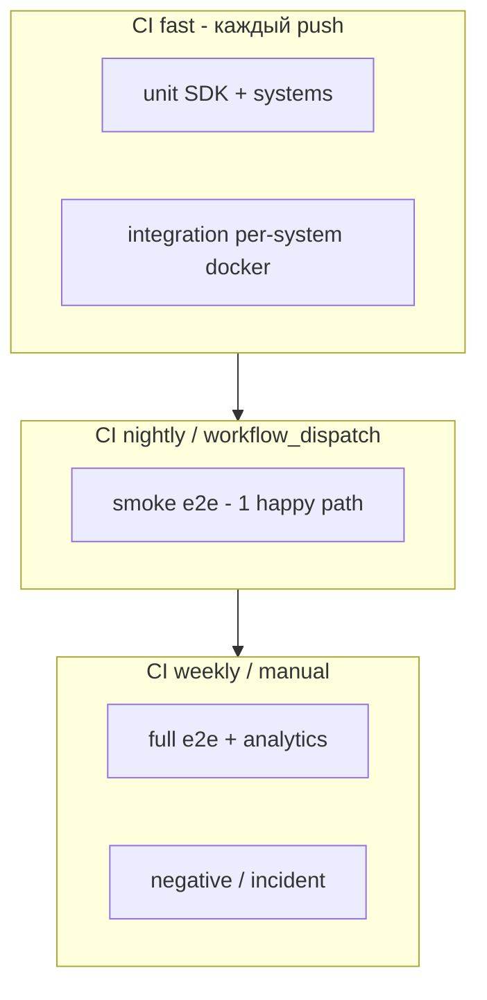
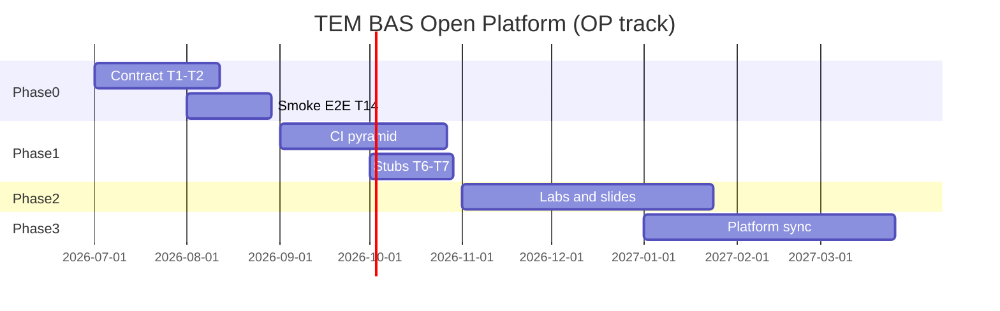

# Мультиагентная разработка проекта ТЭМ БАС

<!-- doc-meta: status=active version=1.0 updated=2026-06-28 -->

Документ — **контракт агент-оркестратора** для подготовки и проведения работ по открытой платформе моделирования экономики эксплуатации безопасных дронов (направление **ОП**, см. [concept.md](concept.md)). Программный стенд — экспорт [`sbd-open-platform-and-trainings-development/code`](../../../sbd-open-platform-and-trainings-development/code).

---

## Содержание

- [context](#context) — контекст и связь репозиториев
- [repo-analysis-ai](#repo-analysis-ai) — анализ `sbd-drones-economics-ai`
- [repo-analysis-core](#repo-analysis-core) — анализ `sbd-drones-economics`
- [merge-decisions](#merge-decisions) — что влить в `master`, от чего отказаться
- [e2e-problem](#e2e-problem) — проблема сквозных тестов
- [agents-connect](#agents-connect) — подключение агентов и навыков
- [orchestration-model](#orchestration-model) — модель оркестрации
- [iterations](#iterations) — итерации проработки (SE × 4, архитектор, QA, DevOps, техпис, PM, методист)
- [development-plan](#development-plan) — план развития платформы
- [backlog-sync](#backlog-sync) — синхронизация с бэклогом этапа 0 (T1–T17)
- [next-actions](#next-actions) — ближайшие действия оркестратора

---

## context {#context}

| Репозиторий | Роль | Основная ветка работ |
|-------------|------|----------------------|
| [`sbd-drones-economics`](../../sbd-drones-economics) | Код платформы (субмодули, E2E, Jenkins) | `feature/uas-dev-company` (+32 к `master`) |
| [`sbd-drones-economics-ai`](.) | AI-интеграция, Operator, учебные материалы, phase 0 | `test/integration-phase0-initiation` (+37 к `master`) |
| [`sbd-open-platform-and-trainings-development`](../../../sbd-open-platform-and-trainings-development) | Канонический стенд ТЭМ, агенты, CI-ворота | `main` / `code/` |

**Расхождение линий развития:** в `-ai` основной deliverable — `systems/operator` (Python, MQTT/Kafka); в `-economics` — полный полигон с субмодулями (`Agregator`, `agrodron`, `SITL-module`, …) и `systems/uas_dev_company`. Слияние веток **без согласования контрактов топиков (T1–T2)** даст конфликт архитектур.

**Цель оркестратора:** выровнять контракты → стабилизировать CI → подключить агентов → вести бэклог этапа 0 и учебного трека ОП.

---

## repo-analysis-ai {#repo-analysis-ai}

**Ветка:** `test/integration-phase0-initiation` (HEAD `c6cccf7`, +17 непушенных коммитов к origin).  
**`master`:** скелет (~86 файлов, только `dummy_system`) — **не отражает** состояние проекта.

### Что добавлено относительно `master`

| Кластер | Содержание | Статус |
|---------|------------|--------|
| `systems/operator/` | SecurityMonitor, FleetManager, MissionPlanner, BusinessLogic, EventJournal, shell-тесты MQTT/Kafka | ✅ unit/integration/shell зелёные локально |
| `docs/integration_process/` | Анализ phase 0, бэклог T1–T17, change requests CR5–CR10 | ✅ активный источник требований |
| `demos/sbd-model-simple-demo/` | Stub-экосистема + pytest | ⚠️ частично |
| `notebooks/` | systems_api, sbd-model, aggregator_operator live demo | ⚠️ live demo WIP |
| `docs/slides/**` | LaTeX/PDF (72118, SBOM, TARA, integration) | 📚 учебный контент, не runtime |
| CI | Корневых workflows **нет**; DronePortGCS CI **несовместим** с Makefile (`unit-test` vs `tests-unit`) | ❌ |

### Phase 0 (честная оценка)

| Цепочка | Статус |
|---------|--------|
| Заказчик → Агрегатор (HTTP) | Частично (модель «доставка», не «агро») |
| Агрегатор → Эксплуатант | ❌ Kafka vs MQTT, разные префиксы топиков (З1–З2) |
| Эксплуатант → Страховая / НУС / Дронопорт / ОрВД | Частично; заглушки не оформлены (З5–З7) |
| Сквозной автотест phase 0 | ❌ (T14) |
| EventJournal → Analytics | Mock HTTP; полный контур не закрыт |

Подробности: [phase0_systems_analysis.md](integration_process/phase0_systems_analysis.md), [phase0_remarks_and_technical_tasks.md](integration_process/phase0_remarks_and_technical_tasks.md).

---

## repo-analysis-core {#repo-analysis-core}

**Ветка:** `feature/uas-dev-company` (+32 к `master`, fast-forward merge возможен).  
**`master`:** рабочий полигон с Jenkins, E2E, 10 субмодулями.

### Ключевые активы

| Компонент | Описание |
|-----------|----------|
| `systems/uas_dev_company/` | UAS Dev Company: certification, registry, purchase, Nuxt UI, Playwright |
| `ci/jenkins/` | JCasC: 5 job (`drone-unit`, `drone-integration`, `drone-e2e`, …) |
| `tests/e2e/test_e2e_scenario.py` | Полный Kafka-сценарий; **29 `pytest.skip`** при неготовности контейнеров |
| `make e2e-codespace` | CI-путь E2E без DroneAnalytics (`E2E_SKIP_ANALYTICS=1`) |
| `make e2e-mqtt-*` | Экспериментальный dual-transport E2E |

### Стабильность E2E (уже mitigated)

- Warmup 100–180 с, pre-create Kafka topics (`e2e_warmup.sh`)
- ORVD timeout workarounds, SITL home publish, DronePort battery fix
- **`drones`** возвращён в compose (на master был исключён)

**Риск:** CI может быть **зелёным при пропусках** — не гарантия полного пути.

---

## merge-decisions {#merge-decisions}

### Влить в `master` (поэтапно, отдельные PR)

#### `sbd-drones-economics`

| PR | Содержание | Условие |
|----|------------|---------|
| **PR-E1** | Fast-forward `feature/uas-dev-company` → `master` | Прогон `make ci-test` + `make e2e-codespace`; убрать бинарный sqlite из git |
| **PR-E2** | Cherry-pick negative E2E из `feature/negative-e2e-scenario` | Если нужен отдельный негативный сценарий (дополняет `test_e2e_incident_scenario.py`) |
| **PR-E3** | Восстановить Fabric E2E job или явно пометить manual-only | Root `Jenkinsfile` удалён на feature — зафиксировать решение |

#### `sbd-drones-economics-ai`

| PR | Содержание | Условие |
|----|------------|---------|
| **PR-A1** | Platform: `systems/operator`, `shared/`, `sdk/`, broker, `demos/`, `tests/` | После T1–T2 (контракт топиков) |
| **PR-A2** | Docs: `docs/integration_process/`, обновлённый `requirements_spec.md` | Независимо от кода |
| **PR-A3** | CI: адаптация из `origin/feature/github-actions` + выравнивание имён целей Makefile | Согласовать с PR-E1 |
| **PR-A4** | Slides: `docs/slides/72118`, `sbom`, `tara` | Отдельный track; без персональных данных |
| **PR-A5** | `docker-compose` профиль `integration-phase0` (T10) | После T1–T3 |

### Отказаться / закрыть без merge

| Ветка / артеfact | Причина |
|------------------|---------|
| `tests-e2e-design`, `feature/component_redesign` (-ai) | Устарели (= master) |
| `feature/Jenkins`, `feature/mqtt-e2e`, `feature/uas-dev-company-integration` (-economics) | Поглощены `feature/uas-dev-company` |
| `tests/phase0-integration--ai` | 6 коммитов, superseded |
| `origin/feature/uas-dev-company*` (-ai) wholesale | Конфликт с `systems/operator`; reconcile после T17 |
| `docs/slides/ksa/ЗУНы/` bulk merge | Nested git + CSV с персональными данными — privacy review |
| `.venv/`, LaTeX aux/pdf в git | Добавить в `.gitignore`, не коммитить |

### Согласование двух репозиториев

```
sbd-drones-economics (полигон)  ←── экспорт/синх ──→  sbd-open-platform/code
         ↑                                              ↑
         └──── контракт топиков (T1–T2) ────────────────┘
sbd-drones-economics-ai (operator + учебный контент)
```

**Правило оркестратора:** сначала **единый topic map** в `-economics`, затем merge Operator из `-ai`.

---

## e2e-problem {#e2e-problem}

### Диагноз (сводка агентов QA + DevOps + архитектор)

| Симптом | Корневая причина |
|---------|------------------|
| E2E отключены в CI по умолчанию | `-ai`: `RUN_DOCKER_TESTS!=1` → skip; `-economics`: только Jenkins `drone-e2e`, не на каждый push |
| «Зелёный» CI при неполном прогоне | 29+ `pytest.skip` в `test_e2e_scenario.py` — мягкий fail |
| Два репозитория — два E2E контура | Operator shell-тесты (-ai) vs полный Kafka stack (-economics) |
| Flaky ORVD/SITL/DronePort | Таймауты шлюзов, cold-start Kafka consumer groups |
| Нет единого compose phase 0 | Разрозненные compose в подсистемах (З9) |

### Целевая модель тестов (пирамида)



### Меры (P0–P2)

| ID | Мера | Владелец-агент |
|----|------|----------------|
| E2E-1 | **Smoke E2E** (T14): заказ → Kafka → Operator ack; без SITL/ORVD | DevOps + QA |
| E2E-2 | Заменить часть `pytest.skip` на **xfail с issue** или hard fail для обязательных шагов smoke | QA |
| E2E-3 | Профиль `integration-phase0` compose (T10) | DevOps |
| E2E-4 | Единый warmup + topic pre-create (перенести паттерн из `-economics` в `-ai`) | DevOps |
| E2E-5 | GitHub Actions: unit+integration на push; e2e-smoke nightly; e2e-full manual | DevOps |
| E2E-6 | Заглушки Дронопорт/ОрВД (T6–T7) — детерминированный smoke без внешних таймаутов | Architect + SE |

---

## agents-connect {#agents-connect}

Источник: [`sbd-open-platform-and-trainings-development/.cursor/`](../../../sbd-open-platform-and-trainings-development/.cursor/), реестр `code/config/agent_skill_registry.json`.

### Обязательный набор для ТЭМ БАС (ОП)

| Роль | Агент (профиль) | Навыки (skills) | `task_type` |
|------|-----------------|-----------------|-------------|
| Системный инженер СКИБ | `systems-engineer-sbd` | `skill_systems_engineer_sbd`, `skill_select_pattern`, `skill_traceability`, `skill_human_review` | `systems_engineer_task` |
| Школа СИ — русская | `se-school-russian` | `skill_toc_se_schools` | `toc_dtr_session` |
| Школа СИ — американская | `se-school-american` | `skill_toc_se_schools` | `toc_dtr_session` |
| Школа СИ — китайская | `se-school-chinese` | `skill_toc_se_schools` | `toc_dtr_session` |
| Школа СИ — agent-native | `se-school-ai-native` | `skill_agent_native_se`, `skill_human_review` | `agent_native_se_design` |
| Архитектор | `software-architect-c4` | `skill_software_architecture_c4`, `documentation-governance` | `software_architecture_c4` |
| QA / приёмка | `qa-marinet-spec` * | `skill_artifact_quality`, `skill_traceability`, `platform-validation` | `artifact_quality_review` |
| DevOps / CI | `ci-marinet-steward` * | `platform-ci-jenkins`, `platform-validation`, `skill_marinet_ci_gates` | `jenkins_or_ci_change` |
| Техпис / документация | *(нет отдельного профиля)* | `documentation-governance`, `skill_artifact_quality` | `docs_change` |
| Проектный менеджер | `project-manager-ccpm` | `skill_project_management_ccpm`, `skill_human_review` | `project_management_ccpm` |
| Методист / преподаватель | `course-educator-platform` | `skill_course_educator_platform`, `skill_human_review` | `course_educator_task` |
| Качество артеfactов | `artifact-quality-controller` | `skill_artifact_quality`, `skill_human_review` | `artifact_quality_review` |
| Оркестратор TOC | `toc-orchestrator` | `skill_toc_se_schools`, `skill_toc_dtr_session` | `toc_dtr_session` |
| Цифровой двойник / SITL | `dt-simulation-lead` | `skill_dt_simulation_tem` | `tem_marinet_domain_task` |
| Экономика / TCO | `tem-economics-analyst` * | `skill_marinet_domain` (экономический контур) | `tem_marinet_domain_task` |

\* — Marinet-профиль; для БАС использовать **с адаптацией** (переименовать job `tem-marinet-*` → `tem-bas-*`, порты из `e2e_ports.*.env`).

### Headless-пакеты (кодинг-агенты)

| Пакет | Применимость к БАС |
|-------|-------------------|
| `tem-bas-purchase-*` | ✅ UAS vitrine, purchase flow (#105–111) |
| `tem-registry-*` | ✅ бэклог платформенных gap |
| `test-profile-refactor-*` | ✅ рефакторинг профилей тестов (E2E-1…6) |
| `certification-demo-*`, `nginx-web-ui-*` | ⚠️ по необходимости для учебных сценариев |

### Что скопировать в `-ai` / `-economics`

```
.cursor/
├── agents/          # подмножество из таблицы выше
├── skills/          # связанные SKILL.md
└── rules/           # documentation-governance, platform-python-deps, ports (адаптировать)
docs/ai_sbd/agents/  # workspace briefs для TOC/SE sessions
code/config/agent_skill_registry.json  # с task_type для BAS
```

### Пробел: агент «экономика дронов»

Отдельного профиля нет. Оркестратор комбинирует: `tem-economics-analyst` + `course-educator-platform` + headless `tem-bas-purchase-*`. При росте КТ-направления — создать `tem-bas-economics` по шаблону Marinet agents.

---

## orchestration-model {#orchestration-model}

### Роли в цикле

| Роль | Инструмент | Делает | Не делает |
|------|------------|--------|-----------|
| **Координатор** | Cursor chat / Makefile `APPLY=1` | GitHub Status, integrate, выбор ветки PR | — |
| **Coding-агент** | headless `cursor-agent` в worktree | Issue → код → unit tests | `gh`, смена board |
| **Review-агент** | `artifact-quality-controller`, deterministic gates | Coherence, SKIB trace | Merge |
| **Human review** | преподаватель / владелец ОП | Приёмка phase 0, учебных материалов | — |

### Типовой цикл (2 недели)

1. **TOC/DTR** (`make toc-se-schools-session`) — ограничение спринта  
2. **Architect** — C4 + topic map (T2)  
3. **SE-SBD** — ЦПБ/контракт для изменения  
4. **Coding headless** — T1–T14 implementation  
5. **QA + DevOps** — CI profile, smoke E2E  
6. **Course educator** — lab / notebook sync  
7. **PM** — buffer review, milestone evidence  
8. **Integrate + human_review**

---

## iterations {#iterations}

Синтез нескольких раундов проработки подключёнными агентами (без исполнения кода — план).

### Итерация 1 — ограничение (TOC + 4 школы СИ)

**Вход:** З1–З2 (Kafka/MQTT, topic map), master не отражает проект.  
**Ограничение (DBR):** отсутствие **опубликованного контракта обмена** блокирует phase 0, merge двух репозиториев и стабильный E2E.

| Школа | Вклад |
|-------|-------|
| Русская (СМД) | Разрыв — не технический, а **деятельностный**: нет позиции «владелец контракта» между командами Aggregator и Operator |
| Американская (V&V) | ConOps phase 0 = один воспроизводимый сценарий; verification = smoke E2E (T14) как **acceptance test** |
| Китайская (整体) | Topic map + compose + тесты — **целое**; частичный merge Operator без Aggregator бессмыслен |
| Agent-native | Issue-ready пакеты: T1, T2, T10, T14 как agent tasks с `task_type` и evidence |

**Решение итерации 1:** спринт **только** T1, T2, T12, T14 — всё остальное в буфер.

---

### Итерация 2 — архитектура и контракты

**Архитектор (`software-architect-c4`):**

- C4 Container: Customer → Aggregator → Operator → {Insurer, GCS, DronePort stub, ORVD stub} → Agrodron  
- ADR-001: транспорт Aggregator↔Operator = **Kafka** на phase 0 (Operator `BROKER_TYPE=kafka`)  
- ADR-002: единый файл `docs/integration/topic_map.yaml` — source of truth  
- ADR-003: профиль compose `integration-phase0` — минимальный набор контейнеров для smoke

**SE-SBD:**

- ЦБ phase 0: целостность цепочки заказа, журналирование EventJournal (БТ10–БТ11)  
- Traceability: harm «потеря заказа» → ЦБ → topic ack → test T14

---

### Итерация 3 — QA и DevOps

**QA (`qa-marinet-spec` + `artifact-quality-controller`):**

- Критерий приёмки master: smoke E2E **без skip** на обязательных шагах  
- Негативные сценарии — отдельный job, не блокирует push  
- Матрица: requirements_spec ↔ T1–T17 ↔ pytest node id

**DevOps (`ci-marinet-steward` + `platform-ci-jenkins`):**

- Портировать JCasC из `-economics`; добавить job `drone-e2e-smoke` (timeout 30 min, warmup 120 s)  
- GitHub Actions для `-ai`: `unit.yml`, `integration.yml`, `e2e-smoke.yml` (nightly)  
- `make ports-check` при добавлении compose (изоляция local/jenkins)

---

### Итерация 4 — методист, техпис, PM

**Методист (`course-educator-platform`):**

- ОП-трек: lab «Phase 0 integration» = пройти smoke E2E + заполнить traceability worksheet  
- Slides 72118/SBOM — отдельный release train, не блокирует CI  
- Jupyter demos — после T16 (стабильный API)

**Техпис (`documentation-governance`):**

- Канон: `docs/integration/topic_map.yaml`, `docs/quick_start.md`, `requirements_spec.md`  
- Термин **СКИБ** — ГОСТ Р 72118-2025 формулировка  
- Индекс в README; doc-meta на active docs

**PM (`project-manager-ccpm`):**

| Milestone | Evidence | Buffer |
|-----------|----------|--------|
| M1: Topic map + ADR | PR merged, review SE | 3 d |
| M2: Smoke E2E green | Jenkins log, no mandatory skips | 5 d |
| M3: `-ai` operator → `-economics` sync | compose up, demo 15 min | 5 d |
| M4: Учебный release (slides subset) | PDF + rubric | 10 d |

**Критический путь:** M1 → M2 → M3. M4 параллельно после M1.

---

## development-plan {#development-plan}

### Фаза 0 — Контракт и воспроизводимость (4–6 недель)

| # | Работа | Арtefact | Агенты |
|---|--------|----------|--------|
| 0.1 | Topic map + ADR Kafka | `docs/integration/topic_map.yaml` | Architect, SE-SBD |
| 0.2 | `service_type: agro_field` в Aggregator (T3) | API spec | SE-SBD, coding |
| 0.3 | Compose `integration-phase0` (T10) | docker-compose profile | DevOps |
| 0.4 | Smoke E2E (T14) | `tests/e2e/test_phase0_smoke.py` | QA, DevOps |
| 0.5 | Merge PR-E1 + PR-A1/A2/A3 | master обоих repo | Coordinator |
| 0.6 | PlantUML sequence (T12) | `docs/integration_process/diagrams/` | Architect, техпис |

**Критерий выхода:** `make integration-phase0-up && make test-phase0-smoke` — green на чистой VM.

---

### Фаза 1 — Стабилизация CI и E2E (6–8 недель)

| # | Работа | Результат |
|---|--------|-----------|
| 1.1 | Пирамида тестов (E2E-1…6) | CI docs в `docs/build_and_test.md` |
| 1.2 | Заглушки DronePort/ORVD (T6–T7) | `systems/stubs/` |
| 1.3 | Insurer adapter (T4) | topic alignment |
| 1.4 | Operator ↔ GCS стыковка (T5) | integration test |
| 1.5 | Cherry-pick negative E2E | optional nightly job |
| 1.6 | Agent headless: `test-profile-refactor-*` | маркеры pytest, profiles |

**Критерий выхода:** nightly smoke 7/7 green; full E2E — weekly, ≤2 flaky/week.

---

### Фаза 2 — Учебный контур ОП (8–12 недель)

| # | Работа | Результат |
|---|--------|-----------|
| 2.1 | Labs phase 0 + rubrics | `docs/labs/` |
| 2.2 | Notebooks sync (T16) | demos без WIP |
| 2.3 | Slides release (72118, SBOM) | отдельный tag `teaching-YYYY-MM` |
| 2.4 | Метрики студентов (concept.md ОП) | autograding hooks |
| 2.5 | `tem-bas-purchase-*` интеграция | UAS purchase lab |
| 2.6 | Gamification elements | по `gamification-facilitator` workspace |

**Критерий выхода:** преподаватель проводит lab за 2 академических часа с demo-pack 45 min.

---

### Фаза 3 — Связь с открытой платформой (ongoing)

| # | Работа |
|---|--------|
| 3.1 | Регулярный export/import с `sbd-open-platform/code` (quarterly) |
| 3.2 | TOC-session при major release |
| 3.3 | Traceability requirements ↔ CI gates |
| 3.4 | КТ-ветка (simulators, swarm, AI) — отдельный repo/branch по [concept.md](concept.md) |

---

### Roadmap (кварталы)



---

## backlog-sync {#backlog-sync}

Приоритеты phase 0 ([T1–T17](integration_process/phase0_remarks_and_technical_tasks.md)) в контексте плана:

| ID | План | Спринт |
|----|------|--------|
| T1, T2, T12 | Фаза 0 | S1 |
| T3, T14 | Фаза 0 | S1–S2 |
| T10, T9 | Фаза 0–1 | S2 |
| T4–T7 | Фаза 1 | S3–S4 |
| T8, T13 | Фаза 1 | S4 |
| T15, T11 | Фаза 1 | по возможности |
| T16 | Фаза 2 | после M2 |
| T17 | Итерация 1 | немедленно — свести с change_requests |

---

## next-actions {#next-actions}

**Немедленно (оркестратор / координатор):**

1. [ ] Push `test/integration-phase0-initiation` (+18 commits) — *gitflic: `remote unpack failed: Packfile is truncated` (2026-06-28); повторить push или связаться с админом remote*  
2. [x] Создать issue «T1+T2: topic map» → [ISSUE-T1-T2-topic-map.md](integration/issues/ISSUE-T1-T2-topic-map.md) *(gh token invalid — локальный шаблон)*  
3. [x] Скопировать `.cursor/agents` subset (15 agents, 19 skills) + [directory.md](ai_sbd/agents/directory.md)  
4. [x] TOC brief + синтез ограничения → [tem_bas_phase0_constraint_2026-06-28.md](ai_sbd/agents/toc/sessions/tem_bas_phase0_constraint_2026-06-28/tem_bas_phase0_constraint_2026-06-28.md) *(полный headless — output_dir в open-platform)*  
5. [x] PR-A2 артефакты: `topic_map.yaml`, ADR-001, privacy review, `agent_skill_registry.json`  
6. [x] Privacy review → [privacy_review_ksa.md](integration/privacy_review_ksa.md); `.gitignore` обновлён  

**Human review (владелец ОП):**

- [ ] Утвердить ADR-001 (Kafka для Aggregator↔Operator)  
- [ ] Утвердить модель заказа `agro_field` (T3)  
- [ ] Утвердить план merge PR-E1 vs PR-A1 sequencing  

---

*Документ подлежит обновлению после каждой интеграционной итерации. Версия 1.0 — первичный синтез анализа репозиториев и агентов платформы.*
