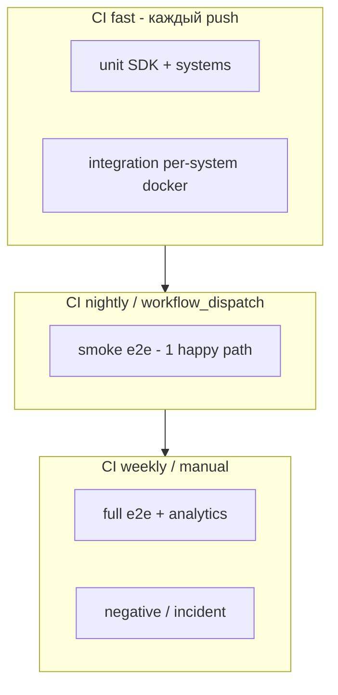
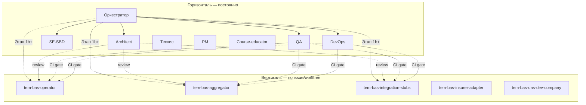
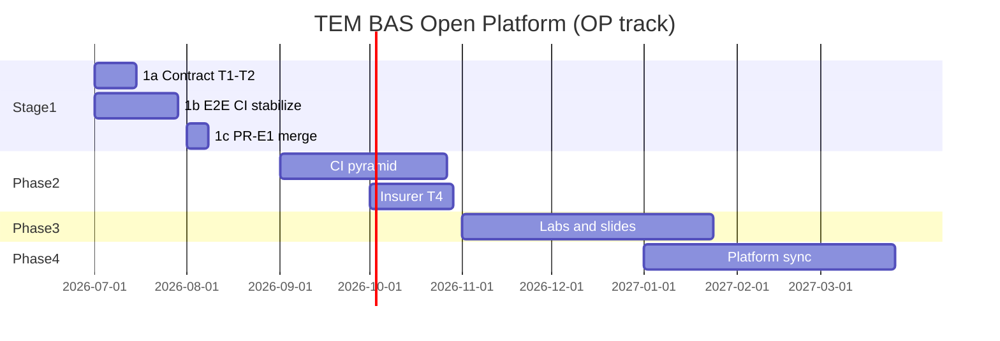
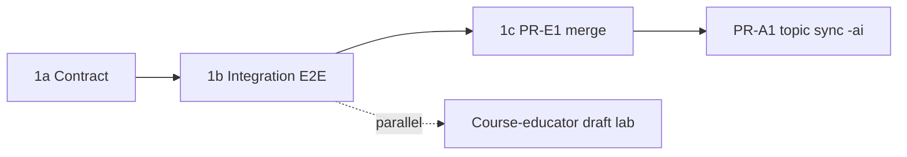

# Мультиагентная разработка проекта ТЭМ БАС

<!-- doc-meta: status=active version=1.7 updated=2026-06-28 -->

<!-- merged from integration branch -->

<!-- doc-meta: status=active version=1.6 updated=2026-06-28 -->

Документ — **контракт агент-оркестратора** для подготовки и проведения работ по открытой платформе моделирования экономики эксплуатации безопасных дронов (направление **ОП**, см. [concept.md](concept.md)). Программный стенд — экспорт [`sbd-open-platform-and-trainings-development/code`](../../../sbd-open-platform-and-trainings-development/code).

---

## Содержание

- [context](#context) — контекст и связь репозиториев
- [repo-analysis-ai](#repo-analysis-ai) — анализ `sbd-drones-economics-ai`
- [repo-analysis-core](#repo-analysis-core) — анализ `sbd-drones-economics`
- [merge-decisions](#merge-decisions) — что влить в `master`, от чего отказаться
- [e2e-problem](#e2e-problem) — проблема сквозных тестов
- [agents-connect](#agents-connect) — подключение агентов и навыков
- [orchestration-model](#orchestration-model) — модель оркестрации
- [system-agents](#system-agents) — двухуровневая модель агентов (горизонталь + вертикаль)
- [iterations](#iterations) — итерации проработки (SE × 4, архитектор, QA, DevOps, техпис, PM, методист)
- [development-plan](#development-plan) — план развития платформы
- [stage-1-plan](#stage-1-plan) — Этап 1: контракт, стабилизация CI/E2E, PR-E1
- [backlog-sync](#backlog-sync) — синхронизация с бэклогом этапа 0 (T1–T17)
- [next-actions](#next-actions) — ближайшие действия оркестратора
- [sprint-120min-2026-06-28](#sprint-120min-2026-06-28) — автономный спринт 120 мин (phase 0 artifacts)

---

## context {#context}

| Репозиторий | Роль | Основная ветка работ |
|-------------|------|----------------------|
| [`sbd-drones-economics`](../../sbd-drones-economics) | Код платформы (субмодули, E2E, Jenkins) | `feature/uas-dev-company` (+32 к `master`) |
| [`sbd-drones-economics-ai`](.) | AI-интеграция, Operator, учебные материалы, phase 0 | `test/integration-phase0-initiation` (+37 к `master`) |
| [`sbd-open-platform-and-trainings-development`](../../../sbd-open-platform-and-trainings-development) | Канонический стенд ТЭМ, агенты, CI-ворота | `main` / `code/` |

**Расхождение линий развития:** в `-ai` основной deliverable — `systems/operator` (Python, MQTT/Kafka); в `-economics` — полный полигон с субмодулями (`Agregator`, `agrodron`, `SITL-module`, …) и `systems/uas_dev_company`. Слияние веток **без согласования контрактов топиков (T1–T2)** даст конфликт архитектур.

**Цель оркестратора:** выровнять контракты → стабилизировать CI → подключить агентов → вести бэклог этапа 0 и учебного трека ОП.

---

## repo-analysis-ai {#repo-analysis-ai}

**Ветка:** `test/integration-phase0-initiation` (HEAD `bda83a48`, synced with `origin`).  
**`master`:** @ `48eae2fa` on `origin` — operator, docs, vuca blocks C–E merged.

<!-- merged from integration branch -->

**Ветка:** `test/integration-phase0-initiation` (HEAD `c6cccf7`, +17 непушенных коммитов к origin).  
**`master`:** скелет (~86 файлов, только `dummy_system`) — **не отражает** состояние проекта.

### Что добавлено относительно `master`

| Кластер | Содержание | Статус |
|---------|------------|--------|
| `systems/operator/` | SecurityMonitor, FleetManager, MissionPlanner, BusinessLogic, EventJournal, shell-тесты MQTT/Kafka | ✅ unit/integration/shell зелёные локально |
| `docs/integration_process/` | Анализ phase 0, бэклог T1–T17, change requests CR5–CR10 | ✅ активный источник требований |
| `demos/sbd-model-simple-demo/` | Stub-экосистема + pytest | ⚠️ частично |
| `notebooks/` | systems_api, sbd-model, aggregator_operator live demo | ⚠️ live demo WIP |
| `docs/slides/**` | LaTeX/PDF (72118, SBOM, TARA, integration) | 📚 учебный контент, не runtime |
| CI | Корневых workflows **нет**; DronePortGCS CI **несовместим** с Makefile (`unit-test` vs `tests-unit`) | ❌ |

### Phase 0 (честная оценка)

| Цепочка | Статус |
|---------|--------|
| Заказчик → Агрегатор (HTTP) | Частично (модель «доставка», не «агро») |
| Агрегатор → Эксплуатант | ❌ Kafka vs MQTT, разные префиксы топиков (З1–З2) |
| Эксплуатант → Страховая / НУС / Дронопорт / ОрВД | Частично; заглушки не оформлены (З5–З7) |
| Сквозной автотест phase 0 | ❌ (T14) |
| EventJournal → Analytics | Mock HTTP; полный контур не закрыт |

Подробности: [phase0_systems_analysis.md](integration_process/phase0_systems_analysis.md), [phase0_remarks_and_technical_tasks.md](integration_process/phase0_remarks_and_technical_tasks.md).

---

## repo-analysis-core {#repo-analysis-core}

**Ветка:** `feature/uas-dev-company` (+32 к `master`, fast-forward merge возможен).  
**`master`:** рабочий полигон с Jenkins, E2E, 10 субмодулями.

### Ключевые активы

| Компонент | Описание |
|-----------|----------|
| `systems/uas_dev_company/` | UAS Dev Company: certification, registry, purchase, Nuxt UI, Playwright |
| `ci/jenkins/` | JCasC: 5 job (`drone-unit`, `drone-integration`, `drone-e2e`, …) |
| `tests/e2e/test_e2e_scenario.py` | Полный Kafka-сценарий; **29 `pytest.skip`** при неготовности контейнеров |
| `make e2e-codespace` | CI-путь E2E без DroneAnalytics (`E2E_SKIP_ANALYTICS=1`) |
| `make e2e-mqtt-*` | Экспериментальный dual-transport E2E |

### Стабильность E2E (уже mitigated)

- Warmup 100–180 с, pre-create Kafka topics (`e2e_warmup.sh`)
- ORVD timeout workarounds, SITL home publish, DronePort battery fix
- **`drones`** возвращён в compose (на master был исключён)

**Риск:** CI может быть **зелёным при пропусках** — не гарантия полного пути.

---

## merge-decisions {#merge-decisions}

### Влить в `master` (поэтапно, отдельные PR)

#### `sbd-drones-economics`

| PR | Содержание | Условие |
|----|------------|---------|
**Правило оркестратора:** PR-E1 в `-economics` первым; затем topic map v0.2 и PR-A1 (`-ai` operator).

---

## e2e-problem {#e2e-problem}
| **PR-E2** | Cherry-pick negative E2E из `feature/negative-e2e-scenario` | Если нужен отдельный негативный сценарий (дополняет `test_e2e_incident_scenario.py`) |
| **PR-E3** | Восстановить Fabric E2E job или явно пометить manual-only | Root `Jenkinsfile` удалён на feature — зафиксировать решение |

#### `sbd-drones-economics-ai`

| PR | Содержание | Условие |
|----|------------|---------|
| **PR-A1** | Platform: `systems/operator`, `shared/`, `sdk/`, broker, `demos/`, `tests/` | После T1–T2 (контракт топиков) |
| **PR-A2** | Docs: `docs/integration_process/`, обновлённый `requirements_spec.md` | Независимо от кода |
| **PR-A3** | CI: адаптация из `origin/feature/github-actions` + выравнивание имён целей Makefile | Согласовать с PR-E1 |
| **PR-A4** | Slides: `docs/slides/72118`, `sbom`, `tara` | Отдельный track; без персональных данных |
| **PR-A5** | `docker-compose` профиль `integration-phase0` (T10) | После T1–T3 |

### Отказаться / закрыть без merge

| Ветка / артеfact | Причина |
|------------------|---------|
| `tests-e2e-design`, `feature/component_redesign` (-ai) | Устарели (= master) |
| `feature/Jenkins`, `feature/mqtt-e2e`, `feature/uas-dev-company-integration` (-economics) | Поглощены `feature/uas-dev-company` |
| `tests/phase0-integration--ai` | 6 коммитов, superseded |
| `origin/feature/uas-dev-company*` (-ai) wholesale | Конфликт с `systems/operator`; reconcile после T17 |
| `docs/slides/ksa/ЗУНы/` bulk merge | Nested git + CSV с персональными данными — privacy review |
| `.venv/`, LaTeX aux/pdf в git | Добавить в `.gitignore`, не коммитить |

### Согласование двух репозиториев

```
sbd-drones-economics (полигон)  ←── экспорт/синх ──→  sbd-open-platform/code
         ↑                                              ↑
         └──── контракт топиков (T1–T2) ────────────────┘
sbd-drones-economics-ai (operator + учебный контент)
```

**Правило merge в `master`:** push только при **зелёных** обязательных тестах (см. PR-E1 gate ниже).

### Решения human_review (2026-06-28)

| Решение | Статус |
|---------|--------|
| **ADR-001** — Kafka для Aggregator↔Operator **на phase 0** | ✅ Accepted |
| **ADR-002** — broker-agnostic платформа после phase 0 (env + профиль теста) | ✅ Accepted |
| Merge line — **PR-E1** (`feature/uas-dev-company` → `master` в `-economics`) | ✅ Выбрано |
| Push `master` | ⛔ **Заблокирован** — `ci-integration-test` red (2026-06-28); см. `-economics/docs/pr-e1-gate-report.md` |
| PR-A1 (`-ai` operator) | После PR-E1 + topic map v0.2 |

### Влить в `master` (поэтапно, отдельные PR)

#### `sbd-drones-economics`

| PR | Содержание | Gate (обязательно green) |
|----|------------|---------------------------|
| **PR-E1** | Fast-forward `feature/uas-dev-company` → `master` | ✅ `master` @ `8132c19`; `ci-test` + `e2e-codespace` green |
| **PR-E2** | Cherry-pick negative E2E из `feature/negative-e2e-scenario` | По необходимости |
| **PR-E3** | Fabric E2E job или manual-only | После PR-E1 |

#### `sbd-drones-economics-ai`

| PR | Содержание | Условие |
|----|------------|---------|
| **PR-A1** | Platform: operator, shared, sdk, demos, tests | После PR-E1 + topic map v0.2 |
| **PR-A2** | Docs: integration_process, requirements_spec | Независимо |
| **PR-A3** | CI из feature/github-actions | Согласовать с PR-E1 |
| **PR-A4** | Slides без PII | Отдельный track |
| **PR-A5** | compose `integration-phase0` | После T1–T3 |

**Правило оркестратора:** PR-E1 в `-economics` первым; затем topic map v0.2 и PR-A1.

---

## e2e-problem {#e2e-problem}

### Диагноз (сводка агентов QA + DevOps + архитектор)

| Симптом | Корневая причина |
|---------|------------------|
| E2E отключены в CI по умолчанию | `-ai`: `RUN_DOCKER_TESTS!=1` → skip; `-economics`: только Jenkins `drone-e2e`, не на каждый push |
| «Зелёный» CI при неполном прогоне | 29+ `pytest.skip` в `test_e2e_scenario.py` — мягкий fail |
| Два репозитория — два E2E контура | Operator shell-тесты (-ai) vs полный Kafka stack (-economics) |
| Flaky ORVD/SITL/DronePort | Таймауты шлюзов, cold-start Kafka consumer groups |
| Нет единого compose phase 0 | Разрозненные compose в подсистемах (З9) |

### Целевая модель тестов (пирамида)



### Меры (P0–P2)

| ID | Мера | Владелец-агент |
|----|------|----------------|
| E2E-1 | **Smoke E2E** (T14): заказ → Kafka → Operator ack; без SITL/ORVD | DevOps + QA |
| E2E-2 | Заменить часть `pytest.skip` на **xfail с issue** или hard fail для обязательных шагов smoke | QA |
| E2E-3 | Профиль `integration-phase0` compose (T10) | DevOps |
| E2E-4 | Единый warmup + topic pre-create (перенести паттерн из `-economics` в `-ai`) | DevOps |
| E2E-5 | GitHub Actions: unit+integration на push; e2e-smoke nightly; e2e-full manual | DevOps |
| E2E-6 | Заглушки Дронопорт/ОрВД (T6–T7) — детерминированный smoke без внешних таймаутов | Architect + SE |

---

## agents-connect {#agents-connect}

Источник: [`sbd-open-platform-and-trainings-development/.cursor/`](../../../sbd-open-platform-and-trainings-development/.cursor/); локальная копия реестра — `config/agent_skill_registry.json`, исходный платформенный реестр — `code/config/agent_skill_registry.json`.

### Обязательный набор для ТЭМ БАС (ОП)

| Роль | Агент (профиль) | Навыки (skills) | `task_type` |
|------|-----------------|-----------------|-------------|
| Системный инженер СКИБ | `systems-engineer-sbd` | `skill_systems_engineer_sbd`, `skill_select_pattern`, `skill_traceability`, `skill_human_review`, `skill_vuca_decision_protocol` | `systems_engineer_task` |
| Школа СИ — русская | `se-school-russian` | `skill_toc_se_schools`, `skill_vuca_decision_protocol` | `toc_dtr_session` |
| Школа СИ — американская | `se-school-american` | `skill_toc_se_schools`, `skill_vuca_decision_protocol` | `toc_dtr_session` |
| Школа СИ — китайская | `se-school-chinese` | `skill_toc_se_schools`, `skill_vuca_decision_protocol` | `toc_dtr_session` |
| Школа СИ — agent-native | `se-school-ai-native` | `skill_agent_native_se`, `skill_human_review`, `skill_vuca_decision_protocol` | `systems_engineer_task` |
| Архитектор | `software-architect-c4` | `skill_software_architecture_c4`, `skill_integration_phase0_contracts`, `documentation-governance` | `software_architecture_c4` |
| QA / приёмка | `qa-marinet-spec` | `skill_artifact_quality`, `skill_sdet_broker_e2e`, `skill_traceability`, `platform-validation` | `sdet_broker_e2e` |
| DevOps / CI | `ci-marinet-steward` | `platform-ci-jenkins`, `platform-validation`, `skill_devops_broker_cicd` | `broker_cicd_infrastructure` |
| Техпис / документация | *(нет отдельного профиля)* | `documentation-governance`, `skill_artifact_quality`, `skill_vuca_decision_protocol` | `docs_change` |
| Проектный менеджер | `project-manager-ccpm` | `skill_project_management_ccpm`, `skill_human_review`, `skill_repo_hygiene_release_gate` | `project_management_ccpm` |
| Методист / преподаватель | `course-educator-platform` | `skill_course_educator_platform`, `skill_agent_zun_development`, `skill_human_review` | `course_educator_task` |
| Качество артефактов | `artifact-quality-controller` | `skill_artifact_quality`, `skill_human_review`, `skill_repo_hygiene_release_gate` | `artifact_quality_review` |
| Оркестратор TOC | `toc-orchestrator` | `skill_toc_se_schools`, `skill_toc_dtr_session`, `skill_triz_tem` | `toc_dtr_session` |
| TRIZ | `triz-expert-tem` | `skill_triz_tem`, `skill_vuca_decision_protocol` | `vuca_decision_support` |
| Цифровой двойник / SITL | `dt-simulation-lead` | `skill_dt_simulation_tem`, `skill_integration_phase0_contracts`, `skill_sdet_broker_e2e` | `integration_phase0` |
| Экономика / TCO | `tem-economics-analyst` | `skill_project_management_ccpm`, `skill_integration_phase0_contracts`, `skill_artifact_quality` | `project_management_ccpm` |

### Headless-пакеты (кодинг-агенты)

| Пакет | Применимость к БАС |
|-------|-------------------|
| `tem-bas-purchase-*` | ✅ UAS vitrine, purchase flow (#105–111) |
| `tem-registry-*` | ✅ бэклог платформенных gap |
| `test-profile-refactor-*` | ✅ рефакторинг профилей тестов (E2E-1…6) |
| `certification-demo-*`, `nginx-web-ui-*` | ⚠️ по необходимости для учебных сценариев |

### Что скопировать в `-ai` / `-economics`

```
.cursor/
├── agents/          # подмножество из таблицы выше
├── skills/          # связанные SKILL.md
└── rules/           # documentation-governance, platform-python-deps, ports (адаптировать)
docs/ai_sbd/agents/  # workspace briefs для TOC/SE sessions
code/config/agent_skill_registry.json  # с task_type для BAS
```

### Пробел: агент «экономика дронов»

Отдельного профиля нет. Оркестратор комбинирует: `tem-economics-analyst` + `course-educator-platform` + headless `tem-bas-purchase-*`. При росте КТ-направления — создать `tem-bas-economics` по шаблону Marinet agents.

---

## orchestration-model {#orchestration-model}

### Роли в цикле

| Роль | Инструмент | Делает | Не делает |
|------|------------|--------|-----------|
| **Координатор** | Cursor chat / Makefile `APPLY=1` | GitHub Status, integrate, выбор ветки PR | — |
| **Coding-агент** | headless `cursor-agent` в worktree | Issue → код → unit tests | `gh`, смена board |
| **Review-агент** | `artifact-quality-controller`, deterministic gates | Coherence, SKIB trace | Merge |
| **Human review** | преподаватель / владелец ОП | Приёмка phase 0, учебных материалов | — |

### Типовой цикл (2 недели)

1. **TOC/DTR** (`make toc-se-schools-session`) — ограничение спринта  
2. **Architect** — C4 + topic map (T2)  
3. **SE-SBD** — ЦПБ/контракт для изменения  
4. **Coding headless** — T1–T14 implementation  
5. **QA + DevOps** — CI profile, smoke E2E  
6. **Course educator** — lab / notebook sync  
7. **PM** — buffer review, milestone evidence  
8. **Integrate + human_review**

---

## system-agents {#system-agents}

Предложение оркестратора: **двухуровневая** модель агентов для ТЭМ БАС (ОП). Горизонтальные роли — постоянный контур координации и приёмки; вертикальные пакеты — **временные** coding-агенты по подсистемам, подключаемые **после baseline Этапа 1a**, но **до** merge PR-E1 (см. [stage-1-plan](#stage-1-plan)).

### Горизонтальный уровень (постоянный контур)

| Роль | Профиль / `task_type` | Зона ответственности |
|------|----------------------|----------------------|
| **Оркестратор** | координатор Cursor / Makefile `APPLY=1` | GitHub Project Status, integrate, выбор PR, rollout coding-пакетов |
| **Архитектор** | `software-architect-c4` | C4, ADR, `topic_map.yaml`, review изменений контрактов |
| **Системный инженер СКИБ** | `systems-engineer-sbd` | КБП/ЦПБ, traceability harm → ЦБ → тест, human_review |
| **QA / приёмка** | `qa-marinet-spec`, `artifact-quality-controller` | критерии приёмки, матрица T1–T17 ↔ pytest, smoke/full E2E |
| **DevOps / CI** | `ci-marinet-steward` | Jenkins/JCasC, GitHub Actions, compose-профили, `ports-check` |
| **Техпис** | `docs_change` (`documentation-governance`) | канон docs, doc-meta, термин **СКИБ** (ГОСТ Р 72118-2025) |
| **Проектный менеджер** | `project-manager-ccpm` | WBS, буферы, milestone evidence, критический путь |
| **Методист / преподаватель** | `course-educator-platform` | labs, rubrics, demo-pack; не блокирует CI-gate |

Горизонтальные агенты **не** привязаны к одному worktree; coding-агенты **не** используют `gh` и **не** меняют статус GitHub Project.

### Вертикальный уровень (coding-пакеты по подсистемам)

Не 15 постоянных профилей, а **issue-scoped headless-пакеты** (один issue → один worktree → один coding-агент):

| Пакет | Подсистема / scope | Типичные задачи |
|-------|-------------------|-----------------|
| `tem-bas-operator` | `systems/operator` (-ai) | Kafka consumer/producer, EventJournal, shell/integration tests |
| `tem-bas-aggregator` | Aggregator / API заказа | `service_type: agro_field` (T3), HTTP→Kafka bridge |
| `tem-bas-insurer-adapter` | страховой адаптер | topic alignment (T4), stub/real switch |
| `tem-bas-integration-stubs` | ORVD / DronePort | детерминированные заглушки (T6–T7) для smoke |
| `tem-bas-uas-dev-company` | `systems/uas_dev_company` | vitrine, purchase flow, Playwright (после PR-E1) |

Пакеты `tem-registry-*`, `test-profile-refactor-*`, `certification-demo-*` — по необходимости, **не** входят в baseline Этапа 1.

### Правила подключения coding-агентов

1. **Один issue = один worktree = один coding-агент** — без параллельной правки одного issue разными агентами.
2. **Coding-агенты не вызывают `gh`** — board, labels, PR создаёт координатор.
3. **Запрет на изменение `topic_map.yaml` и ADR без review архитектора** — SE-SBD подтверждает traceability; merge только после `human_review`.
4. **Rollout по фазам Этапа 1** — см. [stage-1-plan](#stage-1-plan): горизонталь только в **1a**; вертикаль подключается в **1b** (стабилизация integration/E2E); **1c** — merge PR-E1 при green gate.



---

## iterations {#iterations}

Синтез нескольких раундов проработки подключёнными агентами (без исполнения кода — план).

### Итерация 1 — ограничение (TOC + 4 школы СИ)

**Вход:** З1–З2 (Kafka/MQTT, topic map), master не отражает проект.  
**Ограничение (DBR):** отсутствие **опубликованного контракта обмена** блокирует phase 0, merge двух репозиториев и стабильный E2E.

| Школа | Вклад |
|-------|-------|
| Русская (СМД) | Разрыв — не технический, а **деятельностный**: нет позиции «владелец контракта» между командами Aggregator и Operator |
| Американская (V&V) | ConOps phase 0 = один воспроизводимый сценарий; verification = smoke E2E (T14) как **acceptance test** |
| Китайская (整体) | Topic map + compose + тесты — **целое**; частичный merge Operator без Aggregator бессмыслен |
| Agent-native | Issue-ready пакеты: T1, T2, T10, T14 как agent tasks с `task_type` и evidence |

**Решение итерации 1:** спринт **только** T1, T2, T12, T14 — всё остальное в буфер.

---

### Итерация 2 — архитектура и контракты

**Архитектор (`software-architect-c4`):**

- C4 Container: Customer → Aggregator → Operator → {Insurer, GCS, DronePort stub, ORVD stub} → Agrodron  
- ADR-001: транспорт Aggregator↔Operator = **Kafka** на phase 0 (Operator `BROKER_TYPE=kafka`)  
- ADR-002: единый файл `docs/integration/topic_map.yaml` — source of truth  
- ADR-003: профиль compose `integration-phase0` — минимальный набор контейнеров для smoke

**SE-SBD:**

- ЦБ phase 0: целостность цепочки заказа, журналирование EventJournal (БТ10–БТ11)  
- Traceability: harm «потеря заказа» → ЦБ → topic ack → test T14

---

### Итерация 3 — QA и DevOps

**QA (`qa-marinet-spec` + `artifact-quality-controller`):**

- Критерий приёмки master: smoke E2E **без skip** на обязательных шагах  
- Негативные сценарии — отдельный job, не блокирует push  
- Матрица: requirements_spec ↔ T1–T17 ↔ pytest node id

**DevOps (`ci-marinet-steward` + `platform-ci-jenkins`):**

- Портировать JCasC из `-economics`; добавить job `drone-e2e-smoke` (timeout 30 min, warmup 120 s)  
- GitHub Actions для `-ai`: `unit.yml`, `integration.yml`, `e2e-smoke.yml` (nightly)  
- `make ports-check` при добавлении compose (изоляция local/jenkins)

---

### Итерация 4 — методист, техпис, PM

**Методист (`course-educator-platform`):**

- ОП-трек: lab «Phase 0 integration» = пройти smoke E2E + заполнить traceability worksheet  
- Slides 72118/SBOM — отдельный release train, не блокирует CI  
- Jupyter demos — после T16 (стабильный API)

**Техпис (`documentation-governance`):**

- Канон: `docs/integration/topic_map.yaml`, `docs/quick_start.md`, `requirements_spec.md`  
- Термин **СКИБ** — ГОСТ Р 72118-2025 формулировка  
- Индекс в README; doc-meta на active docs

**PM (`project-manager-ccpm`):**

| Milestone | Evidence | Buffer |
|-----------|----------|--------|
| M1: Topic map + ADR | PR merged, review SE | 3 d |
| M2: Smoke E2E green | Jenkins log, no mandatory skips | 5 d |
| M3: `-ai` operator → `-economics` sync | compose up, demo 15 min | 5 d |
| M4: Учебный release (slides subset) | PDF + rubric | 10 d |

**Критический путь:** M1 → M2 → M3. M4 параллельно после M1.

---

## development-plan {#development-plan}

Общий горизонт — см. [stage-1-plan](#stage-1-plan) для детализации **Этапа 1** (baseline phase 0). Ниже — последующие фазы после merge PR-E1 и smoke E2E green.

### Этап 1 — контракт, CI/E2E, PR-E1 (4–6 недель)

**Канонический план:** [stage-1-plan](#stage-1-plan) (подфазы **1a → 1b → 1c**).

Кратко: **1a** — только горизонтальные агенты (T1–T2, ADR); **1b** — подключение coding-пакетов + стабилизация integration/E2E (T14, gate PR-E1); **1c** — merge PR-E1 при green `ci-test` и `e2e-codespace`.

**Критерий выхода Этапа 1:** `make ci-test && make e2e-codespace` green; smoke E2E T14 без обязательных skip; PR-E1 в `master` (`-economics`).

---

### Фаза 2 — Расширение интеграции (6–8 недель, после Этапа 1)

| # | Работа | Результат |
|---|--------|-----------|
| 2.1 | Пирамида тестов (E2E-1…6) | CI docs в `docs/build_and_test.md` |
| 2.2 | Insurer adapter (T4) — `tem-bas-insurer-adapter` | topic alignment |
| 2.3 | Operator ↔ GCS стыковка (T5) | integration test |
| 2.4 | Cherry-pick negative E2E (PR-E2) | optional nightly job |
| 2.5 | Agent headless: `test-profile-refactor-*` | маркеры pytest, profiles |
| 2.6 | `tem-bas-uas-dev-company` — purchase lab hooks | UAS vitrine после PR-A1 |

**Критерий выхода:** nightly smoke 7/7 green; full E2E — weekly, ≤2 flaky/week.

---

### Фаза 3 — Учебный контур ОП (8–12 недель)

| # | Работа | Результат |
|---|--------|-----------|
| 3.1 | Labs phase 0 + rubrics | `docs/labs/` |
| 3.2 | Notebooks sync (T16) | demos без WIP |
| 3.3 | Slides release (72118, SBOM) | отдельный tag `teaching-YYYY-MM` |
| 3.4 | Метрики студентов (concept.md ОП) | autograding hooks |
| 3.5 | `tem-bas-purchase-*` интеграция | UAS purchase lab |
| 3.6 | Gamification elements | по `gamification-facilitator` workspace |

**Критерий выхода:** преподаватель проводит lab за 2 академических часа с demo-pack 45 min.

---

### Фаза 4 — Связь с открытой платформой (ongoing)

| # | Работа |
|---|--------|
| 4.1 | Регулярный export/import с `sbd-open-platform/code` (quarterly) |
| 4.2 | TOC-session при major release |
| 4.3 | Traceability requirements ↔ CI gates |
| 4.4 | КТ-ветка (simulators, swarm, AI) — отдельный repo/branch по [concept.md](concept.md) |

---

### Roadmap (кварталы)



---

## stage-1-plan {#stage-1-plan}

**Этап 1** — единый baseline phase 0: контракт обмена, стабилизация integration/E2E и merge **PR-E1**. Coding-агенты по подсистемам подключаются **не раньше 1a-complete**, но **обязательно в 1b** — исправление integration/E2E входит в первый этап, а не откладывается на «Фазу 2».

### Подфазы

| Подфаза | Срок (ориентир) | Агенты | Работы | Gate |
|---------|-----------------|--------|--------|------|
| **1a — Контракт** | нед. 1–2 | Только [горизонталь](#system-agents): Architect, SE-SBD, техпис, оркестратор | T1, T2, T12; ADR-001/002 ✅; `topic_map.yaml` v0.2; PlantUML sequence; privacy review | `human_review`: владелец ОП утверждает topic map и T3-модель заказа |
| **1b — Integration/E2E** | нед. 3–5 | DevOps + QA **lead**; coding: `tem-bas-operator`, `tem-bas-aggregator`, `tem-bas-integration-stubs` | T10 compose `integration-phase0`; smoke E2E T14; починка `ci-integration-test`; прогон `e2e-codespace`; xfail/skip policy (E2E-2); warmup/topics (E2E-4) | `make ci-test` green; smoke T14 green локально и в CI |
| **1c — PR-E1 merge** | нед. 6 | Оркестратор + QA (sign-off) | Fast-forward `feature/uas-dev-company` → `master` в `-economics`; отчёт [pr-e1-gate-report.md](../../sbd-drones-economics/docs/pr-e1-gate-report.md) | **`ci-test` + `e2e-codespace` green**; push master разрешён |

**1c complete (2026-06-28):** PR-E1 в `-economics` — `origin/master` @ `8132c19`; gate `ci-test` + `e2e-codespace` green (agent e4481536).

### Таблица: агент → фаза → deliverable → acceptance

| Агент | Фаза | Deliverable | Acceptance |
|-------|------|-------------|------------|
| Architect | 1a | `topic_map.yaml`, ADR-003 (compose profile), C4 container update | Review SE-SBD; нет противоречий с ADR-001/002 |
| SE-SBD | 1a | Traceability harm→ЦБ→topic→test; ЦПБ phase 0 | `human_review` владельца ОП |
| Техпис (`docs_change`) | 1a | doc-meta, README index, термин СКИБ | `check_documentation_versioning` pass |
| DevOps | 1b | compose `integration-phase0`, CI job smoke, `ports-check` | Jenkins/GHA log green на integration |
| QA | 1b | `test_phase0_smoke.py` / T14 matrix; skip→xfail policy | Smoke без mandatory skip на happy path |
| `tem-bas-operator` | 1b | Kafka align с topic map; shell+integration tests | pytest green в worktree issue |
| `tem-bas-aggregator` | 1b | `service_type: agro_field` stub/API (T3 мин.) | HTTP→Kafka message в smoke |
| `tem-bas-integration-stubs` | 1b | ORVD/DronePort stubs (T6–T7) | Детерминированный smoke без gateway timeout |
| Оркестратор | 1c | PR-E1 merge, gate report обновлён | `ci-test` + `e2e-codespace` green |
| PM | 1a–1c | Milestone M1–M2 evidence, buffer review | M2 закрыт до push master |
| Course-educator | 1a (parallel) | Lab outline «Phase 0 integration» (черновик) | Не блокирует 1c |

Агенты `tem-bas-insurer-adapter`, `tem-bas-uas-dev-company` — **после** 1c (Фаза 2), если архитектор явно не разблокирует раньше.

### Зависимости подфаз



---

## backlog-sync {#backlog-sync}

Приоритеты phase 0 ([T1–T17](integration_process/phase0_remarks_and_technical_tasks.md)) в контексте плана:

| ID | План | Спринт |
|----|------|--------|
| T1, T2, T12 | Этап 1a | S1 |
| T3, T10, T14 | Этап 1b | S1–S2 |
| T6, T7 | Этап 1b | S2 |
| T4–T5 | Фаза 2 | S3–S4 |
| T8, T9, T13 | Фаза 2 | S4 |
| T15, T11 | Фаза 2 | по возможности |
| T16 | Фаза 3 | после M2 |
| T17 | Этап 1a | немедленно — свести с change_requests |

---

## next-actions {#next-actions}

**Публикация (staged push, 2026-06-28):** отчёты DevOps/QA/техпис — [`sbd-drones-economics/docs/staged-push-reports/`](../sbd-drones-economics/docs/staged-push-reports/).

| Фаза | Ветка GitFlic | Статус |
|------|---------------|--------|
| 1 `-economics` | `feature/uas-dev-company` @ `638a24b` | ✅ gate green; pushed |
| 2 `-ai` docs | `docs/orchestrator-v1.1` @ `c0a124a` | ✅ on remote |
| 3 `-ai` slice | `docs/pr-a2-integration-process` @ `688f7cb` | ✅ pushed (integration_process, без slides) |
| bulk | `test/integration-phase0-initiation` | ⛔ pack >100 MB |

**Немедленно (оркестратор / координатор):**

1. [x] Поэтапный push — см. таблицу выше; bulk integration-ветка **не пушить** (лимит GitFlic)  
2. [x] Создать issue «T1+T2: topic map» → [ISSUE-T1-T2-topic-map.md](integration/issues/ISSUE-T1-T2-topic-map.md)  
3. [x] Скопировать `.cursor/agents` subset + [directory.md](ai_sbd/agents/directory.md)  
4. [x] TOC brief + синтез ограничения  
5. [x] PR-A2 артефакты (ADR, topic map, privacy, registry) — на `docs/orchestrator-v1.1`  
6. [x] Privacy review → [privacy_review_ksa.md](integration/privacy_review_ksa.md)  

**Этап 1 — rollout coding-агентов ([stage-1-plan](#stage-1-plan)):**

**1a (горизонталь only):**

- [x] ADR-001 (Kafka phase 0), ADR-002 (broker-agnostic target)
- [x] `topic_map.yaml` v0.1 — довести до v0.2 + `human_review` → v0.2 orchestrator 2026-06-28
- [ ] T3: утвердить модель заказа `agro_field` (владелец ОП)
- [x] T12: PlantUML sequence в `docs/integration_process/diagrams/` → `phase0_happy_path.puml`
- [ ] Закрыть T17 ↔ change_requests CR5–CR10

**1b (подключить coding-пакеты + CI/E2E):**

- [ ] Issue + worktree: `tem-bas-integration-stubs` (T6–T7)
- [ ] Issue + worktree: `tem-bas-operator` (Kafka align, T14 consumer path)
- [ ] Issue + worktree: `tem-bas-aggregator` (T3 minimal, HTTP→Kafka)
- [ ] DevOps: compose profile `integration-phase0` (T10) — stub doc + ADR-003 ✅; full YAML pending
- [ ] QA + DevOps: smoke E2E T14; policy skip→xfail (E2E-2) — skeleton `test_phase0_smoke.py` ✅
- [x] Починить `ci-integration-test` — green 2026-06-28 ([phase-1 report](../sbd-drones-economics/docs/staged-push-reports/2026-06-28-phase-1.md))
- [x] Прогнать и зафиксировать `make e2e-codespace` green — 29 passed, 1 skipped

**1c (merge):**

- [ ] QA sign-off на gate report ([phase-1](../sbd-drones-economics/docs/staged-push-reports/2026-06-28-phase-1.md))
- [ ] PR-E1: **rebase/merge `origin/master`** в `feature/uas-dev-company` (не FF: +11/−5), затем повтор gate
- [ ] PR-E1 merge → `master` + push при green gate

**Human review (владелец ОП):**

- [x] Утвердить ADR-001 (Kafka) **для phase 0** — 2026-06-28
- [x] Broker-agnostic после phase 0 → [ADR-002](integration/adr/ADR-002-broker-agnostic-platform.md)
- [ ] Утвердить модель заказа `agro_field` (T3)
- [ ] Утвердить rollout coding-агентов (таблица [stage-1-plan](#stage-1-plan))
- [x] Merge: **PR-E1**; push master только при green tests

---

## sprint-120min-2026-06-28 {#sprint-120min-2026-06-28}

Автономный спринт оркестратора: phase 0 integration artifacts без остановок `human_review` (используется `accepted_by_orchestrator`).

### План (6×20 мин)

| Блок | Время | Агенты | Deliverables |
|------|-------|--------|--------------|
| **I1** | 0–20 | PM, QA | Baseline `make ci-test`; sprint section; commit plan |
| **I2** | 20–40 | QA, SE-SBD, Architect | `test_phase0_smoke.py`; `topic_map.yaml` v0.2 (TM-001/002 env) |
| **I3** | 40–60 | DevOps, техпис | `integration-phase0-compose.md`; gate table `build_and_test.md`; CI exclude fix |
| **I4** | 60–80 | Architect, SE-SBD | `phase0_happy_path.puml` (T12); ADR-003; traceability TR-PH0-* |
| **I5** | 80–100 | Course-educator, PM | `ai_agents_improvements.md` gaps; `tem-bas-operator.md` |
| **I6** | 100–120 | QA, DevOps | Re-run gates; results table; final commits |

### Анализ по персонам (синтез)

| Persona | Вывод спринта |
|---------|---------------|
| **DevOps** (`ci-marinet-steward`) | `team1-regulator_operation_devsecops` исключён из `CI_UNIT_EXCLUDE` (missing pydantic). Stub compose + `make phase0-smoke`. Full T10 YAML — следующий worktree. |
| **QA** (`qa-marinet-spec`) | T14 skeleton: structural tests always run; runtime skip if stack down; xfail TM-001 until `tem-bas-operator`. Gate table documents skip/xfail policy (E2E-2). |
| **Техпис** (`documentation-governance`) | doc-meta на `build_and_test.md` v1.1; cross-link topic map / integration-phase0-compose. |
| **Architect** (`software-architect-c4`) | ADR-003 stub; sequence T12 happy path Kafka; topic map v0.2 `operator_env` blocks. |
| **SE-SBD** | Traceability rows TR-PH0-001/002 in topic_map; harm «потеря заказа» → TM-001 → test id. |
| **Course-educator** | ZUN gap table §4.1 in `ai_agents_improvements.md`; lab outline deferred to Фаза 3. |

### Результаты итераций

| Iter | Done | Blocked | Commits | Tests |
|------|------|---------|---------|-------|
| I1 | Sprint plan, baseline ci-test logged | ci-test red: team1 pydantic | `-ai`: plan commit | ci-test: unit partial fail (pre-fix) |
| I2 | smoke skeleton, topic_map v0.2 | Operator Kafka path | both repos | `phase0-smoke` structural |
| I3 | compose stub, gate table, CI exclude | full compose YAML | `-economics` | ci-test re-run |
| I4 | ADR-003, PlantUML T12, traceability | C4 container diagram update | `-ai` | — |
| I5 | agent gaps, tem-bas-operator, ZUN stub | coding worktrees | `-ai` | — |
| I6 | Final table, SHAs | T10 compose, TM-001 xfail | both repos | ci-test + phase0-smoke |

*SHA и финальные counts — см. после I6 commits ниже.*

### Push-ready branches

| Repo | Branch | Note |
|------|--------|------|
| `sbd-drones-economics` | `feature/uas-dev-company` | PR-E1 line |
| `sbd-drones-economics-ai` | `test/integration-phase0-initiation` | slim commits only; no bulk slides push |

---

*Документ подлежит обновлению после каждой интеграционной итерации. Версия 1.1 — двухуровневая модель агентов и детализация Этапа 1 (1a–1c).*
