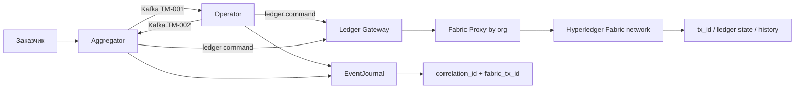

<!-- doc-meta: status=active version=1.0 updated=2026-06-28 audience=internal -->

# Интеграция умных контрактов Hyperledger Fabric в ТЭМ БАС

Документ фиксирует анализ и план развития Fabric-контуров для `sbd-drones-economics-ai`: архитектурную концепцию, фазы реализации, критерии готовности и приёмки, VUCA-протокол, учебный handoff, а также навыки и роли агентов, которые нужно добавить или усилить.

## 1. Контекст и вывод

Проект развивается в двух режимах:

| Режим | Смысл для Fabric |
|---|---|
| **ОП — обучающий проект** | Fabric нужен как учебный слой проверяемых межорганизационных фактов: сертификаты, прошивки, страхование, жизненный цикл заказа, связь с журналом событий и тестами. |
| **КТ — концепт технологии** | Fabric может стать контуром доказательности для сертификации, страхования, допуска и экономических расчётов, но только после стабилизации базовой интеграции. |

Главный вывод совместной проработки: **Fabric не должен блокировать phase 0 Kafka-интеграции**. На phase 0 критический путь остаётся `Aggregator -> Kafka -> Operator -> EventJournal` по `docs/integration/topic_map.yaml`. Fabric вводится как отдельный **доказательный ledger-слой**: сначала manual-only и контрактные тесты, затем асинхронная запись подтверждённых фактов, затем consortium E2E.

Причина: текущие риски проекта лежат в контрактах топиков, compose-профиле `integration-phase0`, T14 smoke и PR-E1. Если добавить Fabric в обязательный gate раньше стабилизации этих границ, проект получит второй нестабильный источник отказов и soft-green CI.

## 2. Использованные источники и вклад агентов

Источники репозитория:

| Источник | Что учтено |
|---|---|
| `docs/concept.md` | Разделение на концепт технологии и обучающий проект. |
| `docs/ai_dev_tasks.md` | Phase 0, PR-E1/PR-E3, T1-T17, агентная модель, VUCA, CI/E2E риски. |
| `docs/ai_agents_improvements.md` | Пробелы навыков: contract governance, broker E2E, repo hygiene, ЗУН агентов. |
| `docs/smart_contracts.md` | Текущий Fabric Ledger Integration, `Ledger Gateway`, `Fabric Proxy`, контракты и `dummy_fabric` E2E. |
| `docs/integration/topic_map.yaml` | Источник истины Kafka-контрактов для phase 0. |
| `docs/integration/adr/ADR-001-kafka-aggregator-operator.md` | Kafka как транспорт phase 0 между Aggregator и Operator. |
| `docs/integration/adr/ADR-002-broker-agnostic-platform.md` | Цель broker-agnostic платформы после phase 0. |
| `docs/integration/adr/ADR-003-integration-phase0-compose.md` | Минимальный compose-профиль для T14 smoke. |
| `docs/integration_process/phase0_systems_analysis.md` | Разрывы между Aggregator, Operator, Insurer, НУС, Дронопортом и ОрВД. |
| `docs/systems-security-analysis.md` | Активы, угрозы и цели безопасности для Регулятора, Эксплуатанта, ОрВД, Страховой и БАС. |
| `config/agent_skill_registry.json` | Текущая маршрутизация агентов и skills. |

Подключённые роли:

| Роль | Ключевой вклад |
|---|---|
| Архитектор C4 | Fabric как доказательный слой, ADR-004..009, граница с Kafka/EventJournal, фазовая архитектура. |
| Преподаватель / методист | Учебные результаты, лабораторные, рубрики, навыки и новые агенты. |
| Системный инженер СКИБ | Границы доверенной базы, traceability harm -> asset -> chaincode event -> test, security assumptions. |
| PM / CCPM | WBS, критический путь, буферы, контрольное решение PR-E3. |
| QA / SDET | Тестовая стратегия, skip/flake policy, доказательные артефакты, negative tests. |

Термин **СКИБ** далее используется как: **система с конструктивной информационной безопасностью (в терминах ГОСТ Р 72118-2025)**.

## 3. VUCA-протокол работы

Для этой задачи применён `skill_vuca_decision_protocol`:

```text
observe -> classify -> decide -> act -> verify -> record
```

| VUCA-фактор | Проявление в задаче | Управляющее решение |
|---|---|---|
| Volatility / изменчивость | Меняются ветки, phase 0 contracts, CI-gates, compose и статус Fabric E2E. | Не включать Fabric в blocking gate PR-E1; вести PR-E3 отдельно. |
| Uncertainty / неопределённость | Неясно, Fabric является audit ledger или authoritative registry. | Зафиксировать ADR-004 и вынести решение о доверенной границе на `human_review`. |
| Complexity / сложность | Fabric добавляет MSP, peers, orderer, endorsement policy, proxy, gateway, Kafka/EventJournal. | Разделить слои: broker contract, EventJournal, Fabric ledger, CI profile, учебные labs. |
| Ambiguity / двусмысленность | «Неизменяемый журнал» могут трактовать как «истинный журнал». | Разделить целостность записи и истинность входных данных; писать только подтверждённые факты и ссылки/хэши. |

Уровень автономности для агентов: **L3 mission-oriented** в рамках анализа и обратимых документальных изменений. Эскалации: ADR, topic map, CI gate, security assumptions, release/acceptance, privacy и решения о доверенной границе.

## 4. Целевая архитектура

### 4.1. Роль Fabric

Fabric должен фиксировать **подтверждённые долгоживущие факты**, а не заменять брокер сообщений или операционный журнал.

| Слой | Ответственность | Источник истины |
|---|---|---|
| Kafka / MQTT / broker SDK | Команды, события интеграции, ack/status между системами. | `docs/integration/topic_map.yaml`, schemas, broker tests. |
| EventJournal | Быстрый операционный журнал, correlation id, события работы компонентов. | EventJournal database / logs. |
| Fabric Ledger | Неотрекаемость, межорганизационные подтверждённые факты, tx ids, evidence для споров. | Chaincode state + transaction history. |
| Analytics / ТЭМ | Расчёты, метрики, агрегированная экономика эксплуатации. | Off-chain хранилища и отчёты. |

Fabric **не должен** использоваться как runtime policy enforcer для команд с жёсткими задержками: аварийная посадка, геозоны, предотвращение столкновений, команды управления БАС. Он может фиксировать факт решения и ссылку на доказательство, но не заменяет механизмы полётной безопасности.

### 4.2. Контейнерное представление



### 4.3. Chaincode-домены

| Домен | Статус | Решение |
|---|---|---|
| `DronePropertiesContract` | P1 | Оставить: паспорт БАС, типовой сертификат, связь с firmware. |
| `FirmwareContract` | P1 | Оставить: сертификация, отзыв, связь с целями безопасности. |
| `InsuranceRecord` | P1/P2 | Оставить: страховая запись и статус допуска. |
| `OrderContract` | P1/P2 | На P1 сузить до контрольных состояний; на P2 расширить жизненный цикл. |
| `FlightPermission` | P2 | Отложить до стабилизации ОрВД/stub и согласования методов. |
| `DistributeFunds` | P2/P3 | Оставить как demo или advanced track до отдельной финансовой модели. |
| `RestrictionViolation` / `CheckZoneConflict` | P2/P3 | Отложить: сейчас высокая доменная неопределённость. |
| `Delete*` методы | Пересмотреть | Для ledger предпочтительны `revoke`, `supersede`, `expire`, а не удаление. |

### 4.4. Несостыковки текущего `docs/smart_contracts.md`

Текущий документ полезен как стартовая точка, но требует ревизии контрактов:

| Наблюдение | Риск | Действие |
|---|---|---|
| В E2E-сценарии есть `IssueTypeCertificate`, `RequestFlightPermission`, `ApproveFlightPermission`, но в основной таблице контрактов они не полностью описаны. | Тесты и документация расходятся. | В Phase F1 свести методы, роли, args, события и tests в единую матрицу. |
| `DistributeFunds` описан как часть заказа. | Ложная точность финансовой модели. | Отнести к P2/P3 или demo-only до human_review. |
| Fabric запускается до `make docker-up` и зависит от `fabric-network/`. | Тяжёлый и flaky CI. | На PR-E3 сначала manual-only / workflow_dispatch, затем nightly. |
| `ENABLE_FABRIC=true` описан как флаг включения. | Неясно, включается ли обязательная dual-write семантика. | Ввести отдельные режимы: `manual`, `ledger_explicit`, `dual_write`. |

Рабочие follow-up артефакты уже вынесены отдельно:

- [`integration/fabric_traceability_matrix.md`](integration/fabric_traceability_matrix.md) — матрица requirement -> method -> event -> test -> evidence;
- [`integration/issues/ISSUE-PR-E3-fabric-e2e-mode.md`](integration/issues/ISSUE-PR-E3-fabric-e2e-mode.md) — checklist для решения PR-E3;
- [`integration/fabric_agent_task_packages.md`](integration/fabric_agent_task_packages.md) — issue-scoped пакеты для Fabric-агентов;
- [`lab_works/fabric_contract_review_lab.md`](lab_works/fabric_contract_review_lab.md) — учебная лабораторная ревизии Fabric-контрактов.

## 5. Решения ADR

| ADR | Решение | Когда нужно |
|---|---|---|
| ADR-004 `fabric-ledger-scope` | Fabric не заменяет Kafka/EventJournal; хранит подтверждённые факты и evidence. | До F1. |
| ADR-005 `ledger-event-correlation` | Единые `correlation_id`, `event_id`, `order_id`, `fabric_tx_id`, связь EventJournal ↔ Fabric. | До F2. |
| ADR-006 `fabric-org-and-msp-model` | Утвердить MSP: Aggregator, Operator, Insurer, CertCenter, Orvd; Manufacturer/Regulator позже. | До F2/F3. |
| ADR-007 `chaincode-domain-boundaries` | Разделить asset/certification/order/evidence; не писать телеметрию целиком. | До F2. |
| ADR-008 `fabric-ci-mode` | PR-E3: manual-only, nightly или blocking; skip/xfail policy. | До F4/F5. |
| ADR-009 `ledger-data-privacy` | On-chain только статусы, хэши, ссылки и минимальные поля; sensitive data off-chain. | До P2. |

Созданные ADR-кандидаты: [`ADR-004`](integration/adr/ADR-004-fabric-ledger-scope.md), [`ADR-005`](integration/adr/ADR-005-ledger-event-correlation.md), [`ADR-006`](integration/adr/ADR-006-fabric-org-and-msp-model.md), [`ADR-007`](integration/adr/ADR-007-chaincode-domain-boundaries.md), [`ADR-008`](integration/adr/ADR-008-fabric-ci-mode.md), [`ADR-009`](integration/adr/ADR-009-ledger-data-privacy.md). Все они требуют `human_review` перед применением как обязательных архитектурных решений.

## 6. Draft ЦБ/ПБ и доверенная граница

### 6.1. Что усиливает Fabric

| Цель / актив | Как помогает Fabric | Ограничение |
|---|---|---|
| Реестр сертификатов Регулятора | Неизменяемая история выдачи, отзыва и статуса. | Fabric не заменяет процесс проверки и подпись Регулятора. |
| Прошивка БАС | История сертификации firmware и связь с целями безопасности. | Истинность анализа firmware доказывается вне ledger. |
| Страховая запись | Неотрекаемость статуса страхования и решения страховщика. | Модель риска и персональные данные не должны попадать on-chain без review. |
| Заказ и выполнение | Контрольные состояния заказа и финальное evidence. | Операционная телеметрия остаётся off-chain. |
| Журнал расследования | `fabric_tx_id` связывает решение, событие и тестовый артефакт. | Ledger фиксирует запись, но не делает ложные входные данные истинными. |

### 6.2. Draft ЦБ/ПБ

| ID | Тип | Формулировка | Владелец | Проверка | Статус |
|---|---|---|---|---|---|
| ЦБ-FAB-1 | ЦБ | Подтверждённые записи сертификатов, firmware и паспорта БАС не могут быть незаметно подменены. | SE + `ledger-privacy-reviewer` | Negative role tests, read-after-write, tx history | draft |
| ЦБ-FAB-2 | ЦБ | Спорное состояние заказа трассируется до `correlation_id`, `fabric_tx_id`, события EventJournal и теста. | QA/SDET + Architect | `fabric_traceability_matrix.md`, JUnit/log evidence | draft |
| ЦБ-FAB-3 | ЦБ | Отказ Fabric не нарушает аварийные функции БАС и phase 0 broker-функции. | SE + DevOps | `RUN_FABRIC_E2E` policy, phase0 smoke без Fabric | draft |
| ПБ-FAB-1 | ПБ | Fabric MSP, CA, endorsement policy и orderer управляются защищённо и имеют владельцев. | Architect + DevOps | ADR-006, role matrix, owner review | draft |
| ПБ-FAB-2 | ПБ | Chaincode проходит review, unit/integration/E2E tests и анализ зависимостей. | `fabric-chaincode-engineer` + QA | Contract matrix, negative tests | draft |
| ПБ-FAB-3 | ПБ | Данные перед записью в ledger проверяются доверенным компонентом. | SE + component owner | Traceability row, input validation tests | draft |
| ПБ-FAB-4 | ПБ | Недоступность Fabric не является причиной отказа аварийных и phase 0 функций. | DevOps + QA | Failure injection / manual defer policy | draft |
| ПБ-FAB-5 | ПБ | On-chain не записываются чувствительные данные без privacy review. | `ledger-privacy-reviewer` | ADR-009, data classification | draft |
| ПБ-FAB-6 | ПБ | Sensitive data хранится off-chain, как hash/reference или private data только после review. | Privacy + owner ОП | Privacy checklist | draft |

### 6.3. Security assumptions

| ID | Предположение |
|---|---|
| ПБ-FAB-1 | Fabric MSP, CA, endorsement policy и orderer управляются защищённо и имеют назначенных владельцев. |
| ПБ-FAB-2 | Chaincode проходит review, unit/integration/E2E tests и анализ зависимостей. |
| ПБ-FAB-3 | Данные перед записью в ledger проверяются доверенным компонентом; Fabric не валидирует физическую истинность телеметрии. |
| ПБ-FAB-4 | Недоступность Fabric не нарушает аварийные функции управления БАС и полётной безопасности. |
| ПБ-FAB-5 | On-chain не записываются персональные, коммерчески чувствительные и секретные данные без privacy review. |
| ПБ-FAB-6 | Для sensitive data используются off-chain ссылки, хэши или private data collections с явными endorsement policies. |

### 6.4. Доверенная граница

По умолчанию Fabric предлагается как **D1/D2 evidence component**, а не D0/TCB. Включение `Ledger Gateway`, `Fabric Proxy`, peers/orderer или chaincode в доверенную базу конкретной цели безопасности требует отдельного `human_review` и тестовой базы.

| Компонент | Default trust level | Когда входит в TCB | Evidence before promotion |
|---|---|---|---|
| `Ledger Gateway` | D1/D2 evidence | Только если ЦБ требует доверенной нормализации ledger-команд | Unit/mock tests, malformed response tests, timeout policy |
| `Fabric Proxy` | D1/D2 evidence | Только если MSP context и подпись транзакции входят в ЦБ | Health, wrong MSP tests, TLS/crypto review |
| peers/orderer | D1/D2 evidence | Только если ledger state объявлен authoritative registry | Endorsement policy, lifecycle review, ops owner |
| chaincode | D1/D2 evidence | Только для методов, где инвариант chaincode является частью ЦБ | Contract matrix, negative state tests, code review |
| EventJournal | D1 operational evidence | Если он становится обязательным доказательством конкретной ЦБ | Correlation tests, log integrity checks |
| Kafka/MQTT broker | Phase 0 integration boundary | Для ЦБ маршрутизации и доставки сообщений | Topic map, schema validation, phase0 smoke |

## 7. Traceability draft

| Harm / ущерб | ЦБ/ПБ | Asset | Policy/trusted component | Chaincode event / method | Test node id | Evidence owner | Status |
|---|---|---|---|---|---|---|---|
| Эксплуатация несертифицированного БАС | ЦБ-FAB-1 | Паспорт БАС, firmware status | `CertCenterMSP`, chaincode P1 | `DronePassIssued`, `FirmwareCertified`; `CreateDronePass`, `CertifyFirmware` | `test_certcenter_can_certify_firmware_and_create_drone_pass` | `fabric-chaincode-engineer` + QA | planned |
| Невозможность расследовать инцидент | ЦБ-FAB-2 | Журнал аудита | EventJournal + Fabric tx | `OrderStarted`, `OrderFinished`, `OrderFinalized` | `test_order_lifecycle_records_tx_ids` | `eventjournal-traceability-sdet` | planned |
| Страховое мошенничество | ЦБ-FAB-2 | Страховая запись | `InsurerMSP` | `InsuranceRecordCreated`, `OrderApprovedByInsurer` | `test_insurer_only_can_create_insurance_and_approve_order` | QA/SDET | planned |
| Фальсификация допуска к полёту | ПБ-FAB-3 | Разрешение ОрВД | `OrvdMSP`, P2 contract | `FlightPermissionRequested`, `FlightPermissionApproved` | `test_orvd_only_can_approve_flight_permission` | SE + QA | P2 planned |
| Финансовый спор | ECO-FAB, ADR-009 | Распределение средств | Off-chain model + optional ledger hash | `FundsDistributed` | `test_distribute_funds_demo_only_after_model_review` | economics owner + privacy reviewer | P2/P3 demo-only |
| Компрометация роли admin | ПБ-FAB-1 | MSP/attributes | MSP role policy | rejected privileged transaction | `test_wrong_msp_rejected_for_privileged_methods` | `fabric-chaincode-engineer` | planned |

## 7.1. Economic assumptions

| ID | Предположение |
|---|---|
| ECO-FAB-1 | Fabric не является платёжной системой; он фиксирует решение, распределение или evidence, но не выполняет расчёт и перечисление денег. |
| ECO-FAB-2 | Тариф, комиссии, страховая премия, доли участников и налоги считаются off-chain и имеют владельца модели. |
| ECO-FAB-3 | Недоступность Fabric не останавливает аварийные и операционные функции БАС. |
| ECO-FAB-4 | Full Fabric E2E до PR-E3 имеет статус manual/nightly; иначе стоимость CI и flaky-риск превышают пользу. |
| ECO-FAB-5 | On-chain пишутся только минимальные суммы/статусы/хэши/tx id; коммерческие условия и персональные данные остаются off-chain. |

`DistributeFunds` до отдельной финансовой модели имеет статус **demo-only / P2-P3**. Его нельзя трактовать как готовый механизм платежей или расчёта тарифа.

## 8. Фазы реализации с DoR, DoD и AC

Обозначения:

- **DoR** — Definition of Ready, критерии входа в работу.
- **DoD** — Definition of Done, критерии завершения инженерной работы.
- **AC** — Acceptance Criteria, критерии приёмки результата.

### F0. Базовый контур phase 0 без Fabric

Цель: не смешивать нерешённые Kafka/topic map разрывы с Fabric.

| DoR | DoD | AC |
|---|---|---|
| ADR-001/002/003 приняты; `docs/integration/topic_map.yaml` v0.2; T14 skeleton определён. | `Aggregator -> Kafka -> Operator` работает в минимальном smoke; Fabric явно отмечен как separate/manual track. | `make phase0-smoke` или эквивалентный T14 проходит без mandatory skip; Fabric не нужен для зелёного phase 0. |

Шаги:

1. Подтвердить `TM-001/TM-002` и env overrides для Operator.
2. Уточнить T14 smoke и обязательность отсутствия mandatory skip.
3. Зафиксировать, что PR-E1 не блокируется Fabric.
4. В `docs/smart_contracts.md` добавить предупреждение о separate ledger track.

### F1. Базовая спецификация ledger-контрактов

Цель: превратить `docs/smart_contracts.md` из инструкции запуска в спецификацию контрактов.

| DoR | DoD | AC |
|---|---|---|
| ADR-004 draft; список chaincode-доменов; выбран P1 scope. | Таблица методов содержит role/MSP, invoke/query, args, errors, events, tests, status. | Архитектор и SE подтверждают: нет расхождения между E2E 14 steps и таблицей методов. |

Шаги:

1. Свести `DronePropertiesContract`, `FirmwareContract`, `OrderContract` в единую contract matrix.
2. Указать для каждого метода: caller MSP, endorsement expectation, args, output, error codes.
3. Разделить P1/P2/P3 методы.
4. Убрать или пометить методы, которых нет в chaincode или тестах.
5. Добавить раздел `ledger_events` как кандидат расширения `topic_map.yaml`, но не менять источник истины без review.

### F2. Chaincode hardening

Цель: сделать chaincode проверяемым, а не CRUD-демонстрацией.

| DoR | DoD | AC |
|---|---|---|
| F1 approved; ADR-006/007 draft; роли MSP согласованы. | Unit/contract tests покрывают P1 методы, роли и недопустимые переходы. | Wrong MSP, duplicate invoke, invalid status, missing entity и replay/idempotency проходят как negative tests. |

Шаги:

1. Пересмотреть `Delete*` в пользу `revoke/supersede/expire`.
2. Добавить/уточнить state machine заказа.
3. Проверить role/MSP для `Aggregator`, `Operator`, `Insurer`, `CertCenter`, `Orvd`.
4. Добавить idempotency key или правило duplicate handling.
5. Проверить endorsement policy и private data needs.

### F3. Fabric infra и gateway

Цель: добиться воспроизводимого запуска Fabric без включения в каждый push.

| DoR | DoD | AC |
|---|---|---|
| Fabric network documented; ports/env known; ADR-008 draft. | `fabric-network`, 5 proxies и `Ledger Gateway` поднимаются документированной командой. | `/health` каждого proxy green; `ListDronePasses` и один invoke/query smoke проходят с уникальным run id. |

Шаги:

1. Разделить профили: `fabric-unit`, `fabric-smoke`, `fabric-full`.
2. Уточнить переменные `FABRIC_PROXY_*`, crypto paths, channel, chaincode.
3. Добавить bounded polling readiness вместо фиксированных ожиданий.
4. Сохранять logs proxy/peer/orderer и версии Fabric images.
5. Проверить локальную изоляцию портов, если сервисы публикуются на host.

### F4. System integration и EventJournal correlation

Цель: связать бизнес-события, Fabric transaction ids и журнал событий.

| DoR | DoD | AC |
|---|---|---|
| ADR-005 approved; выбран режим `ledger_explicit` или `dual_write`; EventJournal schema уточнена. | После Fabric invoke EventJournal содержит `correlation_id`, `event_id`, `fabric_tx_id`, method, status. | Read-after-write подтверждает ledger state; EventJournal excerpt совпадает с order/drone/policy ids. |

Рекомендуемые режимы:

| Режим | Назначение |
|---|---|
| `manual` | Ручной или workflow_dispatch прогон `dummy_fabric`; не влияет на основной сценарий. |
| `ledger_explicit` | Компонент явно вызывает `components.ledger` для учебных или тестовых операций. |
| `dual_write` | Бизнес-событие автоматически пишет в EventJournal и Fabric; включать только после F4. |

Шаги:

1. Ввести единый envelope: `correlation_id`, `event_id`, `source`, `schema_version`, `domain_id`, `fabric_tx_id`, `status`, `error_code`.
2. Добавить `ledger.tx.committed` и `ledger.tx.failed` события.
3. Проверить, что отказ Fabric не маскируется как бизнес-успех.
4. Добавить bounded retry/timeout и классификацию ошибок.
5. Уточнить, что Fabric failure не ломает phase 0 Kafka smoke, если ledger не входит в scope теста.

### F5. QA, CI и PR-E3 decision

Цель: зафиксировать, когда Fabric E2E является manual-only, nightly или blocking.

| DoR | DoD | AC |
|---|---|---|
| F3/F4 smoke воспроизводим; есть evidence checklist; ADR-008 ready. | PR-E3 принимает решение: manual-only сейчас или CI job; skip/xfail policy зафиксирована. | Если `RUN_FABRIC_E2E=1`, недоступный Fabric = hard fail; без флага skip разрешён только для manual profile. |

Рекомендуемый split:

| Контур | Запуск | Что проверяет |
|---|---|---|
| Fast CI | Каждый push | Unit chaincode/gateway mapping, mock proxy, schema validation. |
| Nightly / scheduled | По расписанию | Proxy health + минимальный Fabric smoke. |
| Manual / workflow_dispatch | Перед release или учебной демонстрацией | Full `dummy_fabric` 14-step E2E и dual-write E2E. |
| Blocking release gate | Только если менялись smart contracts, proxy, gateway, MSP mapping или ledger schema. | Full Fabric E2E без mandatory skip. |

### F6. Учебный handoff и агентная эксплуатация

Цель: сделать Fabric-модуль воспроизводимым для преподавателя и студентов.

| DoR | DoD | AC |
|---|---|---|
| F5 decision есть; базовый workflow выбран; labs scope согласован. | Подготовлены лабораторные, rubrics, troubleshooting, demo evidence и матрица ЗУН. | Преподаватель воспроизводит запуск; студент объясняет, почему факт хранится в Fabric, EventJournal или broker. |

Учебные модули:

| Модуль | Артефакт |
|---|---|
| Fabric onboarding | Smoke report + схема `Component -> Gateway -> Proxy -> Peer`. |
| Chaincode basics | Метод контракта, проверка роли, unit test. |
| Order lifecycle | State machine + negative test на недопустимый переход. |
| EventJournal traceability | Таблица requirement -> contract -> topic -> journal -> test. |
| Broker contracts | Topic map + schema validation + incompatible payload test. |
| Integrated E2E | E2E log, tx ids, EventJournal excerpt, финальный `ReadOrder`. |

## 9. CCPM-план и критический путь

| ID | Фаза | Длительность, раб. дни | Предшественники | Evidence |
|---|---:|---:|---|---|
| A | F0 базовый контур phase 0 | 5 | — | PR-E1/T14 gate report. |
| B | F1 базовая спецификация ledger-контрактов | 3 | A частично | Approved contract matrix. |
| C | F2 chaincode hardening | 6 | B | Unit + role negative tests. |
| D | F3 Fabric infra + gateway | 5 | B | Proxy health + query smoke. |
| E | F4 system integration | 5 | C, D | EventJournal + tx id evidence. |
| F | F5 PR-E3 CI/manual decision | 3 | E | ADR-008 + job/manual gate. |
| G | F6 учебный handoff | 3 | F | Labs + runbook + rubrics. |

Критический путь: **A -> B -> C -> E -> F -> G**, ориентир 25 рабочих дней.

Буферы:

| Буфер | Размер | Назначение |
|---|---:|---|
| Project buffer | 6 дней | Fabric/network instability и повторные прогоны. |
| Feeding buffer D -> E | 2 дня | Задержки proxy/crypto/ports перед интеграцией. |
| Resource buffer | 1 день | Доступность Fabric dev / DevOps / QA. |
| Evidence buffer | 2 дня | Сбор логов, tx ids, JUnit, screenshots/console excerpts без секретов. |

## 10. QA/SDET стратегия

### 10.1. Уровни тестов

| Уровень | Что проверяет | Gate |
|---|---|---|
| Unit chaincode / mapping | Методы, args, role mapping, invoke/query routing, ошибки. | Fast CI. |
| Mock proxy integration | `Ledger Gateway`, timeout, malformed response, error envelope. | Fast CI. |
| Fabric proxy integration | `/health`, smoke invoke/query, TLS/crypto readiness. | Nightly/manual. |
| `dummy_fabric` E2E | 14-step workflow по организациям MSP. | Manual/workflow_dispatch, затем nightly. |
| Full dual-write E2E | Бизнес-события отражаются в Fabric и EventJournal. | Release gate при изменении ledger scope. |

### 10.2. Mandatory negative tests

| Группа | Примеры |
|---|---|
| Role/MSP | `Aggregator` не сертифицирует firmware; `Operator` не approving order; `Insurer` не стартует заказ. |
| State machine | `StartOrder` до `ConfirmOrder`; `FinalizeOrder` до `FinishOrder`; повторный finalize. |
| Data validation | Пустой `id`, отрицательные суммы, неверный `status`, невалидный JSON в `details`. |
| Idempotency/conflict | Повторный `CreateDronePass`; конфликтующая страховая запись. |
| Transport/security | Недоступный proxy, timeout peer, неверный channel/chaincode, broken TLS/crypto path. |
| Gateway contract | Unknown action, missing payload, args не массив, method без `ContractName:MethodName`. |

### 10.3. Skip/flake policy

- `skip` допустим только для manual/full E2E, если внешний Fabric-стенд явно не поднят.
- В Fabric smoke недоступность обязательного proxy = fail, а не skip.
- `xfail` допустим только с issue/причиной, владельцем и датой пересмотра.
- При `RUN_FABRIC_E2E=1` недоступность Fabric считается hard fail.
- Любая нестабильность классифицируется: infra, product, contract, test bug, scope, external.
- Fixed `sleep` заменять на bounded polling с диагностикой последнего observed response.

### 10.4. Пакет доказательств

Минимальный пакет доказательств:

- pytest JUnit/XML или полный console log;
- список passed/failed/skipped node ids;
- transaction ids по каждому invoke;
- финальные query snapshots: `ReadDronePass`, `ReadInsuranceRecord`, `ReadOrder`;
- logs `fabric-proxy-*`, peer/orderer, `Ledger Gateway`;
- compose/env snapshot без секретов;
- версии Fabric image, channel, chaincode;
- traceability: requirement -> contract method -> test node id -> evidence file.

### 10.5. Test matrix

| Уровень | Planned test id / файл | Fixture/profile | Env flag | Gate | Required evidence |
|---|---|---|---|---|---|
| Unit mapping | `test_fabric_contract_mapping_unit` | mock gateway | none | `fabric-fast` | JUnit, method/args matrix |
| Mock proxy | `test_ledger_gateway_handles_proxy_errors` | fake HTTP proxy | none | `fabric-fast` | JUnit, error envelope cases |
| Fabric smoke | `test_fabric_proxy_health_and_query` | Fabric proxy + network | `RUN_FABRIC_SMOKE=1` | nightly/manual | health logs, query snapshot |
| Full `dummy_fabric` | `test_dummy_fabric_full_order_workflow` | Fabric network + 5 proxies | `RUN_FABRIC_E2E=1` | manual/full | tx ids, final `ReadOrder`, logs |
| Dual-write | `test_business_event_writes_eventjournal_and_ledger` | business stack + ledger | `ENABLE_FABRIC_LEDGER=true` | release candidate | EventJournal excerpt + tx ids |
| Negative MSP | `test_wrong_msp_rejected_for_privileged_methods` | mock/Fabric | per mode | fast/full | rejected transaction evidence |

### 10.6. Skip/xfail registry format

| Поле | Обязательное значение |
|---|---|
| `node_id` | pytest node id или planned id |
| `mode` | `fabric-fast`, `fabric-smoke`, `fabric-full`, `dual-write` |
| `status` | `skip`, `xfail`, `hard_fail`, `manual_defer` |
| `reason` | infra, product, contract, test bug, scope, external |
| `owner` | роль или человек-владелец |
| `review_date` | дата пересмотра |
| `remove_condition` | условие снятия skip/xfail |

Правило: при `RUN_FABRIC_E2E=1` недоступный Fabric/proxy/orderer и mandatory skip считаются hard fail.

### 10.7. CI/manual split acceptance

| Mode | Acceptance |
|---|---|
| `fabric-fast` | Не требует Fabric-сети, не имеет runtime skip, ловит method/args/schema regressions. |
| `fabric-smoke` | Имеет bounded readiness, proxy health, один invoke/query и cleanup. |
| `fabric-full` | Сохраняет evidence bundle, tx ids, final query и список skipped/xfail. |
| `release-blocking` | Включается только для изменений chaincode/proxy/gateway/MSP/ledger schema после `human_review`. |

## 11. Навыки, которые нужно добавить или усилить

### 11.1. Новые skills

| Skill | Назначение | Основные выходы |
|---|---|---|
| `skill_fabric_chaincode_contracts` | Chaincode, MSP roles, endorsement policy, lifecycle, private data, state machine. | Contract matrix, role matrix, chaincode test plan. |
| `skill_ledger_eventjournal_traceability` | Связь Fabric tx, EventJournal, broker event, pytest evidence. | Traceability table, event envelope, пакет доказательств. |
| `skill_fabric_e2e_sdet` | Fabric smoke/full E2E, negative tests, flake classification. | Test pyramid, skip policy, JUnit/log artifacts. |
| `skill_fabric_devops_cicd` | Fabric network, proxy health, ports/env, manual/nightly/blocking profiles. | CI mode ADR, runbook, readiness checks. |
| `skill_contract_lab_design` | Лабораторные по умным контрактам, scaffolds, rubrics, troubleshooting. | Lab cards, assessment rubrics, instructor notes. |
| `skill_ledger_privacy_review` | On-chain/off-chain граница, private data collections, secrets/PII checks. | Privacy checklist, data classification, allowed fields. |

### 11.2. Усилить существующие skills

| Skill | Что добавить |
|---|---|
| `skill_integration_phase0_contracts` | Fabric как отдельный ledger boundary; PR-E3; связь topic map -> ledger events без блокировки T14. |
| `skill_sdet_broker_e2e` | Проверки `fabric_tx_id`, `ledger.tx.committed`, bounded polling Fabric proxy. |
| `skill_devops_broker_cicd` | Fabric network startup, proxy health, env profiles, cleanup, ports isolation. |
| `skill_agent_zun_development` | Maturity levels для chaincode review, ledger traceability и Fabric labs. |
| `skill_repo_hygiene_release_gate` | Проверки generated crypto material, private keys, connection profiles, secrets и больших ledger artifacts. |
| `skill_vuca_decision_protocol` | Примеры Fabric-specific pivot rules: manual-only, nightly, rollback to mock proxy, evidence-first. |
| `skill_systems_engineer_sbd` | Trusted-boundary decisions: Fabric как evidence component vs TCB. |
| `skill_software_architecture_c4` | C4/DFD patterns для Fabric Proxy, Ledger Gateway, EventJournal correlation. |

### 11.3. ЗУН агентов

| Компетенция | Текущий уровень | Целевой уровень | Evidence |
|---|---|---|---|
| Fabric MSP и роли организаций | L0-L1 | L3 apply/review | Role matrix + wrong-MSP tests. |
| Chaincode state machine | L1 | L3 | State transition table + negative tests. |
| Ledger/EventJournal traceability | L1 | L3 | Requirement -> tx_id -> EventJournal -> pytest evidence. |
| Fabric CI/manual split | L1 | L2-L3 | ADR-008 + runbook + smoke logs. |
| Privacy on-chain/off-chain | L0-L1 | L2 | Data classification + privacy review checklist. |
| Учебный handoff Fabric | L1 | L3 | Labs, rubrics, instructor troubleshooting. |

## 12. Новые роли и агенты

| Агент | Зона ответственности | Когда подключать |
|---|---|---|
| `fabric-chaincode-engineer` | Chaincode, state machine, unit tests, MSP role checks. | F1-F2. |
| `ledger-integration-architect` | Граница Fabric Proxy / Ledger Gateway / broker / EventJournal. | F1-F4. |
| `fabric-devops-cicd-steward` | Fabric network, ports/env, proxy health, CI/manual/nightly profiles. | F3-F5. |
| `eventjournal-traceability-sdet` | Evidence chain: broker event -> EventJournal -> Fabric tx -> pytest. | F4-F5. |
| `fabric-lab-instructor` | Лабораторные, scaffolds, troubleshooting, rubrics. | F6 и учебные потоки. |
| `ledger-privacy-reviewer` | On-chain/off-chain, private data, secrets, PII, generated crypto. | F1-F6, перед release. |
| `broker-contract-steward` | Topic map, schema evolution, correlation ids, backward compatibility. | Уже нужен для phase 0; усилить Fabric ledger events. |
| `contract-security-reviewer` | MSP, недопустимые переходы, replay/idempotency, endorsement policy. | Перед F2/F5 acceptance. |

Рекомендация по агентной модели: не создавать постоянный большой штат Fabric-агентов сразу. Для F1-F3 достаточно issue-scoped агентов `fabric-chaincode-engineer`, `fabric-devops-cicd-steward`, `eventjournal-traceability-sdet`; после стабилизации учебного трека добавить `fabric-lab-instructor`.

## 13. Human review

Решения, которые требуют человека:

| Решение | Владелец |
|---|---|
| Fabric является audit/evidence ledger или authoritative registry. | Владелец ОП + архитектор + SE. |
| Входит ли Fabric Proxy / Ledger Gateway / peer/orderer/chaincode в TCB конкретной ЦБ. | SE + security reviewer. |
| Какие MSP являются каноническими для первого релиза. | Архитектор + владелец домена. |
| Какие поля допустимо писать on-chain. | Privacy/security review + владелец ОП. |
| Статус PR-E3: manual-only, nightly или blocking gate. | Владелец ОП + DevOps + QA. |
| Юридическая трактовка ledger-записей для страхования и сертификации. | Владелец проекта + профильный эксперт. |
| Fabric в ОП: обязательный модуль или продвинутый трек. | Преподаватель / методист. |

Моя рекомендация: **для ближайшего цикла Fabric = evidence ledger first, manual-only/full E2E first, CI blocking later**.

## 14. Ближайшие действия

| Приоритет | Действие | Владелец-агент | Evidence |
|---|---|---|---|
| P0 | Оформить ADR-004 `fabric-ledger-scope`. | `ledger-integration-architect` + SE | ADR accepted by human_review. |
| P0 | Сверить `docs/smart_contracts.md`: методы, роли, args, E2E 14 steps. | `fabric-chaincode-engineer` + QA | Contract matrix v0.1. |
| P0 | Зафиксировать PR-E3 как manual-only на первом шаге или принять план nightly. | PM + DevOps + QA | ADR-008 / decision log. |
| P1 | Добавить traceability matrix для Fabric: requirement -> method -> event -> test. | `eventjournal-traceability-sdet` | `traceability_ledger.yaml` или раздел в docs. |
| P1 | Подготовить unit/mock tests для mapping и ошибок gateway. | QA/SDET | Fast CI test report. |
| P1 | Подготовить учебную лабораторную ревизии Fabric-контрактов. | `fabric-lab-instructor` | Lab card + rubric. |
| P2 | Разработать dual-write режим только после F4 readiness. | Operator/Fabric coding agents | E2E evidence with tx ids. |

## 15. Критерий готовности документа к следующему шагу

Документ считается достаточным для старта F1, если:

- владелец ОП принимает принцип «Fabric не блокирует phase 0»;
- архитектор подтверждает ADR-004/005/008 как ближайшие решения;
- QA принимает skip/flake policy;
- преподаватель выбирает Fabric как обязательный или продвинутый модуль;
- создана отдельная задача на ревизию контрактов `docs/smart_contracts.md`.
