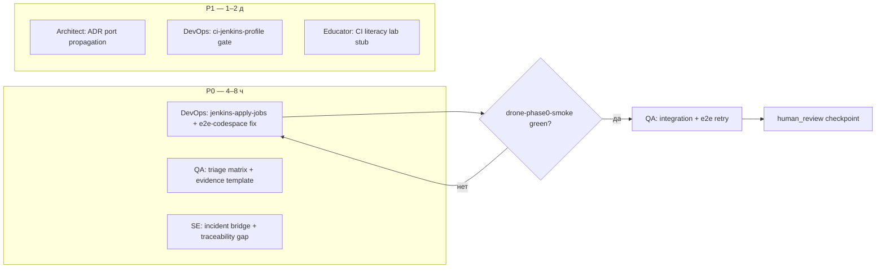

<!-- doc-meta: status=active version=1.0 updated=2026-06-28 audience=internal -->

# Совместный план восстановления Jenkins CI/CD и развития агентов

Документ фиксирует **совместную** (DevOps, QA/SDET, методист, архитектор, системный инженер СКИБ, оркестратор) стратегию восстановления Jenkins-пайплайнов репозитория `sbd-drones-economics` после массового отказа CI, введённого недавними изменениями: профили `e2e_ports.local` / `e2e_ports.jenkins`, `make jenkins-apply-jobs`, job `drone-phase0-smoke`, поддержка `E2E_RUN_MODE` в `prepare_multi.py`.

**Контекст:** локально `make ports-check` и `make ci-config-check` проходят. **Подтверждённый RCA (2026-06-28):** все `drone-*` job падали на SCM checkout — `GIT_BRANCH=feature/Jenkins` в `ci/jenkins/.env` при отсутствии ветки на GitFlic (только `master`); volume `jenkins_jenkins_home` смешивал job платформы (`tem-*`) с drones. Исправления: `GIT_BRANCH=master`, volume `drones_jenkins_home`, `make jenkins-preflight`. Следующий класс отказов: субмодули (например `systems/Agregator` — commit не на remote).

**Связанные репозитории:**

| Репозиторий | Роль |
|---|---|
| `sbd-drones-economics` | Operator, phase 0, полигон, агенты, учебный контур |
| `sbd-open-platform-and-trainings-development` | Канон CI-политик, skills, agent-work-orchestration |

---

## Участники и их перспективы

### 1. DevOps / CI (`ci-marinet-steward`, `platform-ci-jenkins`, `skill_devops_broker_cicd`, `skill_fabric_devops_cicd`)

Инфраструктурный контур отвечает за **детерминированность** стенда: JCasC создаёт job, но **не подхватывает** новый `Jenkinsfile` без `make jenkins-apply-jobs`; volume `jenkins_home` сохраняет старое состояние UI. Профили портов разведены (`config/e2e_ports.local.env` ↔ `config/e2e_ports.jenkins.env`), однако таргет **`make e2e-codespace` не использует `E2E_ENV`**: readiness-циклы и дописывание `.env` жёстко привязаны к local-портам (`8081`, `8088`, `9092`), тогда как `Jenkinsfile.e2e` задаёт `E2E_RUN_MODE=jenkins` и jenkins-диапазон (`10801`, `19092`, …). Это **контрактный разрыв** между pipeline и Makefile — наиболее вероятная причина red `drone-e2e` даже при корректном `prepare_multi.py`.

Общие точки отказа всех job: checkout из **удалённого** `GIT_REPO_URL` (gitflic) при незапушенных локальных правках; `git submodule update --init --recursive`; отсутствие `docker.sock` / compose на агенте; коллизии портов при `disableConcurrentBuilds` = false на соседних job (частично снято для e2e/phase0-smoke).

**Приоритет DevOps в P0:** triage по матрице job × стадия; `make jenkins-apply-jobs`; выравнивание `e2e-codespace` с `e2e-up` по `E2E_RUN_MODE`; smoke одной job (`drone-phase0-smoke`) как канарейка.

### 2. QA / SDET (`qa-marinet-spec`, `skill_sdet_broker_e2e`, `skill_integration_phase0_contracts`)

Тестовый контур различает **structural** gate (`make phase0-smoke`, `-k Structure`, без Docker) и **runtime** gate (`phase0-smoke-full`, `e2e-codespace`). Job `drone-phase0-smoke` должен быть самым устойчивым; если он red вместе с unit — ищем общую инфраструктуру (checkout, pipenv, submodule). Если green только phase0-smoke, а integration/e2e red — классификация **infra** (порты, compose) vs **product** (assertion, контракт топиков).

Известный риск **soft-green**: 29+ `pytest.skip` в `test_e2e_scenario.py` — CI может казаться «почти зелёным» при неполном пути. Политика E2E-2: mandatory шаги smoke — **pass или xfail с issue**, не skip на green gate. Evidence bundle для каждого red билда: JUnit, `e2e-logs.txt`, классификация flake/infra/product/scope.

**Приоритет QA в P0:** таблица «ожидаемый результат × фактический» по 6 job; зафиксировать failure taxonomy; не объявлять sprint complete без `make e2e-codespace` green или явного defer с owner.

### 3. Методист / преподаватель (`course-educator-platform`, `skill_course_educator_platform`)

Для потока ОП **красный CI — видимый сбой учебного стенда**: студенты и преподаватели видят «платформа не собирается», лабораторные phase 0 (чтение topic map, broker E2E) блокируются. Лаборатория «CI literacy» должна явно различать: structural green ≠ интеграция доказана.

**Рубрика ЗУН «грамотность CI» (черновик, L1→L3):**

| Критерий | L1 (наблюдение) | L2 (применение) | L3 (анализ) |
|---|---|---|---|
| Профили портов local/jenkins | знает, что порты разные | запускает `make ports-check` | объясняет, почему `127.0.0.1:8081` из Jenkins-контейнера неверен |
| Тип gate | различает unit / integration / smoke | интерпретирует skip vs fail | связывает red job с TR-PH0-* |
| Evidence | находит артеfact Jenkins | читает JUnit + compose logs | формулирует bug report с классификацией |

**Действия:** обновить demo-pack и лабораторную «Разбор CI-отказа»; не использовать green unit как доказательство phase 0 readiness в зачёте.

### 4. Архитектор C4 (`software-architect-c4`, `skill_software_architecture_c4`)

На **C2 Container** CI — контейнер `drones-jenkins` + host Docker daemon (`docker.sock`), генерируемый `.generated/e2e/docker-compose.yml`, брокер Kafka/MQTT, HTTP-фасады Aggregator/Regulator. Недавние изменения ввели **второй контракт портов** (local vs jenkins) без полного протягивания через `e2e-codespace` — нарушение deployment view: compose публикует `10801`, readiness ждёт `8081`.

**Разрывы контрактов:**

| Контракт | Ожидание | Наблюдаемый разрыв |
|---|---|---|
| `E2E_RUN_MODE` → compose | `prepare_multi.py` мержит `e2e_ports.{mode}.env` | `e2e-codespace` не экспортирует режим в preflight/wait |
| Jenkins → host services | `host.docker.internal:{jenkins_port}` | Makefile wait на `localhost:{local_port}` |
| topic_map v0.2 → smoke T14 | structural test читает map | runtime path Operator↔Kafka ещё xfail |
| ADR-003 integration-phase0 compose | профиль T10 | planned, не в текущем e2e-codespace |

**Действия P1:** ADR «CI port profile propagation»; C2-диаграмма «Jenkins agent ↔ host compose» в `docs/integration/`.

### 5. Системный инженер СКИБ (`systems-engineer-sbd`, `skill_select_pattern`, `skill_traceability`)

Массовый CI-fail — **инцидент V&V**: доказательная цепочка harm → ЦБ → тест → evidence обрывается на уровне инфраструктуры, не продукта. Маршрут шаблонов:

- **Ш4** (разбор инцидента) → **Ш7** (верификация) → **Ш8** (валидация readiness) → **Ш9** (уроки).
- Дополнительно **Ш3** (архитектура политики): политика «local ≠ jenkins порты» принята, но не верифицирована end-to-end в Makefile.

**Пробел V&V:** нет трассируемой связи «изменение e2e_ports → regression gate в CI → evidence в gate report». PR-E1 gate report фиксирует local green, Jenkins — нет.

**human_review:** владелец ОП + SE-SBD подтверждают, что восстановление CI закрывает TR-PH0-* structural gates, не подменяя runtime доказательством skip.

### 6. Оркестратор (`agent-work-orchestration`, sprint-autonomy policy)

Параллельные workstream без взаимной блокировки:



**APPLY gates:** coding-агенты **не** используют `gh`; координатор переводит issue In Progress до `APPLY=1`. Dry-run обязателен для новых skill routes. Sprint autonomy: при infra-red — pivot на structural gates, doc gates, flake taxonomy — **не** early exit ([sprint-autonomy-qa-devops.mdc](../.cursor/rules/sprint-autonomy-qa-devops.mdc)).

---

## A. Гипотезы системного отказа (по конфигурации)

| ID | Гипотеза | Затронутые job | Вероятность | Проверка |
|---|---|---|---|---|
| H1 | **`e2e-codespace` игнорирует jenkins-профиль портов** — wait/preflight на 8081/9092 при compose на 10801/19092 | `drone-e2e` | **Высокая** | `grep 8081 Makefile`; Jenkins build log «Agregator did not respond» |
| H2 | **JCasC не перезагружен** — job `drone-phase0-smoke` отсутствует или старый scriptPath | все новые job | Высокая | `make jenkins-jobs-verify` |
| H3 | **Remote checkout ≠ локальный master** — gitflic без последнего коммита CI | все | Средняя | сравнить SHA workspace vs `git log origin/master` |
| H4 | **Submodule init failure** (credentials, detached, gcs/orvd) | unit, integration, e2e, phase0 | Средняя | стадия Checkout в логе |
| H5 | **Коллизия портов** — local stack + jenkins stack на одном хосте | integration, e2e | Средняя | `make ports-check`; `e2e_preflight` без `E2E_ENV` |
| H6 | **Integration: `team1-regulator` / agrodron docker** — до фикса exclude | `drone-integration` | Средняя | лог `ci-integration-test` |
| H7 | **pipenv / Pipfile.lock** — cleanup stage удаляет lock, cold install flaky | unit, phase0-smoke | Низкая–средняя | стадия pipenv install |
| H8 | **Дублирование CI между `-economics` и `-ai`** — drift Makefile | зеркальные job | Низкая | diff Makefiles |
| H9 | **Soft-green маскирует product gaps** — не причина «все red», но мешает диагностике | e2e при partial pass | Контекст | подсчёт skip в JUnit |

---

## B. Поэтапный план исправлений

### P0 — немедленно (0–8 часов)

| # | Действие | Владелец | Критерий готовности |
|---|---|---|---|
| P0-1 | Triage: таблица 6 job × failing stage × log snippet | QA | документ triage в issue / комментарий |
| P0-2 | `make jenkins-ps` → `make jenkins-apply-jobs` → `make jenkins-jobs-verify` | DevOps | 6 job в UI |
| P0-3 | Канарейка: `make jenkins-build-phase0-smoke WAIT=1` | DevOps | SUCCESS или классифицированный fail |
| P0-4 | **Исправить `e2e-codespace`**: `$(E2E_ENV)`, переменные `${AGREGATOR_PORT}`, `${KAFKA_PORT}`, preflight с профилем; убрать hardcode `8081` | DevOps | `E2E_RUN_MODE=jenkins make e2e-codespace` green на хосте |
| P0-5 | Синхронизировать fix в **оба** репозитория | DevOps | идентичный фрагмент Makefile |
| P0-6 | Retry: unit → integration → e2e | QA | матрица результатов |
| P0-7 | Если H3: push CI commits на gitflic / обновить `GIT_BRANCH` | Координатор | remote SHA = local |

### P1 — структурно (1–3 дня)

| # | Действие | Владелец |
|---|---|---|
| P1-1 | ADR: «Распространение E2E_RUN_MODE через все e2e-* таргеты» | Architect |
| P1-2 | `make ci-jenkins-smoke`: эмуляция jenkins env без UI (ports + structural + dry compose validate) | DevOps |
| P1-3 | Jenkinsfile: stage «Config gate» → `make ci-config-check` перед e2e | DevOps |
| P1-4 | Единый `COMPOSE_PROJECT_NAME=${JOB_NAME}-${BUILD_NUMBER}` в e2e pipeline | DevOps |
| P1-5 | Policy E2E-2: audit skip в smoke; xfail с issue ID | QA |
| P1-6 | Обновить PR-E1 gate report секцией «Jenkins evidence» | SE-SBD |
| P1-7 | Traceability: TR-CI-001…003 (ports, jenkins-apply, e2e-profile) | SE-SBD |

### P2 — профилактика (1–2 недели)

| # | Действие | Владелец |
|---|---|---|
| P2-1 | GitHub Actions / nightly: `ci-config-check` + optional `drone-phase0-smoke` | DevOps |
| P2-2 | Skill `skill_ci_port_profile` (см. §C) + registry `jenkins_or_ci_change` | Orchestrator |
| P2-3 | Лаборатория «CI literacy» + рубрика L1–L3 | Course-educator |
| P2-4 | pre-commit / Makefile: `check_jenkinsfile_env_sync.py` — Jenkins env vs e2e_ports.jenkins.env | DevOps |
| P2-5 | Fabric track: явный manual-only gate (PR-E3), не блокирует phase 0 | DevOps + SE |

---

## C. Развитие агентов (upskilling)

### Обновить prompt / skill существующим агентам

| Агент | Skill | Что добавить |
|---|---|---|
| `ci-marinet-steward` | `platform-ci-jenkins` | § «Post-JCasC checklist»; обязательный `jenkins-apply-jobs` после casc.yaml; матрица local vs jenkins URLs |
| `ci-marinet-steward` | `skill_devops_broker_cicd` | E2E_RUN_MODE propagation; preflight с LOAD_E2E_PORTS |
| `qa-marinet-spec` | `skill_sdet_broker_e2e` | failure_classification для Jenkins; запрет early exit (§4.4 ai_agents_improvements) |
| `qa-marinet-spec` | `platform-validation` | gate table: structural / integration / e2e / jenkins-emulation |
| `software-architect-c4` | `skill_software_architecture_c4` | C2 view «Jenkins + host compose»; ADR template для CI contracts |
| `systems-engineer-sbd` | `skill_systems_engineer_sbd` | CI как V&V артеfact; incident path Ш4→Ш9 для infra regressions |
| `course-educator-platform` | `skill_course_educator_platform` | rubric CI literacy; lab «разбор red pipeline» |
| Координатор | `agent-work-orchestration` | пакет `ci-recovery-*`: dry-run → APPLY → integrate → human_review |
| `tem-bas-operator` | `skill_integration_phase0_contracts` | env KAFKA_* overrides для jenkins profile |

### Новые skills (создать)

| Skill | Назначение | Первый consumer |
|---|---|---|
| **`skill_ci_port_profile`** | Единый контракт: `E2E_RUN_MODE` → env files → Makefile → Jenkinsfile → pytest URLs | `ci-marinet-steward`, `platform-ci-jenkins` |
| **`skill_jenkins_casc_lifecycle`** | JCasC reload, jobs.canonical.txt, verify-only, типичная ошибка «job есть в git, нет в UI» | `ci-marinet-steward` |
| **`skill_ci_failure_triage`** | Матрица triage, evidence bundle, pivot rules (infra/product/scope) | `qa-marinet-spec` |

### Registry (`config/agent_skill_registry.json`)

Расширить `jenkins_or_ci_change`:

```json
"recommended_skills": [
  "skill_devops_broker_cicd",
  "skill_sdet_broker_e2e",
  "skill_ci_port_profile",
  "skill_jenkins_casc_lifecycle"
]
```

Добавить `task_type`: **`ci_failure_recovery`** → required: `skill_ci_failure_triage`, `platform-ci-jenkins`, `skill_human_review`.

---

## D. Новые Makefile / CI verification gates

| Gate | Команда / job | Когда | Блокирует |
|---|---|---|---|
| **Ports registry** | `make ports-check` | pre-push, Jenkins stage Config | merge при коллизии local↔jenkins |
| **CI config** | `make ci-config-check` | каждый PR, `drone-phase0-smoke` | structural + ports |
| **Jenkins jobs sync** | `make jenkins-jobs-verify` | после casc.yaml | release CI config |
| **Jenkins profile emulation** *(новый)* | `make ci-jenkins-profile-check` | локально перед push CI | e2e-codespace с `E2E_RUN_MODE=jenkins` dry-run (compose validate + port env) |
| **Jenkinsfile ↔ env sync** *(новый)* | `python3 scripts/check_jenkins_e2e_env.py` | regression-fast | drift Jenkinsfile env vs `e2e_ports.jenkins.env` |
| **Skip budget** *(новый)* | `python3 scripts/check_e2e_skip_budget.py` | nightly | >N skip на mandatory markers без xfail |

**Рекомендуемая последовательность локального pre-push:**

```bash
make ci-config-check
E2E_RUN_MODE=jenkins make ci-jenkins-profile-check   # после реализации P1-2
make jenkins-jobs-verify                              # если Jenkins запущен
```

---

## E. Обновления документации

| Путь | Действие |
|---|---|
| [ci_failure_joint_plan.md](ci_failure_joint_plan.md) | этот документ (active v1.0) |
| [ai_dev_tasks.md](ai_dev_tasks.md) | ссылка в содержании; пункт next-actions «Jenkins recovery P0» |
| [ai_agents_improvements.md](ai_agents_improvements.md) | § residual risk «e2e-codespace jenkins profile» |
| [build_and_test.md](build_and_test.md) | секция «Jenkins profile emulation» |
| [jenkins.md](jenkins.md) | troubleshooting «all pipelines red» → H1–H2 |
| [ports.md](ports.md) | при изменении портов — sync обязателен |
| `-economics/docs/*` | зеркальные правки (канон полигона) |
| `docs/integration/adr/ADR-00X-ci-port-profile.md` | новый ADR (P1) |
| `.cursor/skills/platform-ci-jenkins/SKILL.md` | § BAS drones economics, e2e-codespace caveat |
| `.cursor/skills/skill_ci_failure_triage/SKILL.md` | triage matrix, QA regression gate |
| `.cursor/skills/skill_jenkins_casc_lifecycle/SKILL.md` | Post-JCasC checklist |
| `.cursor/skills/skill_ci_port_profile/SKILL.md` | E2E_RUN_MODE propagation |
| [ci_agent_upskilling_plan.md](ci_agent_upskilling_plan.md) | upskilling rollout (active v1.0) |
| [labs/lab_ci_failure_triage.md](labs/lab_ci_failure_triage.md) | учебный фрагмент demo-pack |
| `.cursor/rules/sprint-autonomy-qa-devops.mdc` | ссылка на ci_failure_joint_plan + mandatory preflight |

---

## F. Контрольные точки human_review

| # | Checkpoint | Владелец решения | Вход | Выход |
|---|---|---|---|---|
| HR-1 | **Подтверждение triage-матрицы** — согласны с top-3 гипотезами | Tech lead / DevOps | P0-1 таблица | Go / pivot plan |
| HR-2 | **Merge CI fix** — Makefile + Jenkinsfile + docs | Repo maintainer | PR с P0-4, green local jenkins emulation | merge |
| HR-3 | **JCasC applied on shared Jenkins** | DevOps | screenshot / `jenkins-jobs-verify` log | 6 job visible |
| HR-4 | **V&V: structural ≠ runtime** | SE-SBD + QA | green phase0-smoke + red e2e acceptable? | явный defer + issue или блок release |
| HR-5 | **Учебный контур** — что показываем студентам при partial green | Course-educator | статус job + lab script | обновлённый demo-pack |
| HR-6 | **Agent skill rollout** | Orchestrator | новые skills в registry | accepted / revise |
| HR-7 | **Закрытие инцидента CI** | Владелец ОП | все P0 критерии + evidence | postmortem one-pager, traceability TR-CI-* |

---

## Краткий статус проверок (2026-06-28)

| Проверка | Результат |
|---|---|
| `make ports-check` (`-economics`) | OK |
| `make ci-config-check` (`-economics`) | OK (2 structural phase0 tests passed) |
| Jenkins live triage | **не выполнен** — требуется доступ к running Jenkins и логам билдов |

**Следующий шаг координатора:** выполнить P0-2 → P0-3, собрать evidence, назначить coding-пакет `ci-recovery-e2e-profile` с skill `skill_ci_port_profile`.
