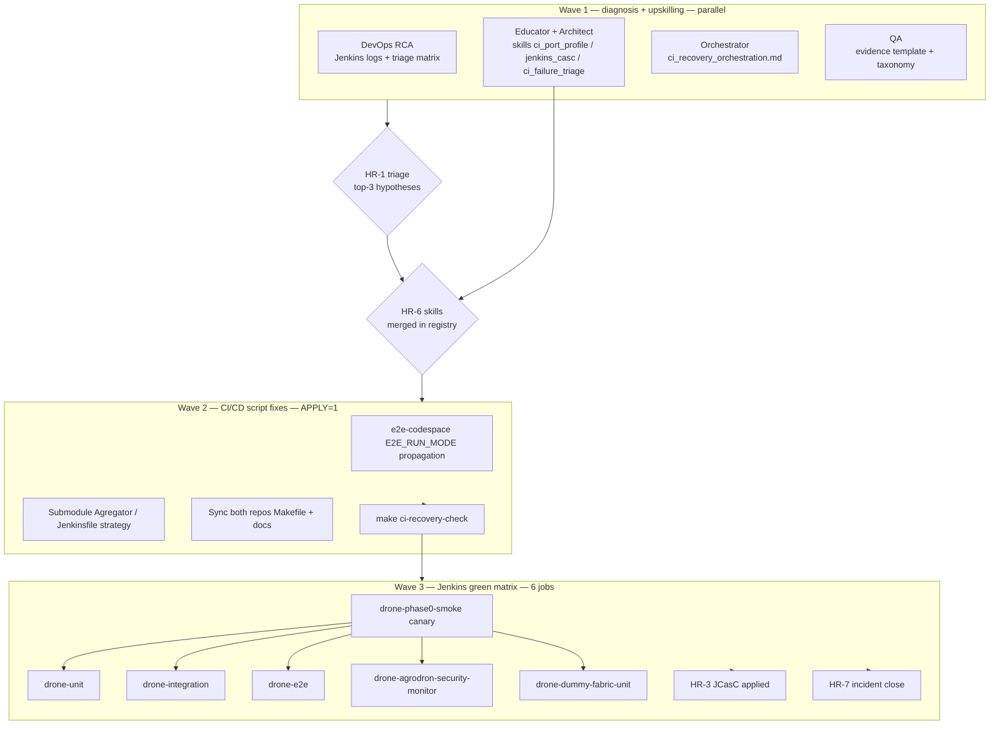

<!-- doc-meta: status=active version=1.0 updated=2026-06-28 -->

# Оркестрация восстановления Jenkins CI/CD (sbd-drones-economics)

Документ координирует **параллельные workstream** восстановления Jenkins после массового red всех `drone-*` pipeline. Канон стратегии и гипотез — [ci_failure_joint_plan.md](ci_failure_joint_plan.md). Методология headless-пакетов — skill `agent-work-orchestration` в репозитории open-platform.

**Репозитории:** `sbd-drones-economics` (полигон) и `sbd-drones-economics-ai` (operator, phase 0, агенты) — один remote GitFlic, зеркальные Makefile/CI.

---

## Роли и зоны ответственности

| Роль | Агент / skill | Wave 1 | Wave 2 | Wave 3 |
|------|---------------|--------|--------|--------|
| **DevOps** | `ci-marinet-steward`, `platform-ci-jenkins`, `skill_devops_broker_cicd` | RCA по логам Jenkins, triage матрица job × stage | Makefile/Jenkinsfile fixes, submodule strategy | Запуск 6 job, evidence bundle |
| **QA / SDET** | `qa-marinet-spec`, `skill_sdet_broker_e2e`, `skill_ci_failure_triage` | failure taxonomy, evidence template | Проверка skip→xfail policy | Матрица green × job, HR-4 |
| **Educator** | `course-educator-platform`, `skill_course_educator_platform` | CI literacy rubric L1–L3, lab stub | demo-pack при partial green | HR-5 учебный контур |
| **Architect** | `software-architect-c4`, `skill_software_architecture_c4` | C2 «Jenkins ↔ host compose» | ADR port propagation (P1) | Контракт readiness URLs |
| **Orchestrator** | `agent-work-orchestration` | этот документ, `ci-recovery-check` gate | coding-пакет `ci-recovery-e2e-profile` после skills | integrate, HR-6/HR-7 |
| **SE-SBD** | `systems-engineer-sbd`, Ш4→Ш9 | traceability gap CI→V&V | TR-CI-* draft | HR-4 structural ≠ runtime |

**Граница workstream (без дублирования):**

- DevOps-агент — **единственный** владелец shell RCA и live Jenkins logs.
- Educator/Architect-агент — **единственный** владелец создания skills (`skill_ci_port_profile`, `skill_jenkins_casc_lifecycle`, `skill_ci_failure_triage`).
- Оркестратор (этот поток) — артефакты координации и Wave 2 checklist; **не** имплементирует risky fixes до HR-1/RCA.

---

## Параллельные workstream и APPLY gates



### APPLY gates (координатор)

| Gate | Условие | Блокирует |
|------|---------|-----------|
| **Dry-run** | inspect worktree, skills, prompt без `APPLY=1` | coding-агент в Wave 2 |
| **HR-1** | DevOps triage + QA taxonomy согласованы | Wave 2 coding |
| **HR-6** | skills `skill_ci_port_profile`, `skill_jenkins_casc_lifecycle`, `skill_ci_failure_triage` в registry | Wave 2 e2e-profile fix |
| **HR-2** | local `E2E_RUN_MODE=jenkins make e2e-codespace` green или явный defer | merge CI fix PR |
| **APPLY=1** | координатор перевёл issue In Progress | headless cursor-agent |
| **ci-recovery-check** | `make ci-recovery-check` green | Wave 3 full matrix |

Coding-агенты **не** используют `gh`; статус GitHub Project — только координатор.

---

## Wave 1 — diagnosis + upskilling (parallel, 4–8 ч)

| ID | Workstream | Владелец | Deliverable | Статус |
|----|------------|----------|-------------|--------|
| W1-D | DevOps RCA | DevOps | triage-матрица 6 job × failing stage × log snippet | in progress (другой агент) |
| W1-E | Upskilling | Educator + Architect | 3 новых skill + registry `ci_failure_recovery` | in progress (другой агент) |
| W1-O | Orchestration | Orchestrator | этот документ + `scripts/ci_recovery_wave2_checklist.sh` + `make ci-recovery-check` | **done** |
| W1-Q | QA taxonomy | QA | evidence bundle template (JUnit, compose logs, classification) | parallel |

**Подтверждённый RCA (2026-06-28, Wave 1):** checkout fail — `GIT_BRANCH=feature/Jenkins` без ветки на GitFlic; volume `jenkins_jenkins_home` смешивал `tem-*` с `drone-*`. Fix: `GIT_BRANCH=master`, `drones_jenkins_home`, `make jenkins-preflight`.

**Следующий класс отказов (ожидает DevOps RCA):** submodule init — `systems/Agregator` commit не на remote (H4).

---

## Wave 2 — CI/CD script fixes (after skills merged)

**Owner:** DevOps coding-пакет `ci-recovery-e2e-profile`  
**Required skills:** `skill_ci_port_profile`, `skill_devops_broker_cicd`, `platform-ci-jenkins`  
**Gate before start:** HR-1 + HR-6

### Wave 2 checklist (локально)

```bash
make ci-recovery-check
# опционально — канарейка + ожидание билда:
WAIT=1 make ci-recovery-check
```

Скрипт: [`scripts/ci_recovery_wave2_checklist.sh`](../scripts/ci_recovery_wave2_checklist.sh).

### Планируемые fixes (Wave 2 implementation — **не** оркестратор)

| ID | Fix | Гипотеза | Owner | Gate |
|----|-----|----------|-------|------|
| W2-1 | **`e2e-codespace`**: протянуть `$(E2E_ENV)` в preflight/wait; убрать hardcode `8081`/`8088` defaults при jenkins profile | H1 | DevOps | HR-1 |
| W2-2 | Синхронизировать fix в **оба** репозитория | H8 | DevOps | W2-1 green local |
| W2-3 | Jenkinsfile: stage Config → `make ci-config-check` | P1-3 | DevOps | HR-2 |
| W2-4 | `COMPOSE_PROJECT_NAME=${JOB_NAME}-${BUILD_NUMBER}` в e2e pipeline | P1-4 | DevOps | HR-2 |

### Pending RCA confirmation (документировано, **не** implement до sign-off)

| ID | Проблема | Предварительное действие | Риск | Ждём |
|----|----------|--------------------------|------|------|
| P0-SM1 | **`systems/Agregator` submodule** — pinned commit отсутствует на remote | `git submodule sync`; обновить gitlink на доступный SHA; push superproject + submodule | break E2E build context | DevOps log стадии Checkout |
| P0-SM2 | **Jenkinsfile submodule strategy** — `git submodule update --init --recursive` без credentials / shallow | рассмотреть `GIT_SUBMODULE_STRATEGY`, SSH credential binding, exclude broken submodules из CI_UNIT_EXCLUDE | security / scope creep | HR-1 + submodule RCA |
| P0-SM3 | **Remote SHA ≠ local** — gitflic без последних CI commits | push `master` обоих репо; verify `jenkins-preflight` | false green local | H3 evidence |
| P0-SM4 | **`e2e-codespace` AGREGATOR_URL default** — fallback `http://localhost:8081` при jenkins compose на `10801` | заменить на `${AGREGATOR_URL}` из `e2e_ports.jenkins.env` | H1 — высокая вероятность | HR-1 подтверждение H1 |

---

## Wave 3 — Jenkins green verification matrix (6 jobs)

После Wave 2 + `make ci-recovery-check` green:

| # | Job | Makefile trigger | Порядок | Критерий |
|---|-----|------------------|---------|----------|
| 1 | `drone-phase0-smoke` | `make jenkins-build-phase0-smoke WAIT=1` | **канарейка** | SUCCESS |
| 2 | `drone-unit` | `make jenkins-build-unit WAIT=1` | после #1 green | SUCCESS |
| 3 | `drone-integration` | `make jenkins-build-integration WAIT=1` | после #1 | SUCCESS или classified infra |
| 4 | `drone-e2e` | `make jenkins-build-e2e WAIT=1` | после W2-1 | SUCCESS или HR-4 defer |
| 5 | `drone-agrodron-security-monitor` | `make jenkins-build-agrodron-security-monitor WAIT=1` | parallel с #2–4 | SUCCESS |
| 6 | `drone-dummy-fabric-unit` | `make jenkins-build-dummy-fabric-unit WAIT=1` | manual-only track | SUCCESS или explicit defer P2 |

**Preflight Wave 3:**

```bash
make jenkins-ps
make jenkins-apply-jobs
make jenkins-jobs-verify
```

Канон имён: [`ci/jenkins/jobs.canonical.txt`](../ci/jenkins/jobs.canonical.txt).

---

## Wave 2 ready criteria (definition of done для старта coding)

Wave 2 coding-пакет **может** стартовать с `APPLY=1`, когда выполнены **все**:

1. **HR-1** — triage-матрица согласована; top-3 гипотезы зафиксированы (минимум H1 + H4 status).
2. **HR-6** — skills merged: `skill_ci_port_profile`, `skill_jenkins_casc_lifecycle`, `skill_ci_failure_triage`; `task_type: ci_failure_recovery` в registry.
3. **`make ci-recovery-check`** — structural gate green (`ci-config-check`, `jenkins-preflight`, `jenkins-jobs-verify`).
4. **DevOps RCA** — evidence по submodule/Agregator (P0-SM1/SM2) или явный «не блокирует phase0-smoke».
5. **Dry-run** coding-пакета `ci-recovery-e2e-profile` — prompt, worktree, skills, command restrictions проверены координатором.

Wave 2 **не** считается завершённой без:

- `E2E_RUN_MODE=jenkins make e2e-codespace` green на хосте (оба репо) **или** HR-4 defer с issue;
- **HR-2** merge sign-off;
- sync Makefile fragment идентичен в `-economics` и `-ai`.

---

## Контрольные точки human_review

| # | Checkpoint | Владелец | Wave | Вход | Выход |
|---|------------|----------|------|------|-------|
| HR-1 | Подтверждение triage + top-3 гипотез | Tech lead / DevOps | 1→2 | DevOps RCA matrix | Go / pivot |
| HR-2 | Merge CI fix (Makefile, Jenkinsfile, docs) | Repo maintainer | 2 | PR W2-1…W2-4, local jenkins emulation | merge |
| HR-3 | JCasC applied, 6 job в UI | DevOps | 3 | `jenkins-jobs-verify` log | screenshot / log |
| HR-4 | structural ≠ runtime (green smoke + red e2e?) | SE-SBD + QA | 3 | Wave 3 matrix | defer + issue или release |
| HR-5 | Учебный контур при partial green | Course-educator | 1–3 | job status + lab | demo-pack update |
| HR-6 | Agent skill rollout | Orchestrator | 1→2 | новые skills | accepted / revise |
| HR-7 | Закрытие инцидента CI | Владелец ОП | 3 | P0 criteria + evidence | postmortem, TR-CI-* |

---

## Связанные артефакты

| Путь | Назначение |
|------|------------|
| [ci_failure_joint_plan.md](ci_failure_joint_plan.md) | Совместная стратегия, гипотезы H1–H9, P0–P2 |
| [ai_dev_tasks.md](ai_dev_tasks.md) | Контракт оркестратора, next-actions |
| [jenkins.md](jenkins.md) | Операции Jenkins, troubleshooting |
| `scripts/ci_recovery_wave2_checklist.sh` | Executable Wave 2 gate |
| `make ci-recovery-check` | Makefile entry point |

---

*Версия 1.0 — orchestration artifact для параллельного CI recovery sprint.*
