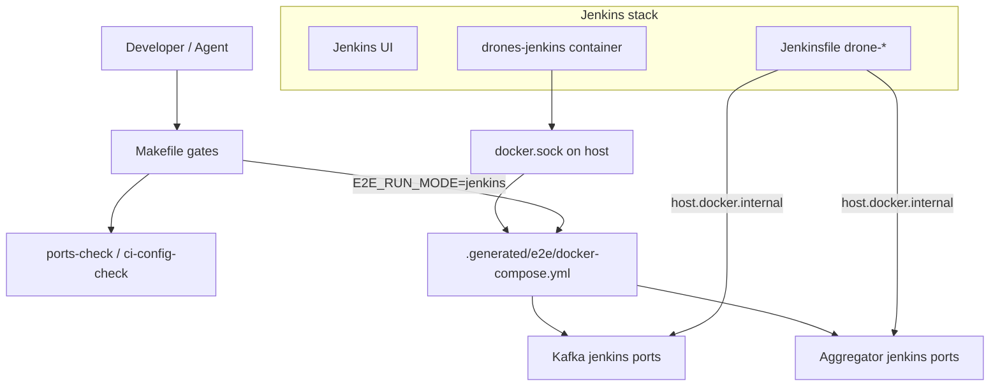

# ADR-004: распространение профиля портов CI (E2E_RUN_MODE)

<!-- doc-meta: status=active version=1.0 updated=2026-06-28 -->

| Поле | Значение |
|------|----------|
| Статус | **Accepted** |
| Дата | 2026-06-28 |
| Связано | [ci_failure_joint_plan.md](../../ci_failure_joint_plan.md), [ports.md](../../ports.md), TR-CI-001 |
| Решает | H1 — `e2e-codespace` vs jenkins-профиль портов |

## Контекст

CI репозиториев `sbd-drones-economics` / `-ai` использует **два** профиля host-портов:

- **local** — `config/e2e_ports.local.env` (разработка, `make e2e-local`);
- **jenkins** — `config/e2e_ports.jenkins.env` (pipeline, `E2E_RUN_MODE=jenkins`).

Политика из open-platform: local и jenkins **не пересекаются** по опубликованным TCP-портам.

Массовый отказ Jenkins (2026-06-28) выявил **контрактный разрыв**: `prepare_multi.py` и Jenkinsfile учитывают режим, а таргеты Makefile (`e2e-codespace`, readiness-wait) частично остаются на local-портах (`8081`, `9092`).

## Решение

1. **Единый источник портов** — только `config/e2e_ports.{E2E_RUN_MODE}.env`; запрет hardcode host-портов в Jenkinsfile и shell-шагах.
2. **Propagation chain** — любое изменение профиля обязано пройти цепочку (см. `skill_ci_port_profile`):
   - env file → Makefile `E2E_ENV` → `prepare_multi.py` → compose publish → readiness scripts → pytest/Jenkins URLs.
3. **Jenkins runtime view (C2)** — Jenkins-контейнер обращается к compose на хосте через `host.docker.internal` и **jenkins**-порты; readiness на хосте при `E2E_RUN_MODE=jenkins` использует те же jenkins-порты.
4. **Verification boundaries**:

   | Boundary | Structural (без Docker) | Runtime (compose) | Jenkins UI |
   |---|---|---|---|
   | Ports registry | `make ports-check` | — | stage Config |
   | Phase 0 contracts | `make ci-config-check` | `make phase0-smoke-full` | `drone-phase0-smoke` |
   | E2E profile | grep/hardcode audit | `E2E_RUN_MODE=jenkins make e2e-codespace` | `drone-e2e` |

5. **SCM boundary отдельно** — checkout/submodule failures классифицируются как **scm**, не как port profile (см. `make jenkins-preflight`).

## C2 Container View (CI/CD)

## Последствия

- DevOps обязан прогонять **jenkins-profile emulation** перед claim «CI complete».
- QA обязан включать минимум один Jenkins smoke в regression gate.
- Архитектор фиксирует новые integration endpoints в ADR/topic_map только после sync env files.
- Учебный контур: structural green ≠ runtime green (лаборатория «Разбор CI-отказа»).

## Альтернативы (отклонены)

| Альтернатива | Почему отклонена |
|---|---|
| Один профиль портов для local и Jenkins | Коллизии на shared CI agent |
| Только Jenkins fix без Makefile | Локальная эмуляция jenkins-profile невозможна |
| Sleep-based readiness | Нарушает `skill_devops_broker_cicd` |

## human_review

Владелец: DevOps + Architect. Подтверждение: P0-4 из joint plan выполнен, `E2E_RUN_MODE=jenkins make e2e-codespace` green на эталонном хосте.
