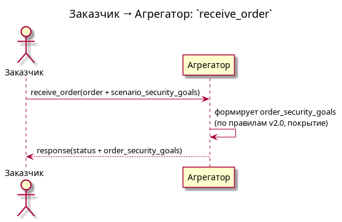
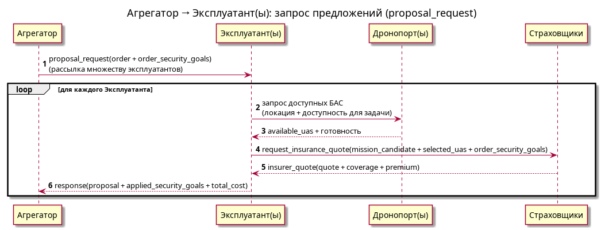
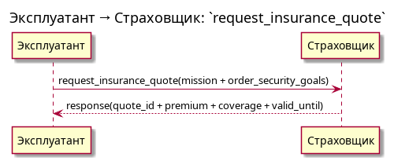
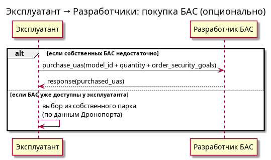
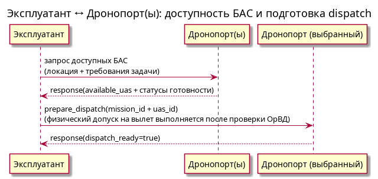
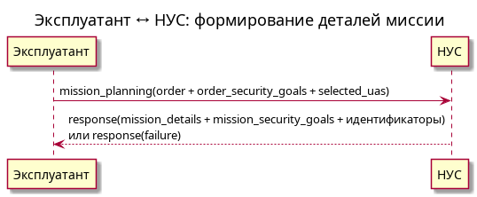
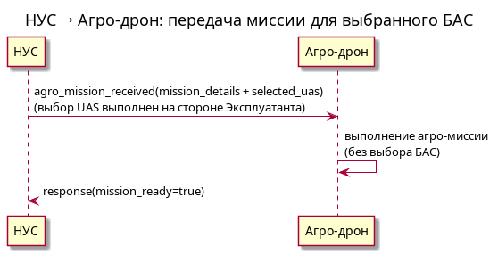
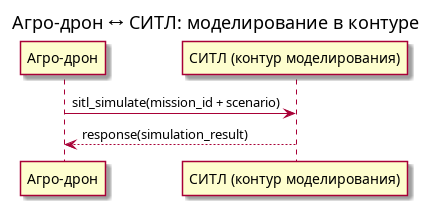
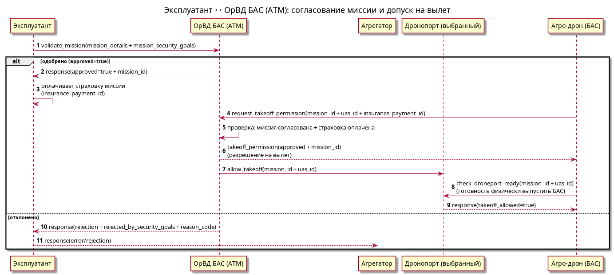
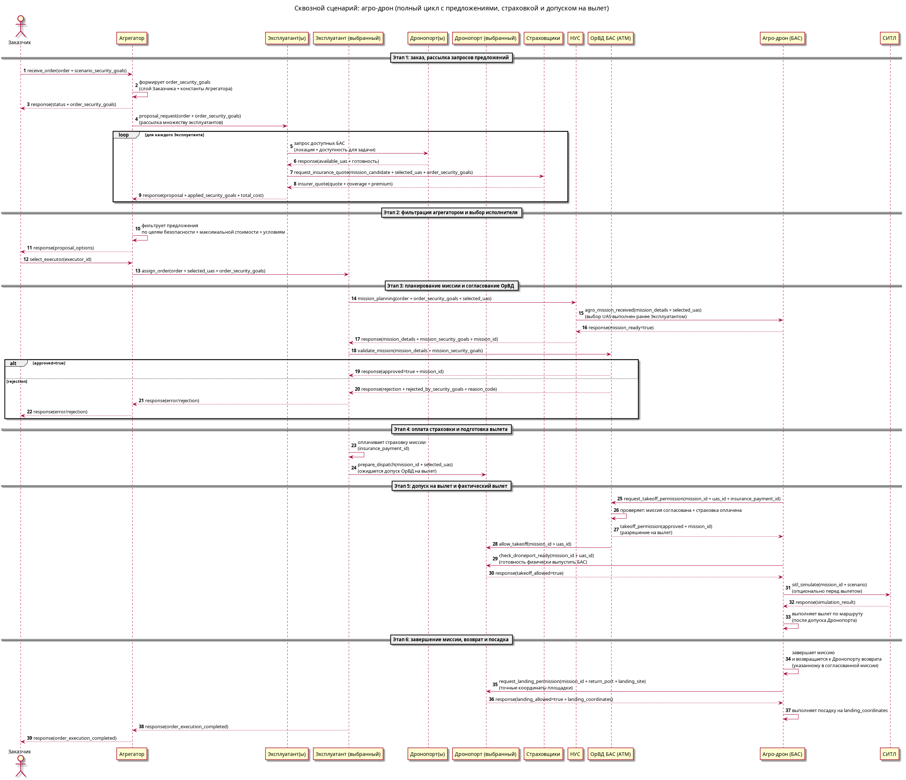

# Описание модели взаимодействия v2.0 (расширенное)

## 0) Что это за документ

Документ расширяет `docs/integration_process/model_description.md` за счёт уточнений, появившихся в экспортированных обсуждениях курса:
`docs/course-chat/20260320/messages.html`.

Цель расширения:
- зафиксировать недостающие архитектурные детали модели взаимодействия;
- сделать явными правила применения `security_goals`/`order_security_goals` и поведение при пустом наборе;
- уточнить, какие события именно должны попадать в **центральный журнал** и откуда;
- связать “как это должно работать по смыслу” с тем, как это реализуется через контрактный API v2.0.

---

## 1) Базовые принципы контракта v2.0 (как в базовом документе)

1. Все межсистемные взаимодействия идут через брокеры (Kafka/Mosquitto) и **центральный журнал**, который также принимает сообщения через брокер.
   Центральный журнал записывает:
   - все внешние события (между системами),
   - а также внутренние события, которые собираются внутренними журналами систем.
2. Envelope использует маршрутизацию по `action`.
3. request/response строится вокруг механики transport/SystemBus (`correlation_id` + `reply_to`).
4. Центральный журнал использует контракт `EventJournal` (в документации — `emit_event`, severity и т.д.).

---

## 2) Модель `security_goals` (ключевое требование Запроса 6) — + расширение

### 2.1 Источник целей

- Для каждой системы определяется набор `system_security_goals`.
- Для каждого заказа определяется набор `order_security_goals`.
- Полные описания целей стандартизированы и доступны у Регулятора; **в сообщениях передаются только ID** (`List[str]`).

### 2.2 Два “слоя” целей и роль агрегатора (уточнение из course-chat)

В обсуждении зафиксировано, что:
- **формулировка заказа и “видение ЦБ” исходит от Заказчика**;
- исполнителю (в контур Эксплуатанта) это ретранслирует **Агрегатор**, **добавляя** необходимые с точки зрения ОрВД / Регулятора ЦБ;
- на первых итерациях можно “прошить” недостающую часть ЦБ в Агрегаторе как **константы для каждого типа сценария**.

Практическое следствие для контракта v2.0:
- `scenario_security_goals` (цб сценария) задаются Заказчиком явно в запросе;
- `order_security_goals` агрегатор формирует как детерминированный результат:
  - базовая часть = `scenario_security_goals`,
  - дополняющая часть = “константы Агрегатора” для типа сценария (в будущем — возможно вывод из справочника/правил Регулятора).

### 2.3 Производство `order_security_goals` (правило покрытия + пустой список)

В постановке для v2.0 принято:
- `order_security_goals` **агрегатор формирует** на основании параметров заказа и шаблонов v2.0;
- отдельный runtime-запрос к Регулятору на каждом шаге не обязателен (если не требуется в будущем).

Правило для пустого списка:
- при `order_security_goals = []` выбор контрагента/исполнителя делается на основе автоматически определённого Агреатора минимального набора целей безопасности для конкретной задачи;
- если и Агреатор не выявил необходимые цели безопасности, допускаются любые БАС, а окончательный выбор осуществляется Заказчиком на основе стоимости.

### 2.4 Две обязательные точки фильтрации контрагентов

1) Фильтрация на стороне Агрегатора  
- применяется при формировании предложения/выборе контрагента;
- если контрагент не покрывает `order_security_goals`, контрагент **отбраковывается**.

2) Фильтрация на стороне ОрВД БАС (одобрение/проверка миссии)  
- применяется при проверке миссии и пригодности исполнителя/БАС к миссии;
- при несоответствии ОрВД фиксирует отказ и требует остановить/не допустить миссию.

### 2.5 Модель отклонения (`rejection`) — унификация

Для uniфицированного поведения важно фиксировать возвращаемый результат:
- какие goal_id стали причиной (`rejected_by_security_goals`);
- тип причины/код (`reason_code`);
- опциональные детали (`details`: candidate, mission_id, violated constraints).

---

## 3) Сценарная модель взаимодействия (coverage пар из Запроса 6) — + уточнения

Ниже перечислены сценарии как **модель стадий**, а не полный покомпонентный список полей.

### 3.1 Заказчик → Агрегатор (receive_order)

Цель: Заказчик инициирует выполнение задачи, Агрегатор принимает заказ в работу.

Вход:
- параметры заказа (включая `scenario_security_goals` и контекст задачи: тип/координаты и пр.).

security_goals (цели/покрытие):
- сценарные цели безопасности (`scenario_security_goals`) задаются Заказчиком явно;
- Агрегатор по типу и координатам запроса определяет набор цб и формирует `order_security_goals` (двухслойно: слой Заказчика + константы Агрегатора для типа сценария).

Результат:
- accept/reject по валидности заказа;
- при успехе агрегатор переводит заказ в состояние `received`.

### 3.2 Агрегатор → Эксплуатант(ы) (`proposal_request` → `proposal`)

Цель: Агрегатор рассылает запрос предложений множеству Эксплуатантов под заказ Заказчика. Эксплуатанты подбирают подходящие БАС (через проверку доступности и локации в Дронопортах), запрашивают стоимость страховки для согласованных условий и возвращают финальные предложения Агрегатору.

security_goals:
- перед отправкой Эксплуатанту(ам) Агрегатор отфильтровывает контрагентов по покрытию `order_security_goals`;
- предложения и отказы возвращают объяснимые сведения: какие goal_id реально использованы/покрыты (например, `applied_security_goals`) и какие `reason_code`/`rejection` послужили причиной отказа.

Результат:
- успех: Агрегатор собирает предложения, фильтрует их по целям безопасности и параметрам (включая максимальную стоимость) и передает Заказчику набор подходящих предложений для выбора исполнителя;
- отказ: Эксплуатант возвращает `error` и/или `rejection` (например, когда не найден подходящий БАС или нет котировок по страховке).

### 3.3 Эксплуатант → Страховщик (request_insurance_quote) — уточнение из обсуждений

В обсуждении отмечено:
- страховая компания предлагает услуги страховки рисков эксплуатации БАС;
- стоимость полиса закладывается в стоимость выполнения заказа;
- агрегатор предлагает заказчику выбор эксплуатантов, удовлетворяющих параметрам заказа:
  - выполняемая задача,
  - ограничение стоимости,
  - требования безопасности,
  - гарантии безопасности.
- задача Эксплуатанта: на основе доступных БАС (из данных Дронопорта) запросить у страховщиков котировки страхования и сформировать финальное предложение на запрос агрегатора.

Итого (для модели контрактов):
- `request_insurance_quote` должен содержать миссию/покрытие и связанные требования (минимально: цель покрытия рисков в терминах `security_goals`/ID полиса);
- `insurer_quote_*` события должны позволять агрегатору прозрачно объяснить заказчику условия принятия/отказа.

### 3.4 Эксплуатант → Разработчики (purchase_uas / find_available_uas)

Цель: выбор и (опционально) покупка подходящих БАС. В базовом сценарии Эксплуатант выбирает БАС из своего парка по данным Дронопортов; покупка выполняется только при необходимости.

security_goals:
- цели безопасности учитываются в части сертификации/допустимости операций;
- фиксируется, какие goal_id “покрыты” конкретной БАС-моделью/сертификацией.

Результат:
- успех: подходящий список БАС (из парка) либо купленные БАС (при необходимости) + статусы;
- отказ: `rejection`/`error` с причинами (включая причины, связанные с целями безопасности, отсутствием доступных БАС или отсутствием страховой котировки).

### 3.5 Эксплуатант ↔ Дронопорт(ы) (и физический допуск выбранного Дронопорта)

Цель: предоставить Эксплуатанту сведения о доступных БАС (по локации и готовности) и обеспечить физический допуск на вылет конкретной БАС после подтверждения со стороны ОрВД БАС.

security_goals:
- Дронопорт (выбранный для конкретной БАС) должен допускать вылет только при наличии подтверждения ОрВД БАС (миссия согласована и страховка на миссию оплачена).

Результат:
- доступность и готовность БАС для задачи (используется Эксплуатантом при подборе кандидатов);
- подготовка диспетчеризации на выбранный Дронопорт и фактическое разрешение на старт конкретной БАС (`takeoff_allowed`) для физического выполнения маршрута;
- расширяемость под доставку/инспекцию через scenario.details.

### 3.6 Эксплуатант ↔ НУС (планирование миссии / регистрация миссии) — уточнение по цепочке ОрВД/НУС/дрон

Цель: НУС формирует детали миссии под конкретного исполнителя/БАС.

Уточнение из обсуждений:
- ОрВД регистрирует дрон и миссию;
- в НУС отправляется миссия для выполнения конкретным дроном;
- эксплуатант в итоге выбирает, какой дрон выполняет миссию, получает для него страховой полис, затем передаёт соответствующую информацию в НУС и ОрВД;
- дрон перед вылетом запрашивает разрешение на вылет; ОрВД проверяет, что миссия согласована и страховка на миссию оплачена и отправляет БАС разрешение на вылет;
- при получении разрешения БАС перед вылетом проверяет готовность Дронопорта выпустить выбранную БАС, и только после подтверждения готовности выполняет вылет;
- после завершения миссии БАС возвращается к Дронопорту возврата, указанному в согласованной миссии, и перед посадкой запрашивает допуск на посадку с точными координатами площадки.

security_goals:
- НУС и/или Эксплуатант должны сохранить `order_security_goals` и передать их в контур ОрВД на этапе проверки/одобрения.

Результат:
- `mission_details` (черновик/статус) + идентификаторы;
- при отклонении: отказ/неуспех с возможностью расширить сведения для поля `rejection`.

### 3.7 НУС → Агро-дрон (планирование агро-миссии для выбранного БАС)

Цель: построить план опрыскивания/агро-задачи для выбранного Эксплуатантом БАС. Выбор конкретного БАС выполняется на уровне Эксплуатанта на основе данных Дронопортов (в НУС передаётся уже выбранная конфигурация).

security_goals:
- применяются цели безопасности, привязанные к сценарию (agro) и выбранному БАС.

Результат:
- `agro_mission_plan` (для выбранного БАС).

### 3.8 Агро-дрон ↔ СИТЛ (моделирование в контуре)

Цель: симуляция движения/помех и телеметрии.

security_goals:
- для фильтрации по целям безопасности достаточно зафиксировать сценарий и привязку к миссии;
- фильтрация по целям безопасности происходит раньше (в контуре ОрВД/одобрения).

Результат:
- `simulation_result` + отчёт/телеметрия.

### 3.9 Эксплуатант ↔ ОрВД БАС (ATM) (согласование миссии и допуск на вылет)

Цель: (1) согласовать миссию для воздушного пространства и (2) обеспечить допуск на вылет конкретной БАС после того, как выполнены условия допуска (миссия согласована и страховка оплачена).

security_goals (согласование миссии):
- ОрВД получает `mission_security_goals` (обычно = `order_security_goals` + сценарные добавки);
- при несоответствии ОрВД отклоняет миссию, возвращает отказ и требует остановить исполнение.

Проверка на вылет:
- перед вылетом БАС запрашивает разрешение на вылет у ОрВД;
- ОрВД проверяет, что миссия согласована и что страховка на миссию оплачена;
- при успешной проверке ОрВД отправляет БАС разрешение на вылет, но сам БАС перед вылетом обязан проверить готовность Дронопорта выпустить данную БАС;
- только получив подтверждение готовности (фактический допуск через состояние Дронопорта), БАС выполняет вылет по маршруту.

Результат:
- `approved=true/false` для согласования миссии;
- при отклонении: `rejection` с `rejected_by_security_goals` и `reason_code`;
- для допуска на вылет: подтверждение/отказ с фиксацией причин в центральном журнале.

После завершения миссии:
- БАС следует к Дронопорту возврата, указанному в согласованной миссии;
- перед посадкой БАС запрашивает у Дронопорта подтверждение допуска на посадку;
- Дронопорт возвращает точные координаты площадки, на которую должна быть выполнена посадка.

### 3.10 Всеми системами → Регулятор (get_system_topics / get_security_goals / get_regulations / report_incident)

security_goals:
- контракт v2.0 предполагает справочник целей на уровне контуров (в рабочих payload используются только goal_id).

Результат:
- возвращаются `security_goals` (возможно с описаниями), но payload в сценариях — только ID.

---

## 4) Централизованный журнал (EventJournal): уточнения из discussion

В обсуждении подчёркнуто:
- события безопасности записываются в журнал (чёрного ящика);
- содержимое журнала может быть использовано для расследования инцидента;
- будет плохо, если журнал будет забит мусором недоверенного домена безопасности.

Также про разграничение стрелок (запрос/ответ) и контроль миссии:
- обычно сплошная стрелка — запрос, пунктирная — ответ;
- миссия в дрон может попадать через недоверенный канал от оператора;
- в модуль безопасности приходит миссия от ОрВД БАС, и **модуль безопасности использует её для контроля перемещения, но не управляет полётом дрона**.

### 4.1 Практическая модель источников для EventJournal

Чтобы избежать “мусора” и сохранить полезность для расследований:
- в центральный журнал должны попадать в первую очередь события ограничителя безопасности/модуля безопасности (цепочка доверенного контроля);
- события телеметрии и “сырой миссии в дрон” из недоверенного канала могут быть использованы, но не должны напрямую расширять security-часть журнала без доверенной верификации.

Результат для контрактной модели:
- центральный журнал получает и внешние, и внутренние события, но payload события безопасности должен формироваться на доверенном шаге (лимитер/модуль контроля перемещения).

---

## 5) Дополнительно: слабая связанность и конфигурация топиков (внешние/внутренние)

Из обсуждений:
- это в первую очередь “внешние” взаимодействия Эксплуатант - Агрегатор, Эксплуатант - Страховая компания;
- “внутреннее” взаимодействие Эксплуатант - НУС - Дрон, Дронопорт-НУС-Дрон;
- для внутреннего взаимодействия топики можно задавать переменными окружения (и использовать docker-compose.yaml для локального запуска).

Следствие для модели v2.0:
- смысл событий/контракта должен быть независим от конкретных топиков (структура топиков — конфигурация);
- envelope и семантика `action/payload` должны оставаться контрактными, даже если топики меняются.

---

## 6) Критические пропуски/открытые вопросы (обновлённая версия списка)

1. Единая форма `rejection` для всех отказов, обусловленных целями безопасности  
   - агрегатор и ОрВД должны возвращать `rejected_by_security_goals` и `reason_code` в одинаковом стиле.
2. Явная привязка `order_security_goals` к покрытию контрагентами (coverage_mode)  
   - нужно формально зафиксировать трактовку пустого списка и режимы выбора.
3. Явный минимальный каталог `event_type` для центрального журнала  
   - особенно для отображения:
     - агрегаторской отбраковки по `security_goals`,
     - ОрВД отклонение миссии,
     - фиксации применённых целей (успех) и причин отказа (rejection).
4. Расширяемость под доставку/инспекцию  
   - договориться, как именно добавляются цели сценария (через `order_security_goals` или через `scenario.details` с выводом).
5. (закрывается уточнением из discussion) Источник и доверенность событий безопасности  
   - события безопасности должны записываться через доверенный “ограничитель/модуль безопасности контроля перемещения”, иначе центральный журнал рискует стать “мусорным”.

---

## 7) Что менять в реализации (коротко, чтобы связать с контрактом)

В рамках реализации контракта v2.0 полезно обеспечить:
- разделение `scenario_security_goals` (заданы Заказчиком) и `order_security_goals` (формирует агрегатор);
- детерминированный алгоритм: “слой Заказчика + константы Агрегатора для типа сценария”;
- дисциплина: события безопасности центрального журнала формируются из доверенной цепочки “ограничитель/модуль безопасности контроля перемещения”, а не из недоверенного канала напрямую;
- покрытие в `EventJournal` (центральном журнале): по стадиям `receive_order` → `proposal_request/collection` → `insurance quote` → assignment → `одобрение/отклонение миссии` → `запрос/выдача разрешения на вылет` → `проверка готовности Дронопорта` → `фактический старт` → `завершение миссии` → `запрос/выдача допуска на посадку` → `посадка на координатах` → завершение, включая фиксацию применённых `goal_id` и `reason_code` при отказе.

---

## 8) Диаграммы последовательности (PlantUML)

Ниже представлены диаграммы последовательности, иллюстрирующие обмен сообщениями между системами (пары) и сквозной сценарий на примере агро-дрона.

Исходные диаграммы PlantUML вынесены в файл `model_description_extended_diagrams.puml`.
PNG сгенерированы в каталоге `docs/integration_process/diagrams/`.

### 8.1 Заказчик → Агрегатор: `receive_order`

### 8.2 Агрегатор → Эксплуатант: `receive_order` → `proposal`

### 8.3 Эксплуатант → Страховщик: `request_insurance_quote`

### 8.4 Эксплуатант → Разработчики: `find_available_uas` / `purchase_uas`

### 8.5 Эксплуатант ↔ Дронопорт(ы) (доступность БАС и подготовка dispatch)

### 8.6 Эксплуатант ↔ НУС: планирование/регистрация миссии

### 8.7 НУС → Агро-дрон: передача миссии для выбранного БАС

### 8.8 Агро-дрон ↔ СИТЛ: `sitl_simulate`

### 8.9 Эксплуатант ↔ ОрВД БАС (ATM): `validate_mission`

### 8.10 Сквозной сценарий: агро-дрон

