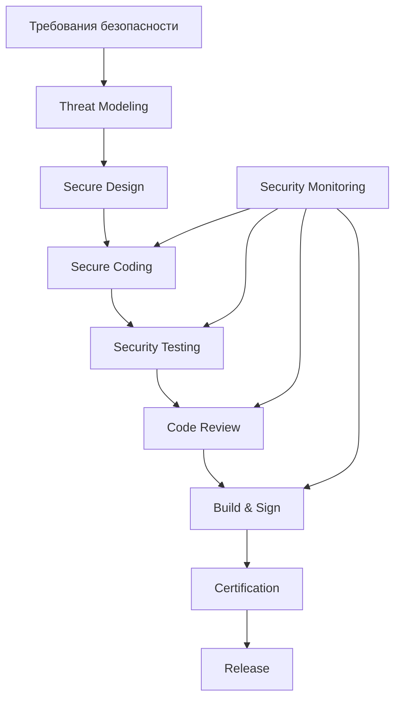

# Расширенный анализ безопасности дополнительных систем

## 6. Система "Агрегатор" (AGGREGATOR)

### Контекст системы
Агрегатор выступает маркетплейсом услуг БАС, связывая заказчиков с эксплуатантами и обеспечивая прозрачность и надёжность транзакций.

### Анализ активов

| Актив | Ценность | Потенциальный ущерб |
|-------|----------|---------------------|
| База заказов и клиентов | Критическая | Потеря бизнеса, нарушение конфиденциальности |
| Алгоритмы матчинга | Высокая | Неэффективное распределение заказов |
| Финансовые транзакции | Критическая | Прямые финансовые потери |
| Репутационные данные | Высокая | Манипуляция рейтингами |
| SLA и контракты | Высокая | Юридические риски |

### Моделирование угроз

**Угрозы целостности маркетплейса:**
- T1: Создание фиктивных заказов для манипуляции рынком
- T2: Накрутка рейтингов эксплуатантов
- T3: Сговор между участниками для монополизации
- T4: Подмена условий заказа после согласования

**Финансовые угрозы:**
- T5: Двойное списание средств
- T6: Уклонение от комиссий платформы
- T7: Отмывание денег через фиктивные заказы

**Операционные угрозы:**
- T8: DDoS атаки в пиковые часы
- T9: Утечка коммерческой информации конкурентам
- T10: Нарушение нейтральности платформы

### Цели безопасности

**ЦБ-AGG-1**: Все транзакции между участниками прозрачны и неизменяемы
- Актив: Целостность транзакций
- Ущерб: Потеря доверия, финансовые споры

**ЦБ-AGG-2**: Алгоритм матчинга работает непредвзято и эффективно
- Актив: Справедливость распределения
- Ущерб: Дискриминация участников, потеря эффективности

**ЦБ-AGG-3**: Персональные данные заказчиков защищены согласно требованиям
- Актив: Конфиденциальность данных
- Ущерб: Штрафы регулятора, потеря клиентов

**ЦБ-AGG-4**: Платформа доступна 99.9% времени в рабочие часы
- Актив: Доступность сервиса
- Ущерб: Потеря выручки, недовольство клиентов

### Предположения безопасности

**ПБ-AGG-1**: Платёжный шлюз соответствует PCI DSS
**ПБ-AGG-2**: Эксплуатанты предоставляют достоверную информацию
**ПБ-AGG-3**: Заказчики действуют добросовестно
**ПБ-AGG-4**: Инфраструктура CDN защищает от DDoS

### Архитектура безопасности

```
┌─────────────────────────────────────────────────────────┐
│                   AGGREGATOR SYSTEM                      │
├─────────────────────────────────────────────────────────┤
│  D0_CRITICAL                                            │
│  ┌─────────────────┐  ┌──────────────────┐            │
│  │ Transaction     │  │ Matching         │            │
│  │ Integrity       │  │ Fairness         │            │
│  │ Monitor         │  │ Controller       │            │
│  └────────┬────────┘  └────────┬─────────┘            │
│           │                     │                       │
│  ┌────────▼──────────────────▼──┐                     │
│  │    Marketplace Monitor       │                     │
│  │  (контроль операций)         │                     │
│  └────────────┬─────────────────┘                     │
├───────────────┼─────────────────────────────────────────┤
│  D1_TRUSTED   │                                        │
│  ┌────────────▼─────────────┐  ┌──────────────────┐  │
│  │ Order Management         │  │ Payment          │  │
│  │ System                   │  │ Processor        │  │
│  └──────────────────────────┘  └──────────────────┘  │
├─────────────────────────────────────────────────────────┤
│  D2_OPERATIONAL                                         │
│  ┌──────────────────┐  ┌──────────────────┐          │
│  │ Matching Engine  │  │ Analytics        │          │
│  │ (подбор испол.)  │  │ Dashboard        │          │
│  └──────────────────┘  └──────────────────┘          │
├─────────────────────────────────────────────────────────┤
│  D3_EXTERNAL                                            │
│  ┌──────────────────┐  ┌──────────────────┐          │
│  │ Customer App     │  │ Operator Portal  │          │
│  │ (приложение)     │  │ (портал операт.) │          │
│  └──────────────────┘  └──────────────────┘          │
└─────────────────────────────────────────────────────────┘
```

## 7. Система "Дронопорт" (DRONEPORT)

### Контекст системы
Дронопорт обеспечивает физическую инфраструктуру для базирования, обслуживания и эксплуатации БАС.

### Анализ активов

| Актив | Ценность | Потенциальный ущерб |
|-------|----------|---------------------|
| Физическая инфраструктура | Критическая | Повреждение БАС, простои |
| Системы зарядки | Высокая | Невозможность эксплуатации |
| Контроль доступа | Критическая | Кража или саботаж БАС |
| Метеоданные | Средняя | Небезопасные вылеты |
| Расходные материалы | Средняя | Срыв обслуживания |

### Моделирование угроз

**Физические угрозы:**
- T1: Несанкционированный физический доступ к БАС
- T2: Саботаж зарядной инфраструктуры
- T3: Кража или подмена БАС
- T4: Повреждение при автоматическом обслуживании

**Кибер-физические угрозы:**
- T5: Взлом системы контроля доступа
- T6: Манипуляция данными о готовности БАС
- T7: Блокировка взлёта/посадки (план "Ковёр")
- T8: Подмена метеоданных

**Операционные угрозы:**
- T9: Перегрузка посадочных мест
- T10: Конфликты при одновременной посадке
- T11: Отказ автоматических систем обслуживания

### Цели безопасности

**ЦБ-DRP-1**: Только авторизованные БАС могут использовать инфраструктуру
- Актив: Физическая безопасность
- Ущерб: Несанкционированное использование

**ЦБ-DRP-2**: План "Ковёр" блокирует все вылеты в течение 10 секунд
- Актив: Экстренное реагирование
- Ущерб: Неконтролируемые полёты в ЧС

**ЦБ-DRP-3**: Конфликты слотов посадки/взлёта исключены
- Актив: Безопасность операций
- Ущерб: Столкновения на земле

**ЦБ-DRP-4**: Целостность БАС сохраняется во время обслуживания
- Актив: Сохранность БАС
- Ущерб: Повреждение дорогостоящего оборудования

### Предположения безопасности

**ПБ-DRP-1**: Физический периметр охраняется
**ПБ-DRP-2**: Резервное питание доступно
**ПБ-DRP-3**: Метеостанция предоставляет точные данные
**ПБ-DRP-4**: Персонал обучен процедурам безопасности

### Архитектура безопасности

```
┌─────────────────────────────────────────────────────────┐
│                   DRONEPORT SYSTEM                       │
├─────────────────────────────────────────────────────────┤
│  D0_CRITICAL                                            │
│  ┌─────────────────┐  ┌──────────────────┐            │
│  │ Access Control  │  │ Emergency        │            │
│  │ System          │  │ Lockdown         │            │
│  │                 │  │ ("Ковёр")        │            │
│  └────────┬────────┘  └────────┬─────────┘            │
│           │                     │                       │
│  ┌────────▼──────────────────▼──┐                     │
│  │    Safety Interlock System   │                     │
│  │  (блокировки безопасности)   │                     │
│  └────────────┬─────────────────┘                     │
├───────────────┼─────────────────────────────────────────┤
│  D1_TRUSTED   │                                        │
│  ┌────────────▼─────────────┐  ┌──────────────────┐  │
│  │ Slot Management          │  │ Maintenance      │  │
│  │ Controller               │  │ Scheduler        │  │
│  └──────────────────────────┘  └──────────────────┘  │
├─────────────────────────────────────────────────────────┤
│  D2_OPERATIONAL                                         │
│  ┌──────────────────┐  ┌──────────────────┐          │
│  │ Charging Manager │  │ Weather Station  │          │
│  │ (управл. заряд.) │  │ Interface        │          │
│  └──────────────────┘  └──────────────────┘          │
├─────────────────────────────────────────────────────────┤
│  D3_EXTERNAL                                            │
│  ┌──────────────────┐  ┌──────────────────┐          │
│  │ Operator App     │  │ Monitoring       │          │
│  │ (приложение)     │  │ Dashboard        │          │
│  └──────────────────┘  └──────────────────┘          │
└─────────────────────────────────────────────────────────┘
```

### Специализация дронопортов

**Агро-дронопорт:**
```yaml
security_features:
  - chemical_storage_monitoring
  - decontamination_control
  - restricted_access_zones
  - spill_containment_system
  
additional_goals:
  - ЦБ-DRP-AGR-1: Химикаты хранятся в изолированных условиях
  - ЦБ-DRP-AGR-2: Процедуры деконтаминации выполняются после каждого полёта
```

**Карго-дронопорт:**
```yaml
security_features:
  - biometric_access_control
  - secure_storage_vault
  - chain_of_custody_tracking
  - temperature_monitoring
  
additional_goals:
  - ЦБ-DRP-CRG-1: Цепочка владения грузом непрерывна
  - ЦБ-DRP-CRG-2: Несанкционированный доступ к грузу исключён
```

## 8. Система "НУС" (GCS - Ground Control Station)

### Контекст системы
Наземная управляющая станция обеспечивает планирование миссий, предполётную подготовку и мониторинг выполнения полётов.

### Анализ активов

| Актив | Ценность | Потенциальный ущерб |
|-------|----------|---------------------|
| Алгоритмы планирования | Критическая | Небезопасные маршруты |
| Каналы управления БАС | Критическая | Потеря контроля |
| База данных миссий | Высокая | Нарушение операций |
| Предполётные чек-листы | Высокая | Небезопасные вылеты |

### Моделирование угроз

**Угрозы планированию:**
- T1: Внедрение опасных точек в маршрут
- T2: Игнорирование препятствий при планировании
- T3: Превышение возможностей БАС
- T4: Нарушение регуляторных требований

**Угрозы управлению:**
- T5: Перехват канала управления
- T6: Подмена команд оператора
- T7: Задержка критичных команд
- T8: Потеря связи с БАС

### Цели безопасности

**ЦБ-GCS-1**: Маршрут миссии безопасен и выполним
- Актив: Качество планирования
- Ущерб: Аварии, невыполнение миссии

**ЦБ-GCS-2**: Команды управления аутентичны и своевременны
- Актив: Целостность управления
- Ущерб: Потеря контроля над БАС

**ЦБ-GCS-3**: Предполётные проверки выполнены полностью
- Актив: Готовность к полёту
- Ущерб: Аварии из-за неисправностей

**ЦБ-GCS-4**: Данные миссии конфиденциальны
- Актив: Коммерческая тайна
- Ущерб: Раскрытие планов конкурентам

### Предположения безопасности

**ПБ-GCS-1**: Картографические данные актуальны
**ПБ-GCS-2**: Операторы квалифицированы
**ПБ-GCS-3**: Каналы связи защищены криптографически
**ПБ-GCS-4**: Рабочие станции защищены от malware

### Архитектура безопасности

```
┌─────────────────────────────────────────────────────────┐
│                      GCS SYSTEM                          │
├─────────────────────────────────────────────────────────┤
│  D0_CRITICAL                                            │
│  ┌─────────────────┐  ┌──────────────────┐            │
│  │ Mission Safety  │  │ Command          │            │
│  │ Validator       │  │ Authenticator    │            │
│  └────────┬────────┘  └────────┬─────────┘            │
│           │                     │                       │
│  ┌────────▼──────────────────▼──┐                     │
│  │    Flight Safety Monitor     │                     │
│  │  (контроль безопасности)     │                     │
│  └────────────┬─────────────────┘                     │
├───────────────┼─────────────────────────────────────────┤
│  D1_TRUSTED   │                                        │
│  ┌────────────▼─────────────┐  ┌──────────────────┐  │
│  │ Mission Planner          │  │ Preflight        │  │
│  │ (планировщик)            │  │ Checker          │  │
│  └──────────────────────────┘  └──────────────────┘  │
├─────────────────────────────────────────────────────────┤
│  D2_OPERATIONAL                                         │
│  ┌──────────────────┐  ┌──────────────────┐          │
│  │ Route Optimizer  │  │ Telemetry        │          │
│  │ (оптимизатор)    │  │ Display          │          │
│  └──────────────────┘  └──────────────────┘          │
├─────────────────────────────────────────────────────────┤
│  D3_EXTERNAL                                            │
│  ┌──────────────────┐  ┌──────────────────┐          │
│  │ Operator Console │  │ Map Service      │          │
│  │ (консоль)        │  │ Interface        │          │
│  └──────────────────┘  └──────────────────┘          │
└─────────────────────────────────────────────────────────┘
```

## 9. Система "Разработчик БАС" (UAS DEVELOPER)

### Контекст системы
Разработчик БАС проектирует, производит и сертифицирует беспилотные системы, обеспечивая их соответствие требованиям безопасности.

### Анализ активов

| Актив | Ценность | Потенциальный ущерб |
|-------|----------|---------------------|
| Исходный код прошивок | Критическая | Компрометация всего парка БАС |
| Ключи подписи прошивок | Критическая | Установка вредоносных прошивок |
| Проектная документация | Высокая | Промышленный шпионаж |
| Результаты испытаний | Высокая | Сокрытие дефектов |
| Производственные данные | Средняя | Подделки продукции |

### Моделирование угроз

**Угрозы разработке:**
- T1: Внедрение закладок в прошивку
- T2: Компрометация системы сборки
- T3: Подмена компонентов безопасности
- T4: Утечка исходного кода

**Угрозы производству:**
- T5: Установка контрафактных компонентов
- T6: Нарушение процедур контроля качества
- T7: Подделка серийных номеров
- T8: Несанкционированное производство

**Угрозы сертификации:**
- T9: Фальсификация результатов тестов
- T10: Сокрытие известных уязвимостей
- T11: Обход требований безопасности

### Цели безопасности

**ЦБ-DEV-1**: Прошивка БАС не содержит недокументированных функций
- Актив: Целостность ПО
- Ущерб: Массовая компрометация БАС

**ЦБ-DEV-2**: Каждый произведённый БАС имеет уникальную идентификацию
- Актив: Прослеживаемость
- Ущерб: Невозможность отзыва дефектных БАС

**ЦБ-DEV-3**: Результаты испытаний достоверны и полны
- Актив: Качество продукции
- Ущерб: Аварии из-за скрытых дефектов

**ЦБ-DEV-4**: Обновления прошивок криптографически подписаны
- Актив: Аутентичность обновлений
- Ущерб: Установка вредоносных прошивок

### Предположения безопасности

**ПБ-DEV-1**: Среда разработки изолирована от интернета
**ПБ-DEV-2**: Доступ к исходному коду ограничен
**ПБ-DEV-3**: Компоненты закупаются у проверенных поставщиков
**ПБ-DEV-4**: Персонал проходит проверку безопасности

### Архитектура безопасности

```
┌─────────────────────────────────────────────────────────┐
│                  UAS DEVELOPER SYSTEM                    │
├─────────────────────────────────────────────────────────┤
│  D0_CRITICAL                                            │
│  ┌─────────────────┐  ┌──────────────────┐            │
│  │ Code Signing    │  │ Security         │            │
│  │ Authority       │  │ Module Builder   │            │
│  └────────┬────────┘  └────────┬─────────┘            │
│           │                     │                       │
│  ┌────────▼──────────────────▼──┐                     │
│  │    Build Security Monitor    │                     │
│  │  (контроль сборки)           │                     │
│  └────────────┬─────────────────┘                     │
├───────────────┼─────────────────────────────────────────┤
│  D1_TRUSTED   │                                        │
│  ┌────────────▼─────────────┐  ┌──────────────────┐  │
│  │ Secure Build Pipeline    │  │ Test            │  │
│  │ (защищённая сборка)      │  │ Automation      │  │
│  └──────────────────────────┘  └──────────────────┘  │
├─────────────────────────────────────────────────────────┤
│  D2_OPERATIONAL                                         │
│  ┌──────────────────┐  ┌──────────────────┐          │
│  │ Development IDE  │  │ Quality          │          │
│  │ (среда разраб.)  │  │ Assurance        │          │
│  └──────────────────┘  └──────────────────┘          │
├─────────────────────────────────────────────────────────┤
│  D3_EXTERNAL                                            │
│  ┌──────────────────┐  ┌──────────────────┐          │
│  │ Update Server    │  │ Support Portal   │          │
│  │ (сервер обновл.) │  │ (поддержка)      │          │
│  └──────────────────┘  └──────────────────┘          │
└─────────────────────────────────────────────────────────┘
```

### Процесс безопасной разработки



## Интеграция систем и сквозные цели безопасности

### Экосистемные цели безопасности

**ЭЦБ-1**: Только сертифицированные системы участвуют в коммерческих операциях
- Обеспечивается: Регулятор + все системы
- Механизм: Проверка сертификатов перед каждой операцией

**ЭЦБ-2**: Нарушение целей безопасности приводит к автоматической изоляции
- Обеспечивается: Мониторы безопасности всех систем
- Механизм: Распространение событий безопасности

**ЭЦБ-3**: Экономические стимулы поощряют безопасное поведение
- Обеспечивается: Страховые + Агрегатор
- Механизм: Дифференцированное ценообразование

**ЭЦБ-4**: Полная прослеживаемость всех операций
- Обеспечивается: Все системы
- Механизм: Распределённое журналирование

### Матрица ответственности за безопасность

| Система | Основная ответственность | Критичные взаимодействия |
|---------|-------------------------|-------------------------|
| Регулятор | Доверие в экосистеме | Все системы |
| Эксплуатант | Безопасность миссий | БАС, ОрВД, Страховая |
| ОрВД | Безопасность воздушного пространства | Все БАС, Эксплуатанты |
| Страховая | Финансовые риски | Эксплуатант, Регулятор |
| БАС | Безопасность полёта | ОрВД, Эксплуатант |
| Агрегатор | Целостность рынка | Эксплуатанты, Заказчики |
| Дронопорт | Физическая безопасность | БАС, Эксплуатанты |
| НУС | Планирование миссий | Эксплуатант, БАС |
| Разработчик | Качество БАС | Регулятор, Эксплуатанты |

## Заключение

Комплексный анализ всех систем экосистемы БАС с применением кибериммунного подхода показывает:

1. **Критичность взаимного доверия** - компрометация одной системы может привести к каскадным эффектам
2. **Необходимость автоматизации** - ручной контроль невозможен при масштабировании
3. **Важность экономических стимулов** - безопасность должна быть выгодна
4. **Ценность прозрачности** - все участники должны видеть статус безопасности
5. **Требование отказоустойчивости** - система должна деградировать безопасно

Реализация предложенной архитектуры создаст основу для безопасной и эффективной экосистемы коммерческого применения БАС.