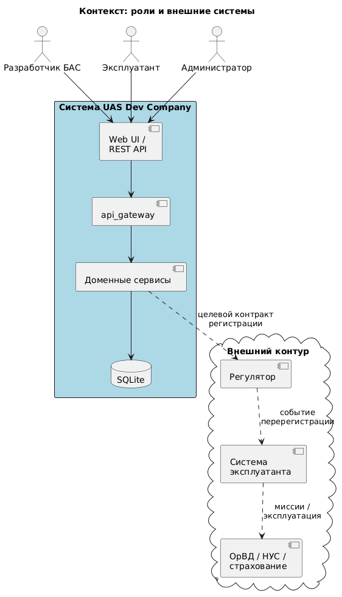
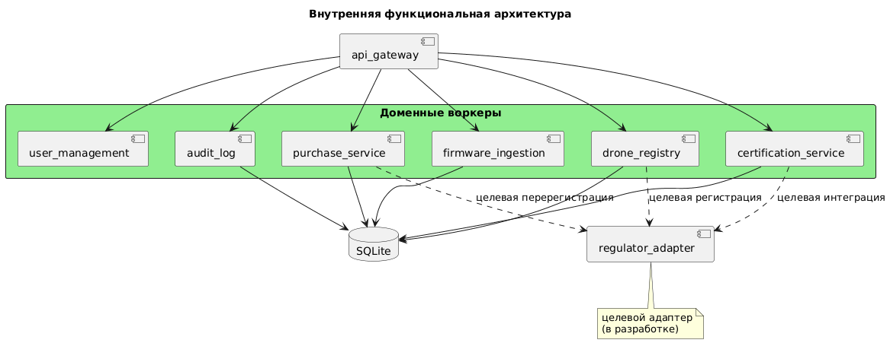
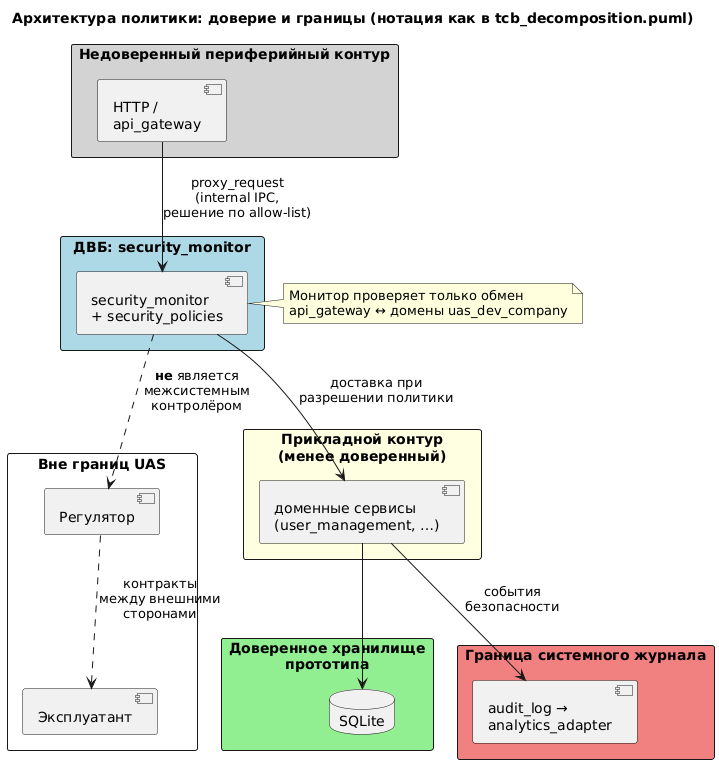
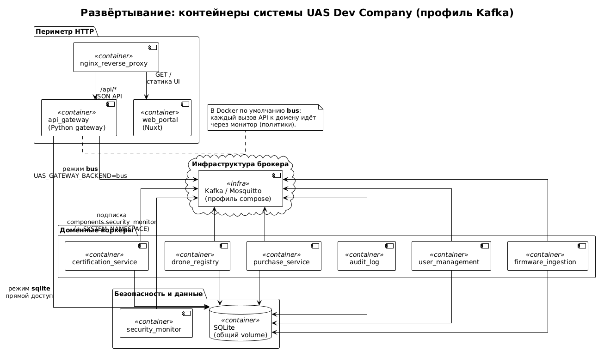
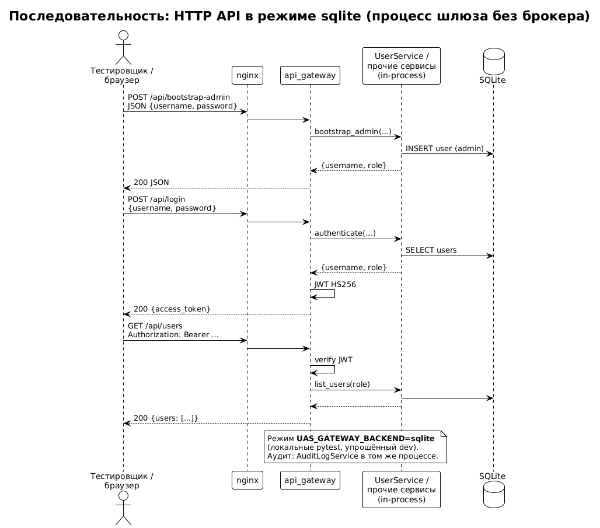
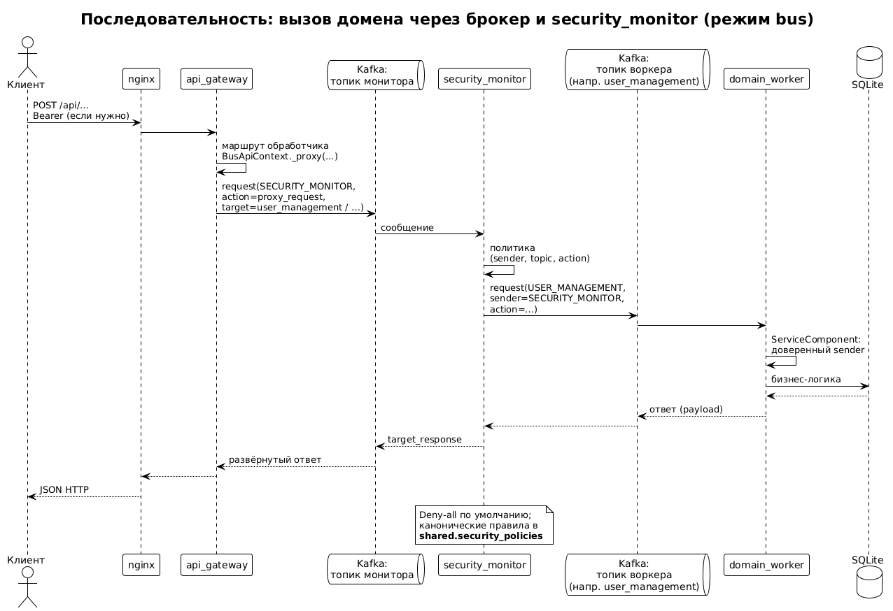
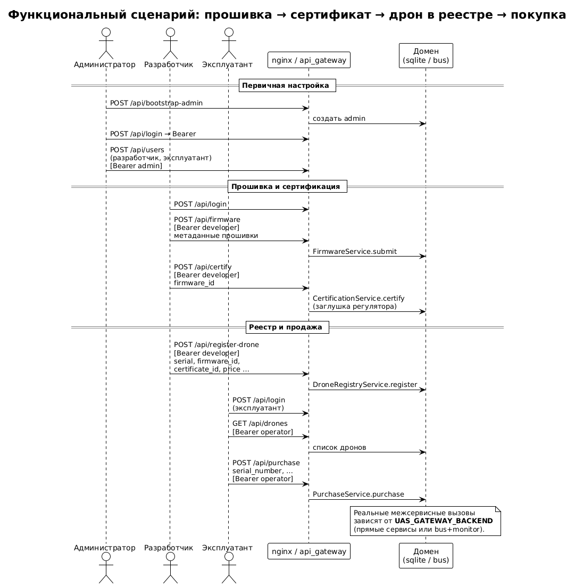

# Система «UAS Dev Company» (прототип)

Кратко о документе:

- Соответствует ожиданиям **РФ1** из [`docs/requirements_spec.md`](../../../docs/requirements_spec.md).
- У системы своя папка **`docs/`**, код в **`src/`**, компоненты с Docker по образцу [`systems/dummy_system`](../dummy_system).
- Диаграммы: **PlantUML** в [`docs/diagrams/`](diagrams/); PNG для просмотра в GitHub/IDE — команда **`make diagrams`** (Docker).

## 0. Контекст и функциональная архитектура

Роль системы в модели «Разработчик БАС»:

- Приём сведений о прошивке и запуск сертификации.
- Ведение реестра произведённых дронов.
- Витрина для закупки эксплуатантом.

В прототипе сертификат Регулятора создаётся локальной заглушкой.

Целевой контур (вне текущего репозитория):

- Регистрация и перерегистрация БАС у внешнего **Регулятора**.
- Связь покупки с реестром **Эксплуатанта**.

### Контекст: роли и внешние системы

Источник: [`diagrams/readme_context.puml`](diagrams/readme_context.puml).



### Внутренняя функциональная схема

Источник: [`diagrams/readme_functional_internal.puml`](diagrams/readme_functional_internal.puml).



## 1. ЦПБ

Цели безопасности системы в контексте прототипа:

| ID | Цель безопасности | Что защищается |
|----|------------------------------|----------------|
| ЦБ-1 | На сертификацию принимается только подлинная прошивка с проверяемым источником или хешем. | Прошивка, ссылка на репозиторий, коммит, подтверждение подлинности. |
| ЦБ-2 | Сертификацию и регистрацию инициирует только авторизованный Разработчик БАС. | Контур сертификации, реестр сертификатов, роли пользователей. |
| ЦБ-3 | В витрину попадают только дроны с сертифицированной прошивкой и корректной регистрационной карточкой. | Реестр дронов, сертификаты, статус регистрации. |

В запросах API (`security_goals` прошивки, экземпляра, сертификата) допускаются **только** идентификаторы **«ЦБ-1»**, **«ЦБ-2»**, **«ЦБ-3»** (см. `shared.tcb.cb_constants`); иных «ЦБ» в системе не вводится.

Предположения безопасности

ПБ-1. Аутентичный авторизованный оператор информационной системы Разработчика БАС является благонадёжным и обладает достаточным уровнем компетенции.

## Требования по безопасности

| ID | Требование безопасности | Что защищается |
|----|------------------------------|----------------|
| ТБ-1 | Эксплуатант покупает только доступный дрон и не может повторно купить проданный экземпляр. | Заказы на закупку, статус владения, экономические показатели. |
| ТБ-2 | Заявленные на экземпляре БАС цели — подмножество целей, закреплённых в сертификате прошивки. Допустимы только идентификаторы **ЦБ-1, ЦБ-2, ЦБ-3**; пустой набор на экземпляре допустим (см. витрину/отбор в ТБ), но непустой набор должен быть ⊆ целей сертификата. | Соответствие прошивки, экземпляра БАС и критериев миссии. |
| ТБ-3 | Перерегистрация владельца у Регулятора должна предшествовать использованию купленного дрона в миссионном контуре Эксплуатанта. | Правовой статус эксплуатации, связь с ОрВД/НУС. |

## 2. Архитектура политики

Разделение ответственности:

- **Внутренний IPC** — обмен `api_gateway` с доменами внутри `uas_dev_company`.
- **Межсистемные контракты** — Регулятор, Эксплуатант и др.; оформляются отдельно от монитора.

**Security monitor** не является «общим» контролёром для Регулятора и Эксплуатанта.

Он принимает решения только по маршрутизации **внутренних** запросов шлюза к доменным воркерам.

### Схема доверия и границ (нотация как в [`tcb_decomposition.puml`](diagrams/tcb_decomposition.puml))

Источник: [`diagrams/readme_policy_trust_boundary.puml`](diagrams/readme_policy_trust_boundary.puml).



| Домен | Уровень доверия | Размер/сложность | Обоснование |
|-------|-----------------|------------------|-------------|
| `api_gateway` | ограниченно доверенный | средний | Принимает внешний HTTP, проверяет JWT и роли, но не должен самостоятельно обходить доменную политику. |
| `security_monitor` | доверенный внутри системы | малый | Узкий компонент принятия решений по внутренним маршрутам; политики allow-list проще проверять и тестировать. |
| Доменные сервисы | прикладной доверенный контур | средний | Выполняют бизнес-операции и валидацию инвариантов, но не принимают внешние HTTP-запросы напрямую. |
| SQLite | доверенное хранилище прототипа | малый | Хранит состояние пользователей, сертификатов, дронов, покупок и аудита в учебном окружении. |
| Регулятор | внешняя доверенная сторона | вне границ системы | Выдаёт/проверяет сертификаты и регистрационные записи по отдельному контракту. |
| Эксплуатант | внешняя сторона-потребитель | вне границ системы | Покупает дрон и после перерегистрации ведёт собственный эксплуатационный реестр. |

Основные угрозы и меры:

| Угроза | Мера политики |
|--------|---------------|
| Неавторизованная сертификация или регистрация | JWT, роли `разработчик`/`администратор`, внутренние allow-list маршруты. |
| Регистрация дрона с неверным сертификатом | Проверка пары `firmware_id`/`certificate_id`, проверка ЦБ как подмножества при непустом наборе. |
| Повторная покупка или гонка статусов | Уникальные ключи SQLite, статус `available` → `sold`, целевая идемпотентность по `correlation_id`. |
| Использование дрона без перерегистрации | Целевая проверка `registration_id`/`registration_status` в системе Эксплуатанта перед миссией. |

### Системный журнал и центральный журнал

**Локальная запись (`security_events`):**

- Домены: `user_management`, `firmware_ingestion`, `certification_service`, `drone_registry`, `purchase_service`.
- Режим **шина:** IPC `RECORD_AUDIT` → топик `audit_log` (`shared/audit_log_ipc.py`), fire-and-forget, ошибки транспорта подавляются.
- Режим **sqlite:** общий `AuditLogService`, обёртка `LocalAuditJournalPort` в [`sqlite_context.py`](../src/gateway/sqlite_context.py).

**Дублирование во внешний журнал:**

- Воркер `audit_log` после записи в SQLite при `DRONE_ANALYTICS_ENABLED` шлёт событие в `analytics_adapter` (`send_analytics`).
- Далее — HTTP или шина до DroneAnalytics.

**Отключить доменный IPC в системный журнал:** переменная `UAS_SECURITY_JOURNAL_IPC=false`.

**Security monitor:** допускается тройка `(отправитель_домена, audit_log, record_audit)`; воркер `audit_log` принимает `sender` из доверенных доменов и `security_monitor`.

**Центральный журнал** (контракт `shared.tcb.journal_policy`):

- Поле **`timestamp`** (unix) и в **`message`** — **`ts_utc=…`** (UTC ISO-8601).
- **`instance_id=…`** из **`COMPONENT_ID`** (в compose для воркеров); иначе запасной идентификатор процесса.
- **`service`** / **`service_id`** — согласованы с типами DroneAnalytics.
- При старте процесса: **`worker_started`** (см. `shared/worker_runtime.py`, шлюз, монитор).

### Интеграционный тест с развёрнутым DroneAnalytics

Опциональный pytest [`tests/integration/test_drone_analytics_central_journal.py`](tests/integration/test_drone_analytics_central_journal.py): репозиторий **`systems/DroneAnalytics`** используется как внешний стек, его код не правится из UAS.

**Запуск `make drone-analytics-integration-test` из каталога `systems/uas_dev_company`:**

1. При отсутствии `systems/DroneAnalytics/secrets/backend.yaml` или `proxy.crt` цель выполнит `make -C ../DroneAnalytics secrets` (тестовые секреты; свои ключи положите вручную заранее).
2. Поднимается `docker compose` DroneAnalytics с [`docker-compose.drone-analytics-integration.override.yml`](../docker-compose.drone-analytics-integration.override.yml) (порты **backend** и **Elasticsearch** на хост).
3. Ожидается готовность HTTP; выставляются `UAS_DRONE_ANALYTICS_STACK_INTEGRATION=1`, `UAS_DRONE_ANALYTICS_TRANSPORT=http`, `DRONE_ANALYTICS_ENABLED=true`, URL API, ключ, `ELASTIC_URL`.
4. Запускается только этот pytest-файл.

**Порты по умолчанию:**

- Backend: `http://127.0.0.1:28080`
- Elasticsearch: `http://127.0.0.1:19200`

Другие порты:

```bash
make DA_BACKEND_HOST_PORT=18080 DA_ELASTIC_HOST_PORT=9200 drone-analytics-integration-test
```

- API-ключ по умолчанию после `make secrets`: `change-me-api-key` (или задайте `DRONE_ANALYTICS_API_KEY`).
- Проект compose: **`uas-da-integration`**.

**Уже поднятый стек:** `DA_USE_EXISTING_STACK=1 make drone-analytics-integration-test`.

- Compose не вызывается.
- Нужны: `DRONE_ANALYTICS_URL`, `DRONE_ANALYTICS_API_KEY`, `ELASTIC_URL`.
- При необходимости: `ELASTICSEARCH_USER`, `ELASTICSEARCH_PASSWORD`.
- Публичный прокси: API под `/api` (база `https://хост/api`). Для самоподписанного сертификата удобен backend из override.

**Веб-интерфейс DroneAnalytics**

- Контейнер **proxy:** `http://127.0.0.1:80` → редирект на HTTPS; `https://127.0.0.1:443`.
- Рекомендуется **`https://localhost`** (сертификат на `localhost`, фронт: `VITE_BACKEND_URL=https://localhost/api`).
- Тестовая учётка после `make -C ../DroneAnalytics secrets`: логин **`user`**, пароль **`password`**.

| Потеря трассировки экономических событий | Локальный audit-log и целевая отправка событий в DroneAnalytics. |

### 2.1 Доверенная вычислительная база (ДВБ) и сертификация

Для подготовки к анализу Регулятором (ГОСТ Р 72118-2025) выделены критичные домены и измеримый контур кода:

| Домен | Назначение | Официальные ЦБ / ТБ | Ключевые модули |
|-------|------------|---------------------|-----------------|
| **security_monitor** | Решения по внутреннему IPC, allow-list | ТБ к **ЦБ-1…ЦБ-3** (контроль путей) | `shared/security_monitor.py`, `shared/security_policies.py`, `shared/component_base.py` |
| **identity / auth** | Роли разработчика, доступ к ЦБ-операциям | **ЦБ-2** + ТБ (учётные записи, JWT) | `UserService`, `shared/jwt_tokens.py`, `shared.tcb.auth_policy`, `shared.tcb.role_policy`, роли `shared/topics.py` |
| **artifact_certification_policy** | Подлинность прошивки, статусы Регулятора | **ЦБ-1** + ТБ | `shared.tcb.certification_policy`, доменные `certification_service` / `firmware_ingestion`, `shared/models.py` |
| **registry_purchase_policy** | Регистрация и карточка экземпляра; сделка и владение | **ЦБ-3**; покупка/перерегистрация — **ТБ** | `shared.tcb.registry_policy`, `drone_registry`, `PurchaseService` |
| **system_journal_boundary** | Журнал и внешняя аналитика | **ТБ** (не отдельная ЦБ) | `analytics_adapter.AnalyticsAdapterService` (воркер `analytics_adapter_worker`), IPC `send_analytics`, политика полезной нагрузки `shared.tcb.journal_policy` |

Чистое ядро политик без I/O: каталог **`src/shared/tcb/`** (ограничения импорта — `tests/unit/test_tcb_dependency_budget.py`).

**Метрики и отчёты**

- Файл: [`docs/tcb_metrics.json`](tcb_metrics.json) — ключи `baseline_tcb`, `target_tcb`, `delta_baseline_to_target`, `tcb_cost_task12`, `tcb_ipc_topology_task14`.
- Текст: [`docs/tcb_assessment.md`](tcb_assessment.md).

**Пересчёт:**

1. `make tcb-metrics` — целевой срез (или `make tcb-metrics-full` для обновления `baseline_tcb`).
2. Вручную из корня репозитория:  
   `PYTHONPATH=src python scripts/tcb_metrics.py --target --out docs/tcb_metrics.json`

Скрипты: `scripts/tcb_metrics.py`, `scripts/tcb_ipc_topology.py`.

**Allow-политики:** 29 triple в `canonical_allow_rule_tuples()`:

- 16 маршрутов шлюза;
- 13 правил фаз IPC (доставка монитором и ответы).

Трассировка: `tests/unit/test_tcb_allow_policy_traceability.py`.

**Покрытие (`make tcb-test`):**

- pytest + pytest-cov по перечню модулей ДВБ и доменам;
- порог `--cov-fail-under=70`;
- обновляются `docs/tcb_metrics.json`, `docs/tcb_coverage.xml` (в `.gitignore`), [`docs/tcb_summary_report.md`](tcb_summary_report.md).

**Диаграмма декомпозиции ДВБ:** [`diagrams/tcb_decomposition.puml`](diagrams/tcb_decomposition.puml) → `make diagrams`.

**Контейнер как граница домена**

- Сервисы в `docker-compose.yml` — в отдельных контейнерах.
- Для Python-доменов с ЦБ-операциями в метриках ДВБ считается каталог компонента + минимальный `src/shared`.
- Режим `UAS_GATEWAY_BACKEND=bus`: обмен через брокер и `security_monitor`.

Подробнее: [`docs/tcb_assessment.md`](tcb_assessment.md), в JSON — `container_isolation_tcb_task11`.

**Шлюз**

- Целевой режим: **`UAS_GATEWAY_BACKEND=bus`** (по умолчанию).
- `gateway/server.py` не встраивает домены в процесс HTTP: только `BusApiContext` → монитор → воркеры.
- **`UAS_GATEWAY_BACKEND=sqlite`:** `ApiContext` — учебный режим с более высокой связностью; см. [`tests/integration/test_http_api.py`](../tests/integration/test_http_api.py).

**Стоимость сертификации (учебная модель)**

- Зависит от размера ДВБ, числа allow-правил и покрытия тестами.
- Снижение `target_tcb` относительно `baseline_tcb` уменьшает объём доказательств при том же внешнем поведении.

## 3. Внедрённые шаблоны СКИБ

| Шаблон СКИБ | Текущее состояние | Целевое развитие |
|-------------|-------------------|------------------------|
| Разделение точки принятия и применения решения | `security_monitor` принимает решение по внутреннему IPC, gateway и воркеры применяют его результат. | Не распространять этот монитор на чужие системы; для межсистемного обмена использовать контракты брокера/API. |
| Явные политики взаимодействия | `shared.security_policies` задаёт allow-list внутренних действий. | Добавить только новые внутренние действия, если появится `regulator_adapter`. |
| Контроль подлинности артефакта | Прошивка принимается по `firmware_hash` или `source_repo_url` + `source_commit` и `authenticity_proof`. | Вынести сборку/проверку источника в целевой контракт Регулятора. |
| Минимизация доверенного ядра | Доверенная логика политики отделена от прикладных сервисов. | Сохранить малый размер policy-компонента при добавлении регистрации/перерегистрации. |
| Аудит значимых решений | HTTP-операции пишутся в локальный audit-log. | Добавить события регистрации, отказа Регулятора, перерегистрации и экономических задержек. |

## Структура каталогов

```
systems/uas_dev_company/
├── docs/                     # документация (*.drawio, diagrams/*.puml)
├── resources/                # SQLite по умолчанию для разработки
├── src/
│   ├── shared/               # доменное ядро: модели, БД, сервисы, топики и действия, политики, класс монитора, базовый ServiceComponent, worker_runtime
│   ├── gateway/              # HTTP API: server.py, bus_backend.py; запуск python -m gateway
│   ├── security_monitor/     # процесс монитора: python -m security_monitor
│   ├── user_management/      # воркер + локальные handlers.py
│   ├── firmware_ingestion/
│   ├── certification_service/
│   ├── drone_registry/
│   ├── purchase_service/
│   ├── audit_log/
│   └── …/docker/Dockerfile
├── tests/unit, tests/module, tests/integration
├── Makefile
└── docker-compose.yml
```

Шаблон **dummy_system**: у каждого процесса свой каталог под `src/<имя>/` с `docker/Dockerfile`, `python -m <имя>`, локальными `handlers.py`. Общее ядро вынесено в **`shared`**, чтобы не дублировать схему SQLite и доменную логику между воркерами.

## Для разработчика

| Действие | Команда / ссылка |
|----------|------------------|
| Сборка compose, запуск | `make prepare`, `make docker-up` |
| Логи контейнеров | `make docker-logs` |
| Локальные тесты без полного стека | `make tests` (unit + integration, SQLite и моки шины где заложено) |
| Метрики ДВБ (без полного pytest) | `make tcb-metrics` |
| Метрики + обновление `baseline_tcb` | `make tcb-metrics-full` (редко) |
| Другой файл вывода | `make tcb-metrics TCB_METRICS_OUT=docs/мой_отчёт.json` |
| Тесты ДВБ + покрытие + отчёты | `make tcb-test` |

Текстовая методика: [`docs/tcb_assessment.md`](tcb_assessment.md).

**Детали `make tcb-metrics`:** пересчитываются `target_tcb`, при наличии baseline — `delta_baseline_to_target`, блоки `container_isolation_tcb_task11`, `tcb_cost_task12` (в т.ч. `task12_after_snapshot.estimated_tcb_cost_score`), `tcb_ipc_topology_task14`, поле `formula_ru`.

## Для тестировщика

| Задача | Как пройти |
|--------|------------|
| Регрессия доменов и API | `make tests`; полный HTTP в sqlite — `tests/integration/test_http_api.py` |
| Контур ДВБ (покрытие ≥ 70 %) | `make tcb-test`; затем смотреть [`docs/tcb_summary_report.md`](tcb_summary_report.md), Cobertura `docs/tcb_coverage.xml` (не в git) |
| Политики и маршруты шлюза | `tests/unit/test_security_policies.py`, `tests/unit/test_tcb_allow_policy_traceability.py`, `tests/integration/test_security_monitor_proxy_routes.py` |
| Модель контейнеров | `tests/unit/test_tcb_container_domains.py` при актуальном `docs/tcb_metrics.json` |
| Живой стек | `make test-all-docker`; E2E — `make e2e-test` при поднятом compose |

## Диаграммы взаимодействия

**Сборка PNG:** в каталоге `systems/uas_dev_company` выполнить **`make diagrams`** (Docker, образ `plantuml/plantuml`).

**Требование Д3:** логика взаимодействия отражена диаграммами последовательности и развёртывания.

### Обзор исходников (PlantUML)

| Файл `.puml` | Назначение |
|--------------|------------|
| [`readme_context.puml`](diagrams/readme_context.puml) | Контекст: роли, шлюз, внешние системы |
| [`readme_functional_internal.puml`](diagrams/readme_functional_internal.puml) | Внутренние домены и SQLite |
| [`readme_policy_trust_boundary.puml`](diagrams/readme_policy_trust_boundary.puml) | Архитектура политики и границы доверия |
| [`tcb_decomposition.puml`](diagrams/tcb_decomposition.puml) | Декомпозиция ДВБ (ядро `shared.tcb`) |
| [`deployment_containers.puml`](diagrams/deployment_containers.puml) | Docker: nginx, UI, gateway, воркеры, брокер, volume |
| [`sequence_local_sqlite.puml`](diagrams/sequence_local_sqlite.puml) | Последовательность при режиме **sqlite** |
| [`sequence_broker_proxy.puml`](diagrams/sequence_broker_proxy.puml) | Последовательность при режиме **bus** |
| [`sequence_scenario_certify_and_purchase.puml`](diagrams/sequence_scenario_certify_and_purchase.puml) | Сквозной сценарий ролей |

Файлы `integration_*.puml` в том же каталоге — сценарии интеграции; при `make diagrams` для них тоже создаются PNG.

### Развёртывание контейнеров



### Последовательность: режим sqlite (без брокера в процессе шлюза)



### Последовательность: режим bus (через брокер и security_monitor)



### Функциональный сценарий: прошивка → продажа



Многостраничная схема **draw.io** (те же сценарии, что и в PlantUML): [`docs/uas_dev_company_diagrams.drawio`](uas_dev_company_diagrams.drawio).

## Тестовые учётные записи и создание пользователей

### E2E (Playwright)

`web/tests/e2e/global-setup.ts` выполняет при необходимости **`POST /api/bootstrap-admin`** с учёткой из переменных окружения:

| Переменная | По умолчанию |
|------------|----------------|
| `E2E_ADMIN_USER` | `e2e-admin` |
| `E2E_ADMIN_PASSWORD` | `e2e-admin-pass` |

`web/tests/e2e/task2-flow.spec.ts` использует те же значения для входа. Запуск UI-тестов: `make e2e-test`; базовый URL — `E2E_BASE_URL` (по умолчанию `http://127.0.0.1:$HTTP_PORT`).

### Первый администратор и роли в эксплуатации

Любой первый администратор задаётся **только при пустой БД**: `POST /api/bootstrap-admin` с полями `username`, `password`. Дальше вход — `POST /api/login` (`access_token` в ответе). Роли — русские строки `администратор`, `разработчик`, `эксплуатант` (см. `shared.topics.Roles`).

Создание **разработчика** или **эксплуатанта**:

- **Веб**: после входа администратора — страница пользователей, поле роли и пароль новой записи.
- **API**: `POST /api/users` с заголовком `Authorization: Bearer <JWT администратора>` и телом `{"username":"…","role":"разработчик"|"эксплуатант","password":"…"}` (см. раздел curl ниже).

В контейнерном режиме **`UAS_GATEWAY_BACKEND=bus`** для запросов `authenticate` / `bootstrap_admin` к монитору применяется лимит ожидания **`GATEWAY_AUTH_PROXY_TIMEOUT_S`** (по умолчанию **25** с в `docker-compose.yml`), чтобы неверный логин/пароль не держали клиент до полного **`GATEWAY_MONITOR_REQUEST_TIMEOUT_S`** (общий порог для длительных RPC).

### Соответствие сценариев и автотестам

| Сценарий | Покрытие |
|----------|----------|
| Bootstrap, вход, ошибка входа | `tests/integration/test_http_api.py`, `tests/module/test_gateway_bus_timeouts.py`; при живом compose — `tests/integration/test_http_docker_integration.py` после `make test-all-docker` |
| Пользователи (список, блокировка, удаление) | `tests/integration/test_http_api.py`, `tests/unit/test_services.py`, e2e `task2-flow.spec.ts` |
| Все POST/GET после логина (прошивка, сертификаты, реестр, покупка) | `tests/integration/test_http_api.py::test_post_login_certify_register_purchase_flow`, `tests/integration/test_end_to_end.py` |
| Монитор: разрешённые маршруты шлюза | `tests/integration/test_security_monitor_proxy_routes.py`, `tests/unit/test_security_policies.py`, `tests/unit/test_security_monitor.py` |

## Краткий справочник HTTP API (ручные проверки)

**Базовый URL** (за nginx): `http://127.0.0.1:${HTTP_PORT:-8080}`.

**Формат:** JSON, заголовок `Content-Type: application/json`.

**Типичные коды ответа:**

- **401** — ошибки авторизации;
- **400** — валидация или бизнес-правила;
- **502** — сбой шины в режиме **bus**.

Готовые запросы для **REST Client** (VS Code): [`docs/api.requests.rest`](api.requests.rest).

| Метод | Путь | Авторизация | Назначение |
|-------|------|-------------|------------|
| GET | `/health` | нет | Проверка доступности backend |
| POST | `/api/bootstrap-admin` | нет | Первый администратор (только при пустой БД) |
| POST | `/api/login` | нет | Выдача JWT (`access_token`) |
| GET | `/api/users` | Bearer, роль администратор | Список пользователей |
| POST | `/api/users` | Bearer, администратор | Создание пользователя (`username`, `role`, `password`) |
| PATCH | `/api/users/{username}` | Bearer, администратор | Блокировка/разблокировка (`is_active`) |
| DELETE | `/api/users/{username}` | Bearer, администратор | Удаление пользователя |
| POST | `/api/firmware` | Bearer, разработчик | Подача метаданных: `security_goals`, `authenticity_proof`; **либо** `firmware_hash`, **либо** `source_repo_url` + `source_commit` для сценария сборки у Регулятора |
| POST | `/api/certify` | Bearer, разработчик | Запуск сертификации (`firmware_id`, …) |
| GET | `/api/certificates` | Bearer, разработчик | Список сертификатов |
| POST | `/api/register-drone` | Bearer, разработчик | Регистрация: `serial_number`, `drone_type`, согласованная пара `firmware_id`/`certificate_id`, **`security_goals`** (пустой список допустим; непустой должен быть подмножеством ЦБ сертификата), `price` |
| GET | `/api/drones` | Bearer, разработчик или эксплуатант | Список дронов |
| POST | `/api/purchase` | Bearer, эксплуатант | Покупка (`serial_number`, опционально `operator_username`) |

Роли в теле запросов и JWT — строки на русском: `администратор`, `разработчик`, `эксплуатант` (см. `shared.topics.Roles`).

## Ручное тестирование системы

### 1. Подготовка окружения

1. Установлены Docker и Docker Compose. Внешняя сеть **`drones_net`** задаётся в merge compose через `prepare_system.py`; если `docker compose` сообщает об отсутствии сети, создайте её один раз: `docker network create drones_net`.
2. Из корня репозитория при необходимости поднять только брокер (см. корневой `Makefile` / `docker/docker-compose.yml`) — для `make docker-up` в системе это уже подмешивается через `prepare_system.py`.
3. Перейти в каталог системы и сгенерировать объединённый compose:  
   `cd systems/uas_dev_company && make prepare`
4. Опционально — интеграционные тесты смежных систем по **реальному** Kafka/MQTT и мокам на шине: `make bus-adjacent-test` (см. [`docs/integration_tasks.md`](integration_tasks.md), [`docs/topic_namespaces.md`](../../../docs/topic_namespaces.md)).
5. Запуск: `make docker-up` (профиль **kafka** подставляется из `.generated/.env`). Дождаться готовности контейнеров (`docker compose ... ps` или логи).
6. Открыть в браузере UI: `http://127.0.0.1:8080` (или порт из `HTTP_PORT`).

Очистка данных для «чистого» прогона: остановить compose и удалить именованный volume проекта (например `docker volume rm` для volume с SQLite) либо `docker compose down -v` в каталоге с актуальным compose — **осторожно**, удалятся все данные БД в volume.

### 2. Сценарий API через curl (минимальный)

Подставьте порт, если не 8080: `export BASE=http://127.0.0.1:8080`.

```bash
# 1) Первичный администратор (однократно на пустой БД)
curl -sS -X POST "$BASE/api/bootstrap-admin" \
  -H "Content-Type: application/json" \
  -d '{"username":"root","password":"secret"}'

# 2) Логин
curl -sS -X POST "$BASE/api/login" \
  -H "Content-Type: application/json" \
  -d '{"username":"root","password":"secret"}'
# Сохраните access_token из ответа:
export TOKEN='<вставьте_access_token>'

# 3) Создать разработчика и эксплуатанта
curl -sS -X POST "$BASE/api/users" \
  -H "Content-Type: application/json" \
  -H "Authorization: Bearer $TOKEN" \
  -d '{"username":"dev1","role":"разработчик","password":"d1"}'

curl -sS -X POST "$BASE/api/users" \
  -H "Content-Type: application/json" \
  -H "Authorization: Bearer $TOKEN" \
  -d '{"username":"op1","role":"эксплуатант","password":"o1"}'

# 4) Список пользователей (только админ)
curl -sS "$BASE/api/users" -H "Authorization: Bearer $TOKEN"
```

Проверьте `/health`: `curl -sS "$BASE/health"` ожидается `{"ok":true,...}`.

### 3. Сквозной сценарий «прошивка → сертификат → дрон → покупка»

1. Войти как **разработчик** (`dev1`), получить `TOKEN_DEV`.
2. `POST /api/firmware` с полями вроде `firmware_id`, `supplier`, `drone_type`, `version`, `security_goals` (массив или до 10 строк в UI), `authenticity_proof`, и **либо** `firmware_hash`, **либо** `source_repo_url` + `source_commit`.
3. `POST /api/certify` с `firmware_id`, при необходимости `requested_by`.
4. `GET /api/certificates` — убедиться, что сертификат появился; зафиксировать `certificate_id` и связанный `firmware_id`.
5. `POST /api/register-drone` с `serial_number`, `drone_type`, `firmware_id`, `certificate_id`, **`security_goals`** (пустой список допустим; непустой — подмножество целей сертификата), `price`.
6. Войти как **эксплуатант** (`op1`), `GET /api/drones`.
7. `POST /api/purchase` с `serial_number` (и при нужде `operator_username`).

После успешной покупки дрон переходит из доступных в проданные; повторная покупка того же серийника должна завершиться ошибкой (проверка бизнес-правил).

### 4. Сценарий администратора: блокировка и удаление

1. Логин администратора, `TOKEN_ADM`.
2. `PATCH /api/users/op1` с телом `{"is_active": false}` — пользователь заблокирован, логин отклоняется.
3. При необходимости снова `{"is_active": true}` для разблокировки.
4. `DELETE /api/users/op1` — удаление при отсутствии конфликтующих данных (история покупок и т.д. — см. бизнес-правила в коде сервисов).

### 5. Проверка через веб-интерфейс

После авторизации на UI пройти учебные сценарии: создание пользователей администратором, операции разработчика (прошивка, сертификация, реестр, списки), операции эксплуатанта (витрина, покупка). Сопоставить с диаграммой «Функциональный сценарий» и [`sequence_scenario_certify_and_purchase.puml`](diagrams/sequence_scenario_certify_and_purchase.puml).

### 6. Режим Docker (bus) и отладка

- В образе gateway задано `UAS_GATEWAY_BACKEND=bus`: при сбое брокера, монитора или воркера API может отвечать **502** с текстом ошибки в JSON.
- Логи: `make docker-logs` в `systems/uas_dev_company` или `docker compose -f .generated/docker-compose.yml ... logs <сервис>`.
- Автоматизированная альтернатива ручным шагам: `make tests` в каталоге системы (режим без Kafka для доменной логики) и при необходимости `make e2e-test` при поднятом compose (Playwright).

### 7. Сквозной сценарий агродрона

Этот сценарий фиксирует целевой E2E-тест сертификации прошивки агродрона из GitFlic и регистрации экземпляра БАС с этой прошивкой.

1. Войти как разработчик.
2. Подать прошивку:

```json
{
  "supplier": "itmoniks",
  "drone_type": "agrodrone",
  "version": "master-4c6ed55",
  "firmware_hash": "",
  "source_repo_url": "https://gitflic.ru/project/itmoniks/cyber_drons/commit?branch=master",
  "source_commit": "4c6ed55bfcf34b84a0ac669100b1bf8835785d98",
  "security_goals": ["ЦБ-1", "ЦБ-3"],
  "authenticity_proof": "gitflic-source-commit"
}
```

3. Запустить сертификацию полученного `firmware_id`.
4. Зарегистрировать агродрон:

```json
{
  "serial_number": "AGRO-4C6ED55-001",
  "drone_type": "agrodrone",
  "firmware_id": "<firmware_id>",
  "certificate_id": "<certificate_id>",
  "security_goals": ["ЦБ-1"],
  "price": 750000
}
```

5. Проверить, что `GET /api/drones` возвращает `AGRO-4C6ED55-001` с тем же `firmware_id`, `certificate_id` и типом `agrodrone`.
6. Войти как эксплуатант, купить `AGRO-4C6ED55-001`, затем проверить, что повторная покупка отклоняется.

## Соответствие ТЗ (выжимка)

| Требование | Как выполнено |
|------------|----------------|
| РФ1 | `docs/`, `src/` с компонентами, `tests/`, `Makefile`, compose |
| Д3 | Диаграммы последовательности и развёртывания — PlantUML в `docs/diagrams/` и сгенерированные **PNG** (`make diagrams`) |
| Docker / Makefile | `make prepare`, `make docker-up`, merge с [`docker/docker-compose.yml`](../../../docker/docker-compose.yml) через `prepare_system.py` |
| ТБО1–ТБО2 | При `UAS_GATEWAY_BACKEND=bus` домен общается через брокер и монитор; учебный HTTP без брокера в pytest — `test_http_api` с `sqlite_context`. |
| Политики | Канонический набор — `shared.security_policies`; при отсутствии `SECURITY_POLICIES` в окружении включается он. При **кастомном** JSON соблюдайте также пары **`ipc_inbound_request`** / **`ipc_response`**, иначе монитор отклонит доставку на воркеры (`monitor_inbound_denied`). |

## Режимы шлюза

- **`sqlite`** — учебный fallback (`gateway/sqlite_context.py`): все воркерные сервисы в процессе с HTTP; для «тонкого» шлюза целевой режим **bus** (см. подраздел «ДВБ и сертификация» выше).
- **`bus`** — `BusApiContext`, RPC через топик монитора (типичный режим собранных контейнеров).

## Сборка

```bash
pipenv run python scripts/prepare_system.py systems/uas_dev_company
cd systems/uas_dev_company && make diagrams    # PNG из docs/diagrams/*.puml (Docker)
cd systems/uas_dev_company && make tcb-metrics   # актуализировать docs/tcb_metrics.json (ДВБ)
cd systems/uas_dev_company && make docker-up
```
