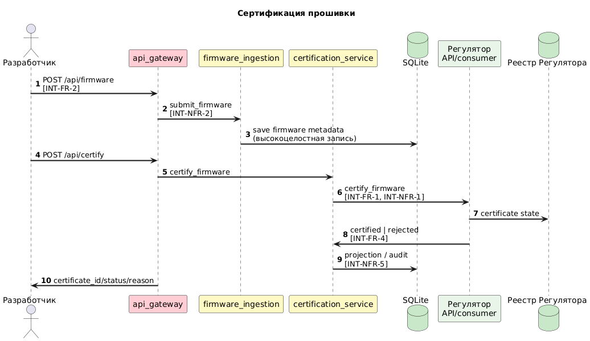
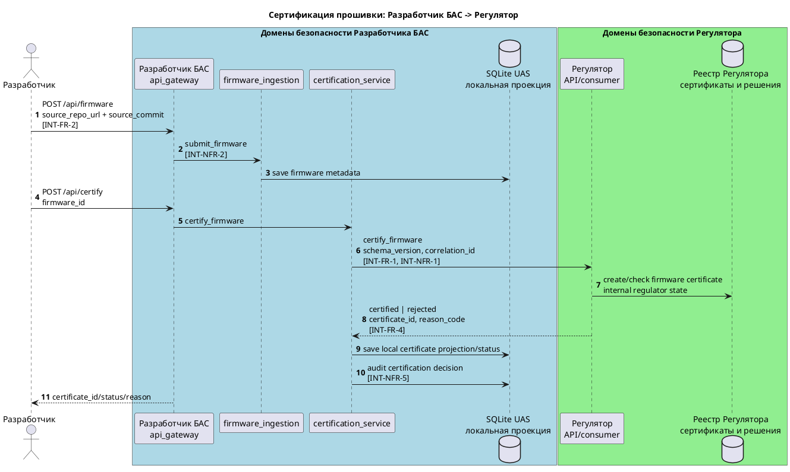
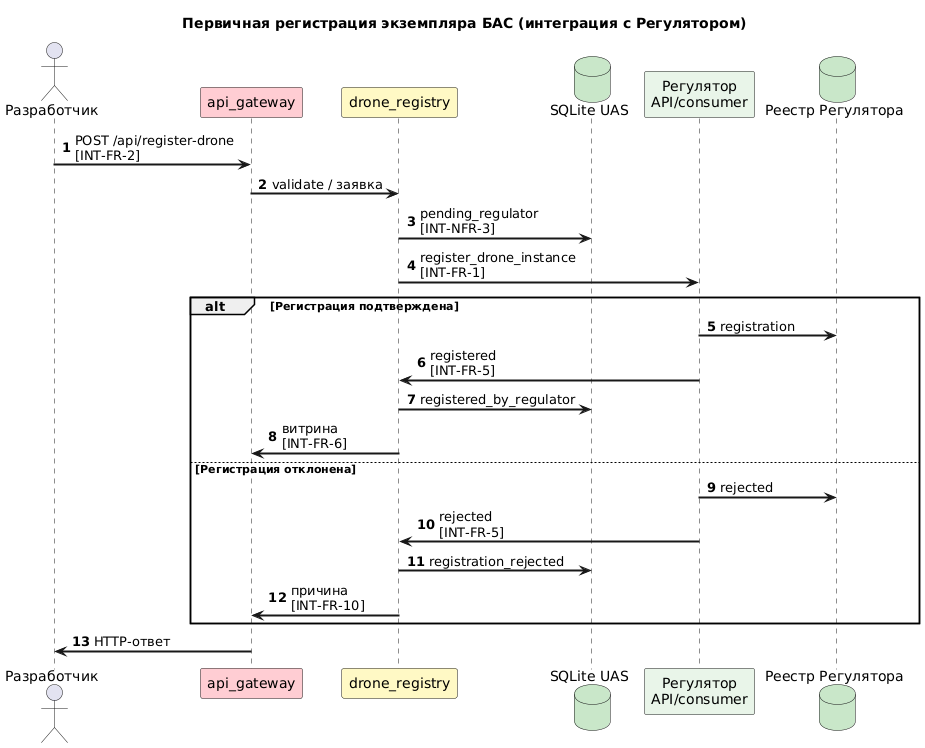
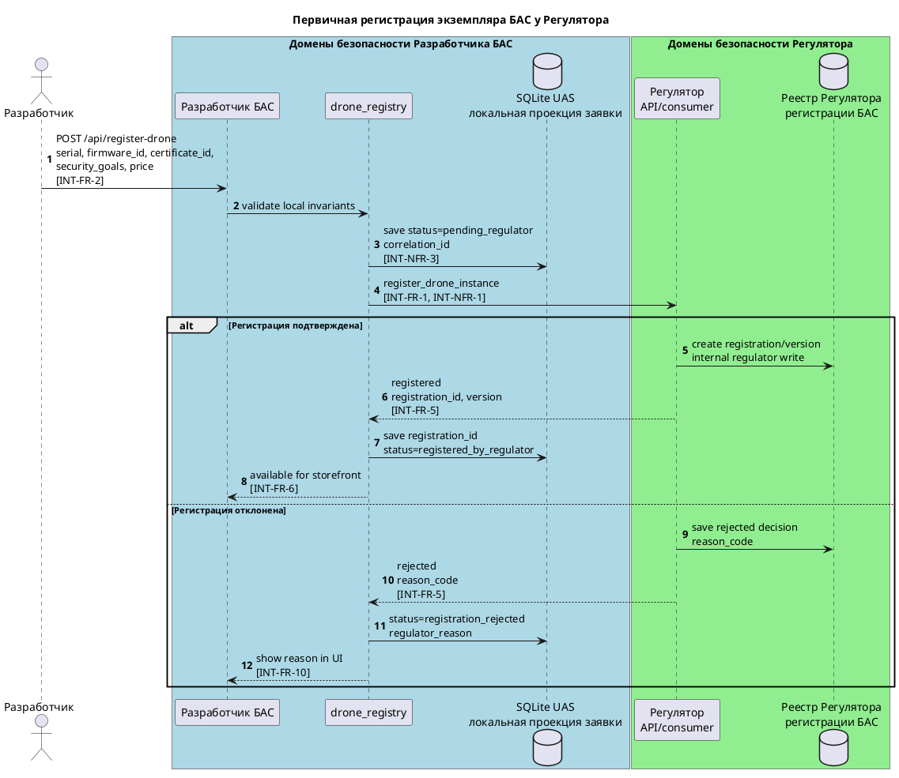
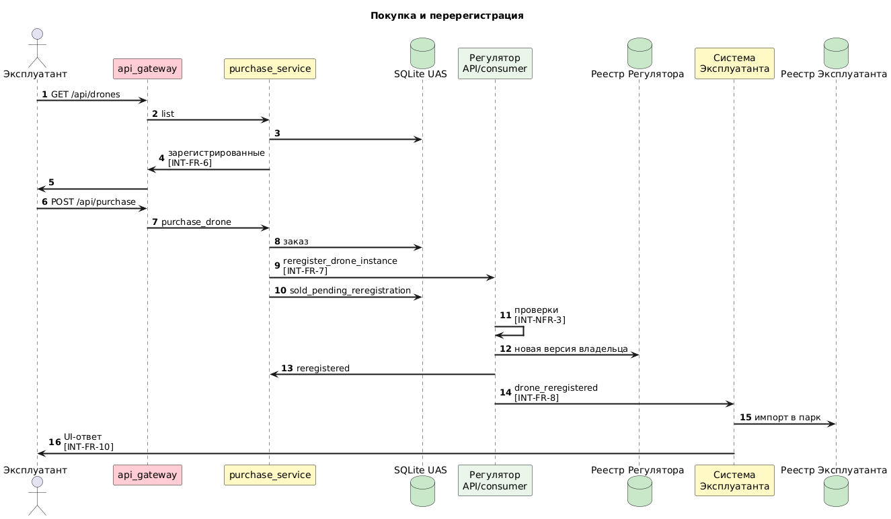
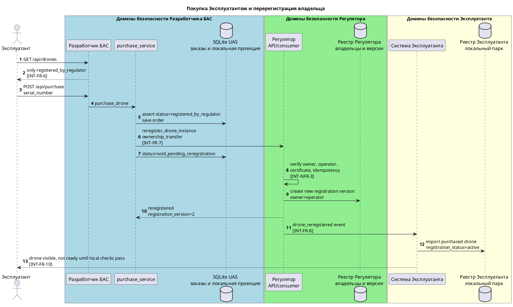
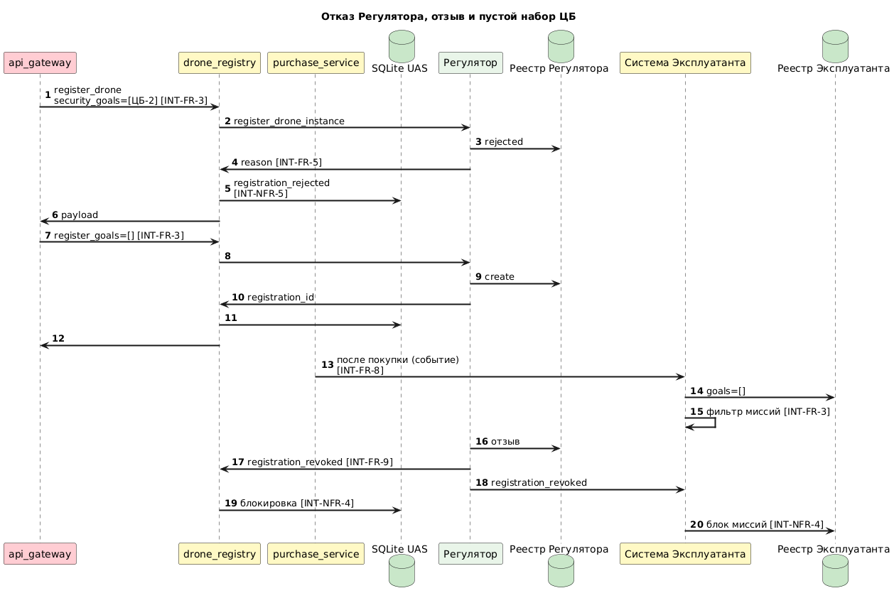
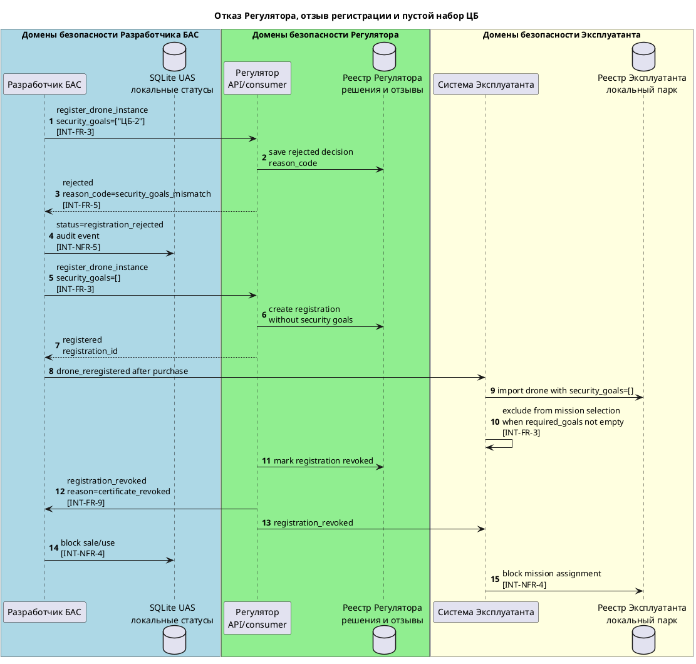
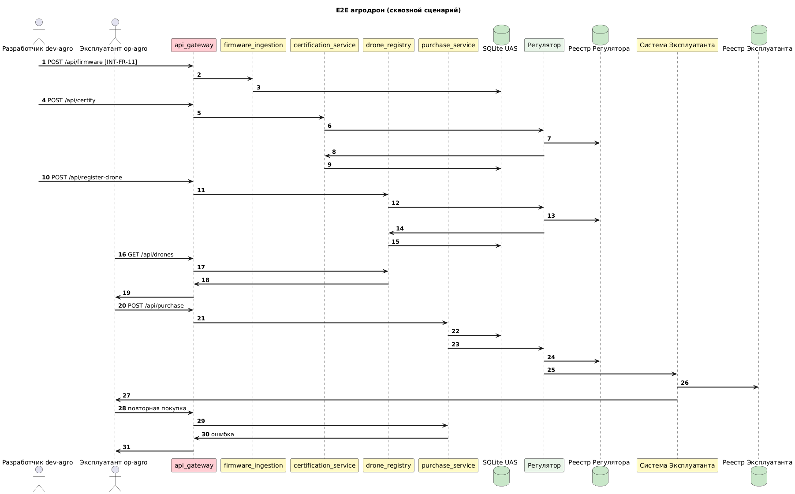
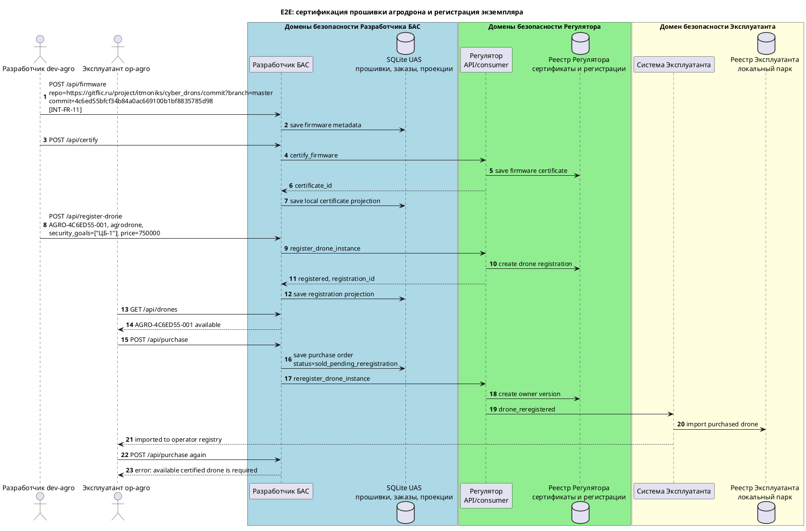

# Интеграция Разработчика БАС, Регулятора и Эксплуатанта

Документ фиксирует требования, рекомендации и тестовые сценарии для целевой интеграции систем:

- `systems/uas_dev_company` — Разработчик БАС;
- `systems/regulator` и/или `systems/team1-regulator_operation_devsecops` — Регулятор;
- `systems/operator` и/или `systems/drone-operator-system` — Эксплуатант.

Контекст: текущий `uas_dev_company` уже поддерживает учебный локальный сценарий «прошивка → сертификат → дрон → покупка», но сертификат Регулятора пока создаётся внутри системы как заглушка. Целевая интеграция должна вынести регистрацию и перерегистрацию экземпляра БАС во внешний контур Регулятора и синхронизировать купленный дрон с реестром Эксплуатанта.

Межсистемная интеграция описывается контрактами брокера/API, аутентификацией, корреляцией и аудитом.

## Термины и состояния

| Термин | Значение |
|--------|----------|
| Сертификат прошивки | Подтверждение Регулятора, что конкретная прошивка или исходный репозиторий с коммитом прошли проверку. |
| Регистрация БАС | Запись Регулятора о конкретном экземпляре дрона: серийный номер, тип, прошивка, сертификат, владелец, статус, версия. |
| Перерегистрация | Создание новой версии регистрационной записи при смене владельца, прошивки, критического компонента, набора ЦБ, отзыве или списании. |
| ЦБ дрона | Набор целей безопасности экземпляра БАС. Может быть пустым; непустой набор должен быть подмножеством ЦБ сертификата прошивки. |
| Готовность к миссии | Состояние в системе Эксплуатанта, когда дрон зарегистрирован, перерегистрирован на Эксплуатанта, сертификаты действуют, а локальные критерии миссии выполнены. |

Рекомендуемые статусы жизненного цикла экземпляра БАС:

```text
draft
  -> pending_regulator
  -> registered_by_regulator
  -> available
  -> reserved
  -> sold_pending_reregistration
  -> sold_reregistered
  -> active_at_operator
  -> revoked | retired
```

## Требования

### Функциональные требования

| ID | Требование |
|----|------------|
| INT-FR-1 | Разработчик БАС отправляет в Регулятор заявку на регистрацию экземпляра БАС перед публикацией дрона в витрине. |
| INT-FR-2 | Заявка регистрации содержит `serial_number`, `drone_type`, `firmware_id`, `certificate_id`, `security_goals`, `manufacturer_id`, `seller_id`, `hardware_config`, `declared_price`, `correlation_id`. |
| INT-FR-3 | `security_goals` может быть пустым списком. Если список непустой, Регулятор и Разработчик проверяют, что он является подмножеством ЦБ сертификата прошивки. |
| INT-FR-4 | Регулятор хранит отдельные сущности сертификата прошивки, регистрационной записи БАС, версии регистрации, владельца, истории решений и причины отказа/отзыва. |
| INT-FR-5 | Регулятор возвращает статусы `accepted`, `registered`, `rejected`, `revoked`, `reregistration_required`, `reregistered` и машиночитаемый `reason_code`. |
| INT-FR-6 | Эксплуатант покупает только дрон со статусом `registered_by_regulator`, действующим `certificate_id` и `registration_id`. |
| INT-FR-7 | После покупки Разработчик БАС инициирует перерегистрацию владельца у Регулятора. До подтверждения перерегистрации дрон не готов к миссии у Эксплуатанта. |
| INT-FR-8 | Эксплуатант принимает событие/ответ о перерегистрации и создаёт локальную запись дрона с `registration_id`, `registration_version`, `certificate_id`, `security_goals`, `manufacturer_id`, `purchase_order_id`. |
| INT-FR-9 | Перерегистрация поддерживает причины `ownership_transfer`, `firmware_update`, `hardware_change`, `security_goals_change`, `certificate_revoked`, `retirement`. |
| INT-FR-10 | UI Разработчика показывает статус регистрации у Регулятора и причину отказа. UI Эксплуатанта показывает статус перерегистрации и готовность к миссии. |
| INT-FR-11 | Агродрон должен проходить сквозной сценарий: прошивка из GitFlic по коммиту → сертификация → регистрация экземпляра → покупка Эксплуатантом. |

### Нефункциональные требования

| ID | Требование |
|----|------------|
| INT-NFR-1 | Межсистемные вызовы выполняются через согласованные топики брокера или явно документированный API-контракт. |
| INT-NFR-2 | Каждый межсистемный запрос содержит `schema_version`, `correlation_id`, `sender`, `actor`, `timestamp`. |
| INT-NFR-3 | Повтор запроса с тем же `correlation_id` идемпотентен и не создаёт вторую регистрацию, покупку или перерегистрацию. |
| INT-NFR-4 | Локальный статус дрона у Разработчика и Эксплуатанта не переходит в `available` или `ready`, если Регулятор вернул отказ или сертификат отозван. |
| INT-NFR-5 | Все решения регистрации, отказа, покупки, перерегистрации и отзыва пишутся в локальный audit-log и, при включении интеграции, в DroneAnalytics. |
| INT-NFR-6 | Для прототипа допустимы SQLite и in-memory хранилища, но контракты сообщений должны быть стабильными и версионированными. |

## Рекомендации по доработке систем

### `systems/uas_dev_company`

1. Добавить в модель и SQLite поля `registration_id`, `registration_status`, `registration_version`, `regulator_reason`, `owner_operator_id`, `hardware_config`, `last_regulator_correlation_id`.
2. Разделить локальную регистрацию дрона и публикацию в витрине: после локальной валидации отправлять `register_drone_instance` в Регулятор и публиковать дрон только после `registered`.
3. Добавить адаптер Регулятора для `bus` и fake-адаптер для unit/integration тестов.
4. Изменить покупку: разрешать её только для `registered_by_regulator`; после покупки отправлять `reregister_drone_instance`.
5. Добавить API статуса регистрации и обработчик результата/события `drone_reregistered`.
6. Отображать в UI статус регистрации, `registration_id`, причину отказа и статус перерегистрации.
7. Маршрутизировать операционные события центрального журнала через системный журнал: домены вызывают `RECORD_AUDIT` на топик `audit_log` (`shared/audit_log_ipc.py`); воркер `audit_log` пишет в SQLite и при `DRONE_ANALYTICS_ENABLED` дублирует запись в `analytics_adapter` (`send_analytics`). Прямая дуга `SEND_ANALYTICS` из доменов `certification_service` / `drone_registry` / `purchase_service` снята; в политике остаётся `AUDIT_LOG` → `ANALYTICS_ADAPTER`. Отключение доменного IPC в журнал: `UAS_SECURITY_JOURNAL_IPC=false`. Смежные системы Регулятор/Оператор/Дронопорт подключаются к доменным воркерам при `UAS_EXTERNAL_SYSTEMS_TRANSPORT=bus`.
8. Добавить расширенную проверку против развёрнутого `systems/DroneAnalytics` — см. [`tests/integration/test_drone_analytics_central_journal.py`](../tests/integration/test_drone_analytics_central_journal.py) и `make drone-analytics-integration-test` в README; код DroneAnalytics не изменяется.

### `systems/regulator`

1. Расширить actions: `register_drone_instance`, `verify_drone_registration`, `reregister_drone_instance`, `revoke_drone_registration`, `get_drone_registration_status`.
2. Развести сертификат прошивки и регистрацию экземпляра БАС.
3. Реализовать repository-интерфейс для регистраций и версий; прототип может хранить данные in-memory.
4. Проверять валидность сертификата, уникальность активной регистрации, корректность владельца, идемпотентность `correlation_id`.
5. Возвращать `reason_code`: `certificate_not_found`, `security_goals_mismatch`, `serial_already_registered`, `owner_mismatch`, `operator_not_verified`, `certificate_revoked`.
6. Публиковать `drone_reregistered` для Эксплуатанта и audit-события.

### `systems/operator` и `systems/drone-operator-system`

1. Добавить импорт купленного дрона через событие `drone_reregistered` или action `import_purchased_drone`.
2. Сохранять `registration_id`, `registration_version`, `certificate_id`, `manufacturer_id`, `purchase_order_id`, `security_goals`, `source_system`.
3. Проверять `verify_drone_registration` перед добавлением дрона в доступный парк.
4. Не использовать дрон в миссии, если регистрация не активна или сертификат недействителен.
5. Если у заказа/миссии есть обязательные ЦБ, исключать дроны с пустым `security_goals` и дроны без требуемого подмножества ЦБ.

## Контракты сообщений

### `register_drone_instance`

```json
{
  "schema_version": "uas-registration.v1",
  "correlation_id": "reg-2026-0001",
  "sender": "systems.uas_dev_company",
  "actor": "dev-agro",
  "timestamp": "2026-05-07T08:00:00Z",
  "payload": {
    "serial_number": "AGRO-4C6ED55-001",
    "drone_type": "agrodrone",
    "manufacturer_id": "uas-dev-company",
    "seller_id": "uas-dev-company",
    "owner_operator_id": null,
    "firmware_id": "fw-agro-4c6ed55",
    "certificate_id": "cert-drone-fw-agro-4c6ed55",
    "security_goals": ["ЦБ-1"],
    "hardware_config": {
      "frame": "agro-frame",
      "payload_kg": 10
    },
    "declared_price": 750000
  }
}
```

### `reregister_drone_instance`

```json
{
  "schema_version": "uas-registration.v1",
  "correlation_id": "rereg-2026-0001",
  "sender": "systems.uas_dev_company",
  "actor": "dev-agro",
  "timestamp": "2026-05-07T08:10:00Z",
  "payload": {
    "registration_id": "uas-reg-AGRO-4C6ED55-001",
    "serial_number": "AGRO-4C6ED55-001",
    "from_owner_id": "uas-dev-company",
    "to_owner_id": "operator-m2",
    "reason": "ownership_transfer",
    "purchase_order_id": "order-agro-0001",
    "certificate_id": "cert-drone-fw-agro-4c6ed55"
  }
}
```

### `drone_reregistered`

```json
{
  "schema_version": "uas-registration-event.v1",
  "correlation_id": "rereg-2026-0001",
  "sender": "systems.regulator",
  "timestamp": "2026-05-07T08:10:30Z",
  "payload": {
    "registration_id": "uas-reg-AGRO-4C6ED55-001",
    "registration_version": 2,
    "serial_number": "AGRO-4C6ED55-001",
    "owner_operator_id": "operator-m2",
    "certificate_id": "cert-drone-fw-agro-4c6ed55",
    "security_goals": ["ЦБ-1"],
    "status": "reregistered"
  }
}
```

## Диаграммы последовательности

PNG-картинки должны лежать рядом с PlantUML-исходниками в `docs/diagrams/`. Если картинки ещё не сгенерированы, их можно получить PlantUML-командой для соответствующих `.puml` файлов.

На диаграммах явно выделены домены безопасности систем. Стрелки к `SQLite UAS` означают запись локальной проекции состояния в системе Разработчика БАС; записи в `Реестр Регулятора` выполняются только внутри домена безопасности Регулятора; записи в `Реестр Эксплуатанта` выполняются только внутри домена безопасности Эксплуатанта.

### 1. Сертификация прошивки

Требования: `INT-FR-1`, `INT-FR-2`, `INT-FR-4`, `INT-NFR-1`, `INT-NFR-2`, `INT-NFR-5`.

Картинка:



PlantUML:



### 2. Первичная регистрация экземпляра БАС

Требования: `INT-FR-1` - `INT-FR-5`, `INT-FR-10`, `INT-NFR-1` - `INT-NFR-6`.

Картинка:



PlantUML:



### 3. Покупка и перерегистрация владельца

Требования: `INT-FR-6`, `INT-FR-7`, `INT-FR-8`, `INT-FR-10`, `INT-NFR-3`, `INT-NFR-4`, `INT-NFR-5`.

Картинка:



PlantUML:



### 4. Отказ Регулятора, отзыв и пустые ЦБ

Требования: `INT-FR-3`, `INT-FR-5`, `INT-FR-9`, `INT-NFR-4`, `INT-NFR-5`.

Картинка:



PlantUML:



### 5. Сквозной сценарий агродрона

Требования: `INT-FR-11`, `INT-FR-1` - `INT-FR-8`, `INT-NFR-1` - `INT-NFR-5`.

Картинка:



PlantUML:



## Рекомендуемые интеграционные тесты

| ID | Требования | Системы | Предусловия | Шаги | Ожидаемый результат |
|----|------------|---------|-------------|------|---------------------|
| IT-INT-1 | INT-FR-1, INT-FR-2, INT-FR-4, INT-NFR-1 | `uas_dev_company`, fake/real `regulator` | Есть пользователь `разработчик`, прошивка сертифицирована | Зарегистрировать дрон, дождаться ответа Регулятора | Дрон получает `registration_id`, статус `registered_by_regulator`, виден в витрине. |
| IT-INT-2 | INT-FR-3, INT-FR-5 | `uas_dev_company`, `regulator` | Сертификат прошивки содержит `["ЦБ-1"]` | Отправить регистрацию с `["ЦБ-2"]` | Регулятор возвращает `rejected`, `reason_code=security_goals_mismatch`; покупка запрещена. |
| IT-INT-3 | INT-FR-3 | `uas_dev_company`, `operator` | Дрон зарегистрирован с `security_goals=[]` | Запросить подбор для миссии с обязательной `ЦБ-1` | Дрон исключён из отбора, но остаётся в общем реестре. |
| IT-INT-4 | INT-FR-6, INT-FR-7, INT-NFR-4 | `uas_dev_company`, `regulator` | Дрон без `registration_id` или со статусом `registration_rejected` | Попытаться купить | API возвращает ошибку бизнес-правила, статус не меняется. |
| IT-INT-5 | INT-FR-7, INT-FR-8 | `uas_dev_company`, `regulator`, `operator` | Зарегистрированный дрон доступен к покупке | Купить дрон | Создан заказ, отправлен `reregister_drone_instance`, Эксплуатант импортирует запись после `drone_reregistered`. |
| IT-INT-6 | INT-NFR-3 | Все три системы | Есть сохранённый `correlation_id` регистрации | Повторить тот же запрос | Возвращён прежний результат, дубли регистраций и заказов отсутствуют. |
| IT-INT-7 | INT-FR-9, INT-NFR-4 | `regulator`, `operator` | Дрон активен у Эксплуатанта | Отозвать регистрацию | У Разработчика/Эксплуатанта статус `revoked`, миссия не назначается. |
| IT-INT-8 | INT-FR-11 | `uas_dev_company`, fake/real `regulator` | Пользователи `dev-agro`, `op-agro` | Пройти сценарий GitFlic-коммита и покупки | Агродрон `AGRO-4C6ED55-001` сертифицирован, зарегистрирован, куплен, повторная покупка отклонена. |

## Детальные E2E-сценарии

### E2E-INT-1. Полный позитивный цикл

Требования: `INT-FR-1` - `INT-FR-8`, `INT-FR-10`, `INT-NFR-1` - `INT-NFR-5`.

1. Bootstrap администратора.
2. Создать пользователей `dev1` (`разработчик`) и `op1` (`эксплуатант`).
3. `dev1` подаёт прошивку с `source_repo_url`, `source_commit`, `security_goals`.
4. `dev1` запускает сертификацию и получает `certificate_id`.
5. `dev1` регистрирует дрон с `certificate_id`.
6. Регулятор возвращает `registration_id`, статус становится `registered_by_regulator`.
7. `op1` видит дрон в витрине и покупает его.
8. Разработчик отправляет перерегистрацию владельца.
9. Регулятор публикует `drone_reregistered`.
10. Эксплуатант импортирует дрон и показывает статус готовности.

Критерии приёмки: все статусы проходят цепочку `pending_regulator -> registered_by_regulator -> sold_pending_reregistration -> sold_reregistered -> active_at_operator`; audit-log содержит события сертификации, регистрации, покупки и перерегистрации.

### E2E-INT-2. Отказ Регулятора при регистрации

Требования: `INT-FR-3`, `INT-FR-5`, `INT-FR-10`, `INT-NFR-4`, `INT-NFR-5`.

1. Сертифицировать прошивку с ЦБ `["ЦБ-1"]`.
2. Попытаться зарегистрировать дрон с `security_goals=["ЦБ-2"]`.
3. Получить отказ Регулятора.
4. Открыть UI/запросить API реестра.
5. Попытаться купить этот дрон.

Критерии приёмки: статус `registration_rejected`, причина `security_goals_mismatch`, дрон не доступен к покупке, событие отказа записано в audit-log.

### E2E-INT-3. Перерегистрация отклонена

Требования: `INT-FR-7`, `INT-FR-8`, `INT-NFR-3`, `INT-NFR-4`.

1. Зарегистрировать дрон у Регулятора.
2. Купить дрон от имени Эксплуатанта без действующей регистрации оператора или с неверным `to_owner_id`.
3. Получить отказ перерегистрации.
4. Проверить реестр Разработчика и Эксплуатанта.

Критерии приёмки: заказ не переводит дрон в `active_at_operator`, у Эксплуатанта нет готовой к миссии записи, повтор запроса с тем же `correlation_id` не создаёт дубликаты.

### E2E-INT-4. Обновление прошивки после продажи

Требования: `INT-FR-9`, `INT-NFR-4`, `INT-NFR-5`.

1. Купить и перерегистрировать дрон на Эксплуатанта.
2. Инициировать обновление прошивки.
3. Получить новый сертификат прошивки.
4. Отправить перерегистрацию с причиной `firmware_update`.
5. Проверить увеличение `registration_version`.

Критерии приёмки: старая версия регистрации не используется для новых миссий, новая версия связана с новым сертификатом, audit-log содержит причину перерегистрации.

### E2E-INT-5. Агродрон GitFlic

Требования: `INT-FR-11`, `INT-FR-1` - `INT-FR-8`, `INT-NFR-1` - `INT-NFR-5`.

1. Создать `dev-agro` и `op-agro`.
2. Подать прошивку:

```json
{
  "supplier": "itmoniks",
  "drone_type": "agrodrone",
  "version": "master-4c6ed55",
  "firmware_hash": "",
  "source_repo_url": "https://gitflic.ru/project/itmoniks/cyber_drons/commit?branch=master",
  "source_commit": "4c6ed55bfcf34b84a0ac669100b1bf8835785d98",
  "security_goals": ["ЦБ-1", "ЦБ-3"],
  "authenticity_proof": "gitflic-source-commit"
}
```

3. Сертифицировать прошивку.
4. Зарегистрировать дрон:

```json
{
  "serial_number": "AGRO-4C6ED55-001",
  "drone_type": "agrodrone",
  "firmware_id": "<firmware_id>",
  "certificate_id": "<certificate_id>",
  "security_goals": ["ЦБ-1"],
  "price": 750000
}
```

5. Купить дрон от имени `op-agro`.
6. Дождаться перерегистрации и импорта в реестр Эксплуатанта.
7. Повторить покупку того же серийного номера.

Критерии приёмки: сертификат создан по GitFlic URL и коммиту; `AGRO-4C6ED55-001` зарегистрирован с этим сертификатом; покупка успешна один раз; повторная покупка отклонена.

## Интеграция с `systems/drone_port` (целевой брокерный контракт)

Исходные файлы `systems/drone_port` в учебном контуре **не модифицируются**. Для доставки проданного БАС в указанный дронпорт (`destination_droneport_id`) Разработчик БАС после успешной перерегистрации инициирует асинхронное сообщение на внешний контур системы дронпорта (`systems.drone_port`), например action **`accept_delivered_drone`** (алиас сценария **`register_drone_delivery`**) с обязательными полями:

- `port_id` — идентификатор дронпорта назначения;
- `serial_number` / `drone_id`;
- `model` / тип БАС;
- `registration_id`, `certificate_id` — связь с реестром Регулятора.

Текущий gateway `systems.drone_port` маршрутизирует `request_landing` / `request_takeoff` и не задаёт требуемый `destination_droneport_id`; поэтому описанный action отражает **целевую доработку** и покрывается интеграционными тестами через `FakeDronePort`, без правок репозитория `systems/drone_port`.

## Интеграционные тесты с реальным брокером

Моки Регулятора, Эксплуатанта, Дронопорта и DroneAnalytics слушают **системные** топики по [topic_namespaces.md](../../../docs/topic_namespaces.md): `systems.regulator`, `systems.operator`, `systems.drone_port`, `systems.drone_analytics` (с учётом `SYSTEM_NAMESPACE`). Сообщения: `bus.request(топик, {"action": "...", "sender": "systems.uas_dev_company", "payload": {"envelope": <конверт>}})`; для журнала в `payload` передаётся `event`. Моки проверяют конверты ([`tests/integration/adjacent_contracts.py`](../tests/integration/adjacent_contracts.py)) перед вызовом тех же in-memory `Fake*`, что и в локальных тестах.

Запуск из каталога `systems/uas_dev_company`: **`make bus-adjacent-test`** (поднимает kafka и mosquitto из сгенерированного compose). Переменные: `UAS_ADJACENT_BUS_INTEGRATION=1`, при необходимости **`UAS_ADJACENT_BROKER_TYPES`** (`kafka`, `mqtt` или `kafka,mqtt`). В **`make test-all-docker`** по умолчанию проверяется только **kafka**, чтобы не требовать одновременно доступный Mosquitto.

## Матрица трассировки

| Требование | Диаграммы | Интеграционные тесты | E2E |
|------------|-----------|----------------------|-----|
| INT-FR-1 | 1, 2, 5 | IT-INT-1, IT-INT-8 | E2E-INT-1, E2E-INT-5 |
| INT-FR-2 | 1, 2, 5 | IT-INT-1 | E2E-INT-1, E2E-INT-5 |
| INT-FR-3 | 2, 4 | IT-INT-2, IT-INT-3 | E2E-INT-2 |
| INT-FR-4 | 1, 2 | IT-INT-1 | E2E-INT-1 |
| INT-FR-5 | 2, 4 | IT-INT-2 | E2E-INT-2 |
| INT-FR-6 | 3 | IT-INT-4, IT-INT-5 | E2E-INT-1 |
| INT-FR-7 | 3 | IT-INT-5 | E2E-INT-1, E2E-INT-3 |
| INT-FR-8 | 3, 5 | IT-INT-5, IT-INT-8 | E2E-INT-1, E2E-INT-5 |
| INT-FR-9 | 4 | IT-INT-7 | E2E-INT-4 |
| INT-FR-10 | 2, 3 | IT-INT-1, IT-INT-2 | E2E-INT-1, E2E-INT-2 |
| INT-FR-11 | 5 | IT-INT-8 | E2E-INT-5 |
| INT-NFR-1 | 1, 2, 3, 5 | IT-INT-1, IT-INT-5 | E2E-INT-1, E2E-INT-5 |
| INT-NFR-2 | 1, 2 | IT-INT-1 | E2E-INT-1 |
| INT-NFR-3 | 2, 3 | IT-INT-6 | E2E-INT-3 |
| INT-NFR-4 | 3, 4 | IT-INT-4, IT-INT-7 | E2E-INT-2, E2E-INT-3 |
| INT-NFR-5 | 1, 4 | IT-INT-7 | E2E-INT-1, E2E-INT-4 |
| INT-NFR-6 | 2 | IT-INT-1 | E2E-INT-1 |
